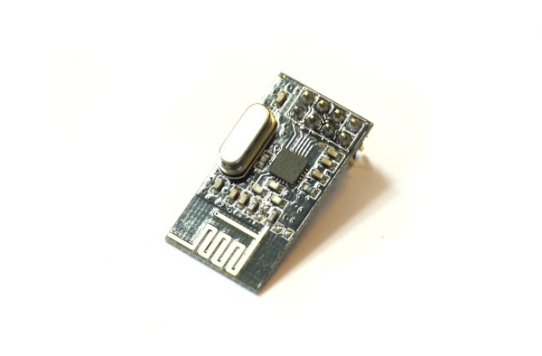
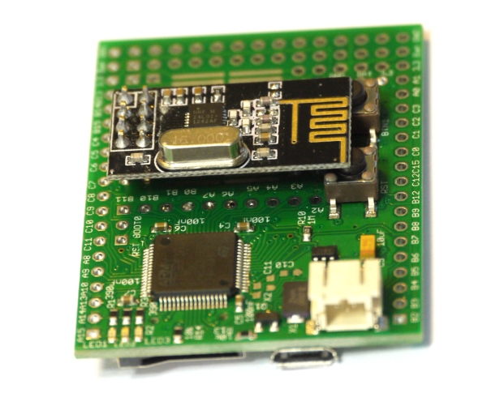
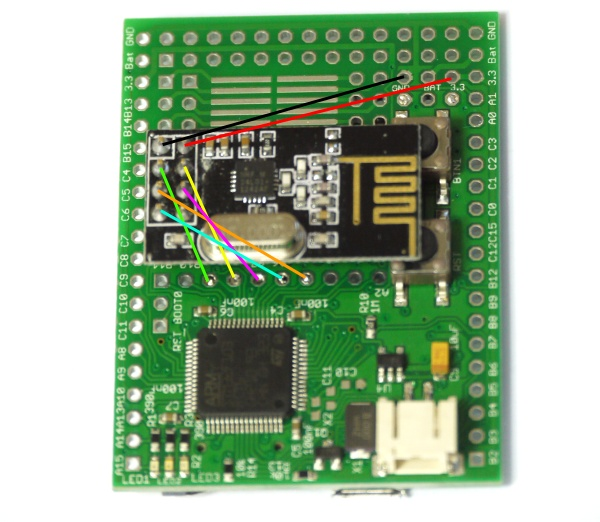
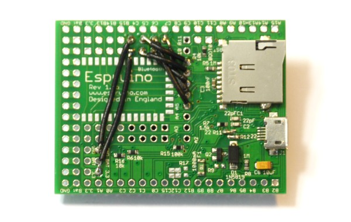

<!--- Copyright (c) 2013 Gordon Williams, Pur3 Ltd. See the file LICENSE for copying permission. -->
NRF24L01+ Wireless Module
======================

<span style="color:red">:warning: **Please view the correctly rendered version of this page at https://www.espruino.com/NRF24L01P. Links, lists, videos, search, and other features will not work correctly when viewed on GitHub** :warning:</span>

* KEYWORDS: Module,NRF,NRF24L01,NRF24L01P,NRF24L01+,Wireless,Radio,Transceiver





The Nordic [NRF24L01+](http://www.nordicsemi.com/eng/Products/2.4GHz-RF/nRF24L01P) transceiver is very popular and works well with Espruino. It is sold in very inexpensive wireless modules that interface via SPI. They can easily be obtained via [eBay](http://www.ebay.com/sch/i.html?_nkw=NRF24L01%2B) and many other places for prices as low as $2.

A driver for it is available in the [[NRF24L01P.js]] module.

Connect as follows:

| NRF24L01+ | Name |  Espruino Original  | Type |
|-----------|------|------------| ---- |
| 1    | GND       | GND        | GND |
| 2    | 3.3V      | 3.3        | 3.3v |
| 3    | CE        | B1         | GPIO Out |
| 4    | CSN       | B0         | GPIO Out |
| 5    | SCK       | A5         | SPI SCK |
| 6    | MOSI      | A7         | SPI MOSI |
| 7    | MISO      | A6         | SPI MISO |
| 8    | IRQ       | unused     | GPIO In |

**Note:** These pins are suggested for the [Original Espruino Board](/Original) as they are in the middle, leaving the edges free for IO. However you can use any GPIO pins you want (with software [[SPI]] you needn't use SPI pins either).

For the [[Pico]] there is [an adaptor shim available](/Shims#nrf24l01p-0-05-shim) as part of the [shim collection](/Shims#shim-collection) that makes the NRF24 a lot easier to solder!

We'd also suggest that you add a 10nF - 100nF decoupling capacitor between GND and 3.3v. Some cheaper modules can be unrelible without this.

You can either connect the module with wires and mount it separately, or you can solder it into the prototype area, and run wires as follows on the back of the board. We'd recommend using thin, solid core wire for this.



The finished wiring might look like this:



Notes
-----

* The NRF24L01+ is a packet radio. It can transmit and receive small packets (up to 32 bytes) of data
* Devices have a transmit and a receive address
* Devices can only transmit **or** receive. They can't do both at the same time
* Transmits are acknowledged - a module knows if the data it sent was received
* The NRF24 module can be unreliable at the higher

The Espruino module allows you to send and receive strings. It does this by sending enough packets to contain the string plus a terminating zero. It will retry, but it is possible for parts of the string to get missed out.

Simple Usage
-----------

We've made simple handlers that allow you to send commands, receive data, and even reprogram a device...

Just do the following for a Slave:

```
SPI1.setup({sck:A5, miso:A6, mosi:A7});
var nrf = require("NRF24L01P").connect( SPI1, B0, B1 );
function onInit() {
  nrf.init([0,0,0,0,1], [0,0,0,0,2]);
}
onInit();
setInterval(function() {
  nrf.slaveHandler();
}, 50);
```

And the following for a Master:

```
SPI1.setup({sck:A5, miso:A6, mosi:A7});
var nrf = require("NRF24L01P").connect( SPI1, B0, B1 );
function onInit() {
  nrf.init([0,0,0,0,2], [0,0,0,0,1]);
}
onInit();
setInterval(function() {
  nrf.masterHandler();
}, 50);
```

Note the two addresses that are given to init - one is the transmit address, one is a receive address. We also use the ```onInit``` function, which is called automatically by Espruino when it starts up.

On a Master all you have to do is use nrf.sendCommand to send a command to the Slave Espruino, and in a few milliseconds the result will appear:

```JavaScript
nrf.sendCommand("1+2", function(r) { print("=="+r); });
=3

nrf.sendCommand("analogRead(A0)", function(r) { print("=="+r); });
=0.356694

nrf.sendCommand("LED2.set()", function(r) { print("=="+r); });
=undefined
```

You can even reprogram the Espruino wirelessly!

```
nrf.sendCommand("function on() { LED3.set(); }");
nrf.sendCommand("on();");
```

To communicate with another Espruino, all you need to do to is to call ```nrf.setTXAddr([1,2,3,4,5])``` on the master, giving the address that you have to the Slave Espruino's nrf.init function.

Advanced Usage
------------

The usage of ```slaveHandler``` and ```masterHandler``` is not required - if you want, you can call methods such as ```send``` and ```getDataPipe()``` directly. For instance you could make a simple wireless sensor:

```
SPI1.setup({sck:A5, miso:A6, mosi:A7});
var nrf = require("NRF24L01P").connect( SPI1, B0, B1 );
function onInit() {
  nrf.init([0,0,0,0,1], [0,0,0,0,2]);
}
onInit();
setInterval(function() {
  var value = analogRead(A0); // read a value in
  nrf.sendString(""+value);
}, 5000);
```

And then a receiver:

```
SPI1.setup({sck:A5, miso:A6, mosi:A7});
var nrf = require("NRF24L01P").connect( SPI1, B0, B1 );
function onInit() {
  nrf.init([0,0,0,0,2], [0,0,0,0,1]);
}
onInit();

dataLine = "";
setInterval(function() {
  while (nrf.getDataPipe() !== undefined) {
    var data = nrf.getData();
    for (var i in data) {
      var ch = data[i];
      if (ch===0 && dataLine!=="") {
        console.log(dataLine);
        // we could even save it onto an SD card using require('fs').appendFile("log.txt", dataLine+"\n");
        dataLine = "";
      } else if (ch!==0) {
        dataLine += String.fromCharCode(ch);
      }
    }
  }
}, 50);
```

More Advanced Usage
-----------------

You can send individual packets using ```NRF.send(data)```, where data is an array of numbers of length ```NRF.PAYLOAD```. To receive you can use the same ```NRF.getData()``` function. For more information consult the module ([[NRF24L01P.js]]).

Reference
--------------

* APPEND_JSDOC: NRF24L01P.js

Using
-----

* APPEND_USES: NRF24L01+

Buying
-----

NRF24L01+ modules are usually based on Nordic's own reference design, so can be purchased from many places:

* [eBay](http://www.ebay.com/sch/i.html?_nkw=NRF24L01%2B)
* [digitalmeans.co.uk](https://digitalmeans.co.uk/shop/index.php?route=product/search&tag=nrf24l01)
