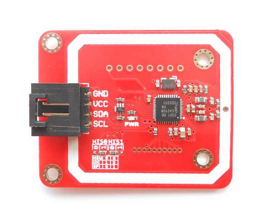

<!--- Copyright (c) 2013 Gordon Williams, Pur3 Ltd. See the file LICENSE for copying permission. -->
PN532 NFC/RFID module
==================

* KEYWORDS: Module,I2C,NFC,RFID,PN532,NXP,13.56 MHz,Mifare



The PN532 is a 13.56 MHz RFID reader chip. It's common and very easy to interface to with the [[PN532.js]] module.


Wiring Up
--------

Simply connect up I2C as follows:

| RFID | Espruino |
|------|----------|
| GND | GND |
| VCC | BAT |
| SCL | B6 |
| SDA | B7 |

**Note:** some of these boards have 2 very small switches on them that select the interface type ([[I2C]], [[SPI]], or [[USART]]). You need to make sure that I2C is selected.


Software
-------

The Espruino module currently implements only a very small subset of the PN532's functionality, but you can use it as follows.

The code below will light the red, green or blue LED depending on which of three RFID tags is in range:

```
I2C1.setup({scl:B6, sda:B7});
var nfc = require("PN532").connect(I2C1);
print(nfc.getVersion());
nfc.SAMConfig(); // start listening
setInterval(function() {
 nfc.findCards(function(card) {
  print("Found card "+card);
  card = JSON.stringify(card);
  var leds = [LED1,LED2,LED3];
  if (card=="[147,239,211,128]") digitalWrite(leds,1);
  if (card=="[249,192,235,164]") digitalWrite(leds,2);
  if (card=="[4,99,129,114,72,52,128]") digitalWrite(leds,4);
 });
}, 1000);
```

Once `nfc.SAMConfig()` is called, you can then poll the PN532 to see if it has any cards in range using `nfc.findCards(...)`. If a card is in range, it will return an array containing the unique ID of that card.


Using 
-----

* APPEND_USES: PN532

Buying
-----

* [eBay](http://www.ebay.com/sch/i.html?_nkw=NXP+PN532)
* [digitalmeans.co.uk](https://digitalmeans.co.uk/shop/index.php?route=product/search&tag=pn532)
