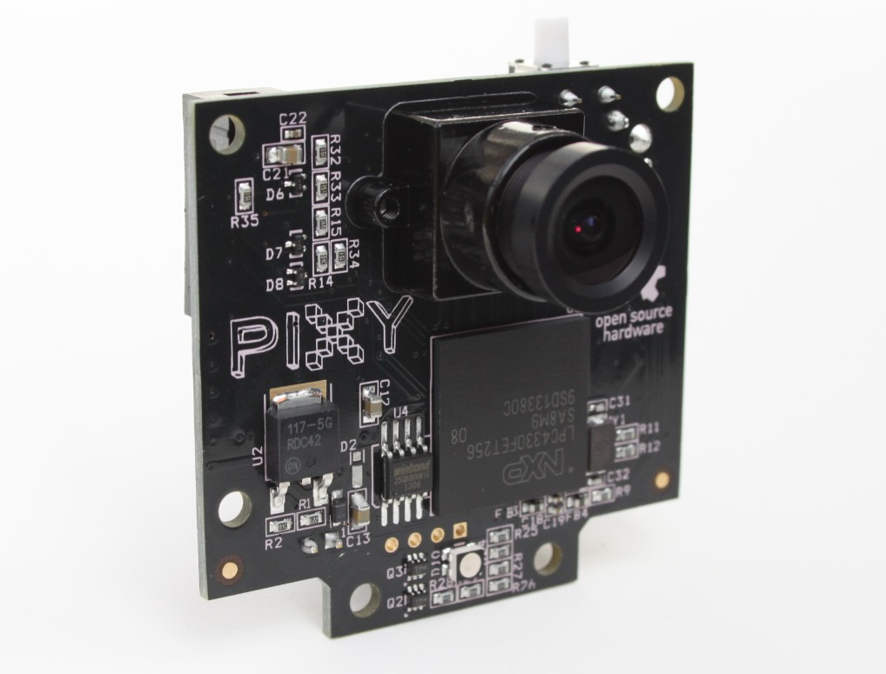
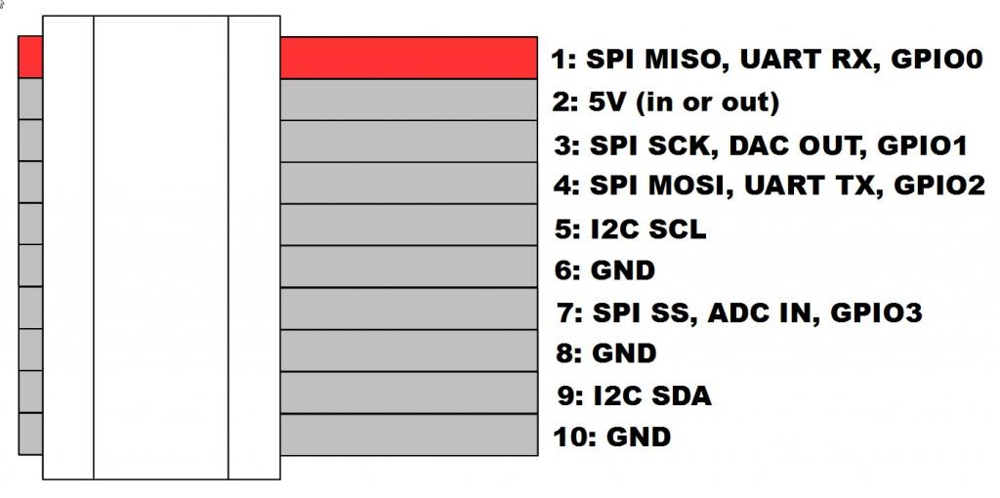

<!--- Copyright (c) 2014 Gordon Williams. See the file LICENSE for copying permission. -->
CMUcam5 Pixy
============

<span style="color:red">:warning: **Please view the correctly rendered version of this page at https://www.espruino.com/Pixy. Links, lists, videos, search, and other features will not work correctly when viewed on GitHub** :warning:</span>

* KEYWORDS: Module,Camera,CMUcam5,Pixy,Computer Vision



The Pixy is a computer vision camera that does all the hard work on-board. It can recognize coloured objects that it 'sees', and will then report their size and position back to a connected microcontroller.

The official documentation is here: [http://cmucam.org/projects/cmucam5/wiki/Quick_Start]

There's an Espruino module called [[Pixy.js]] which will interface to it.

Wiring Up
---------



Use SPI (the default for Pixy), and connect as follows:

| CMUCam |  |Espruino |
|--------|--|--------|
| 1 | SPI MISO | B14 |
| 2 | 5V | Bat |
| 3 | SPI SCK | B13 |
| 4 | SPI MOSI | B15 |
| 5 | I2C SCL | |
| 6 | GND | GND |
| 7 | SPI SS |  |
| 8 | GND |  |
| 9 | I2C SDA | |
| 10 | GND | |

**Note:** Pins 7 to 10 are not exposed on the ribbon cable that comes with the pixy.

Software
-------

```
SPI2.setup({sck : B13, miso : B14, mosi : B15, baud : 1000000});
var pixy = require("Pixy").connect(SPI2);
console.log(pixy.getBlocks());
```

returns something like:

```JSON
[
  {"id":1,"x":18,"y":24,"width":17,"height":2}
]
```

**Note:** There may currently be issues with the minified version of this module. To use the unminified version, change `.min.js|.js` to `.js|.min.js` in the Web IDE's settings menu.

Reference
--------
 
* APPEND_JSDOC: Pixy.js

Using 
-----

* APPEND_USES: Pixy

Buying
-----

* [Order from Charmed Labs](http://charmedlabs.com/)
* [digitalmeans.co.uk](https://digitalmeans.co.uk/shop/index.php?route=product/search&tag=pixy)
