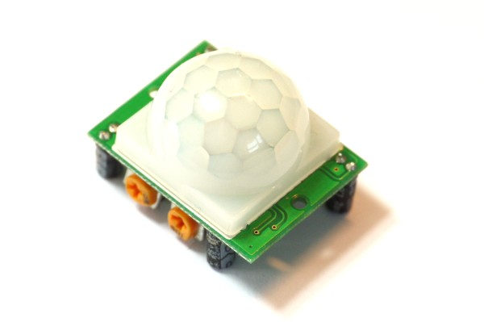
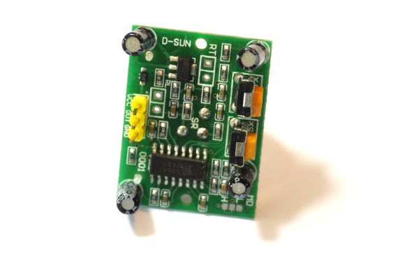
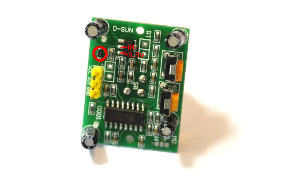

<!--- Copyright (c) 2018 Gordon Williams, Pur3 Ltd. See the file LICENSE for copying permission. -->
Pyroelectric Motion Sensor (HC-SR501)
======================================

<span style="color:red">:warning: **Please view the correctly rendered version of this page at https://www.espruino.com/Pyroelectric. Links, lists, videos, search, and other features will not work correctly when viewed on GitHub** :warning:</span>

* KEYWORDS: Pyroelectric Motion Sensor,PIR,Motion,Movement,Sensor,HC-SR501





Pyroelectric (PIR) Motion Sensor's are what you'd find in a home burglar alarm or a motion sensitive light. The module shown is the HC-SR501, and it outputs a 3.3v pulse on the output pin whenever movement is detected (some units may be open drain, or output a pulse at the operating voltage). The length of this pulse is adjustable by one of the potentiometers on the unit, being about 2 seconds long at the minimum setting, and 5 minutes or more at the maximum setting (allowing it to control motion sensing lights without external components).

The HC-SR501 draws less than 50uA when it is on, which means it'll run off a battery for ages.

Connect as follows:

| HC-SR501 | Espruino   |
| ------- | ------- |
| VCC | VBAT (5v) |
| OUT | A1      |
| GND | GND     |

**Note:** any GPIO pin will do for OUT

You can then easily trigger something to happen when movement is detected:

```
setWatch(function() {
  console.log("Movement detected");
}, A1, {repeat:true, edge:"rising"});
```

Specs
----

| Specification | Value |
| ------- | ------- |
| Input Voltage | 4.5-20v (can work as low as 3.9v) |
| Output Voltage | 0 (low), 3.3v (high) |
| Current Draw | &lt; 50uA |


Low Voltage Operation
---------------------



These sensors are designed to run off 5v or more, and will not work reliably
as they come even off of a LiPo battery (around 3.7v).

You can however easily modify them to work off of lower voltages.

* The diode circled in the image above exists only to protect against the board
being wired up backwards, however it reduces the voltage the board can run off by around
0.55 volts. **Simply short the diode out or unsolder it and replace it with a wire link,
and the sensor will be able to run off voltages as low as 3.4v**.
* There is also a voltage regulator shown above with `IN` and `3.3v` marked on it. You can
short the two pins (in addition to the diode mentioned above) and can then power the
sensor off of your Espruino board's 3.3v supply.

The sensor itself is designed to run off 3.3v internally, so even with the modifications
above you won't be able to run it off something like a CR2032 (which is only 3v).


Using
-----

* APPEND_USES: Pyroelectric

Buying
-----

* [eBay](http://www.ebay.com/sch/i.html?_nkw=HC-SR501)
