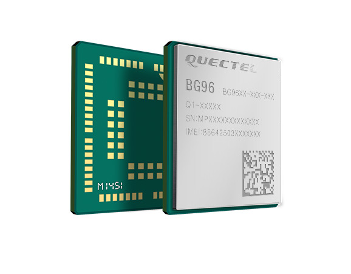

<!--- Copyright (c) 2018 Gordon Williams, Pur3 Ltd. See the file LICENSE for copying permission. -->
Quectel LTE BG96 Cat.M1/NB1 & EGPRS Module
=============================================

<span style="color:red">:warning: **Please view the correctly rendered version of this page at https://www.espruino.com/QuectelBG96. Links, lists, videos, search, and other features will not work correctly when viewed on GitHub** :warning:</span>

* KEYWORDS: Internet,Module,LTE,Cat.M1,CatM1,Cat M1,NB1,NB-IoT,NBIoT,Mobile,BG96,EGPRS,QUECTEL,Wireless,Radio
* USES: AT



The Quectel BG96 is a LTE/Cat.M1/NB1/EGPRS module that can provide internet access via an AT command set.

Support is provided in Espruino by the [[QuectelBG96.js]] module.

Software
---------

```
Serial1.setup(115200, { rx: .., tx : ... });

function connectionReady() {
  var http = require("http");
  http.get("http://www.pur3.co.uk/hello.txt", function(res) {
    res.on('data', function(data) {
      console.log(data);
    });
  });
}

gprs = require('QuectelBG96').connect(Serial1, {
  apn : "",
  username : "",
  password : ""
}, function(err) {
  if (err) throw err;
  connectionReady();
});
```

The second argument to `connect` is an object that can contain:

```
{
  lte : bool, // Are we using LTE? This changes how we check if we're registered
  apn : "", // optional access point name.
  username : "", // optional username
  password : "", // optional password
}
```

Reference
--------

`gprs.at`

The AT command handler - use this to send your own AT commands to the M35.

`gprs.debug(isDebugging)`

Return debugging information and to turn on/off debug messages.

`gprs.getVersion(function(err, version) { ... });`

Call the callback with the version number reported back from the `AT+GMR` command. The callback is called with `err==null` on success.

`gprs.getIP(function(err, ip) { ... });`

Call the callback with the current IP address, as a String. The callback is called with  err==null  on success.

Using
-----

* APPEND_USES: QuectelBG96
