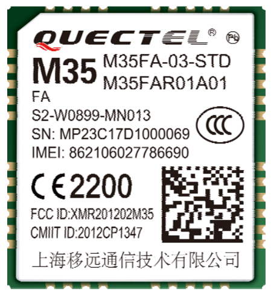

<!--- Copyright (c) 2018 Gordon Williams, Pur3 Ltd. See the file LICENSE for copying permission. -->
Quectel M35 Quad-band GSM/GPRS module Module
=============================================

<span style="color:red">:warning: **Please view the correctly rendered version of this page at https://www.espruino.com/QuectelM35. Links, lists, videos, search, and other features will not work correctly when viewed on GitHub** :warning:</span>

* KEYWORDS: Internet,Module,GSM,GPRS,2G,3G,Mobile,M35,QUECTEL,Wireless,Radio
* USES: AT



The Quectel M35 is a GSM/GPRS module that can provide internet access via an AT command set.

Support is provided in Espruino by the [[QuectelM35.js]] module.

Software
---------

This module expects the modem to have started and to be connected to
the network already. This means you may need to wait ~15 seconds after
powering on for it to work.

```
Serial1.setup(115200, { rx: .., tx : ... });

function connectionReady() {
  var http = require("http");
  http.get("http://www.pur3.co.uk/hello.txt", function(res) {
    res.on('data', function(data) {
      console.log(data);
    });
  });
}

gprs = require('QuectelM35').connect(Serial1, {}, function(err) {
  if (err) throw err;
  connectionReady();
});
```

Reference
--------

`gprs.at`

The AT command handler - use this to send your own AT commands to the M35.

`gprs.debug()`

Return debugging information and to turn on/off debug messages.

`gprs.getVersion(function(err, version) { ... });`

Call the callback with the version number reported back from the `AT+GMR` command. The callback is called with `err==null` on success.

`gprs.getIP(function(err, ip) { ... });`

Call the callback with the current IP address, as a String. The callback is called with  err==null  on success.

Using
-----

* APPEND_USES: QuectelM35
