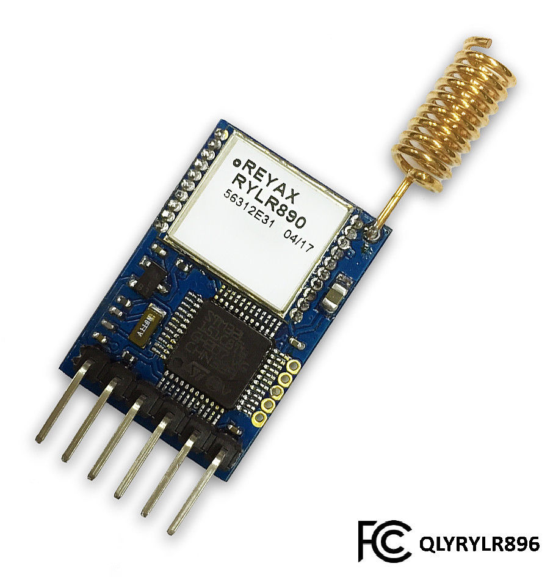

<!--- Copyright (c) 2018 Davy Wybiral. See the file LICENSE for copying permission. -->
REYAX RYLR896/406/895/405 LoRa modules
===================================

<span style="color:red">:warning: **Please view the correctly rendered version of this page at https://www.espruino.com/RYLR. Links, lists, videos, search, and other features will not work correctly when viewed on GitHub** :warning:</span>

* KEYWORDS: Module,LoRa,LoRaWan,Radio,Wireless,RYLR896,RYLR406,RYLR895,RYLR405,RYLR,REYAX
* USES: AT




REYAX RYLR896/406/895/405 LoRa modules provide LoRa connectivity with an
AT-command Serial interface to the host microcontroller. The [[RYLR.js]] module
provides a simple JavaScript interface for those modules.

[[https://youtu.be/IStuUv9eAmE]]

Wiring
-------

Just wire up:

* The power supply to 3.3v
* RX and TX wires to Serial-capable pins on your Espruino device

Software
--------

```
/*
This is an example of using Espruino JS to control a REYAX LoRa module.
It listens for "on" and "off" messages to change and LED and
sends "on" and "off" messages by pressing the button.
*/
var RYLR = require('RYLR.js');

Serial1.setup(115200, {rx: B7, tx: B6});
var lora = RYLR.connect(Serial1);

lora.setNetwork(13).then(res => {
  return lora.setAddress(1);
}).then(res => {
  lora.on('data', evt => {
    digitalWrite(LED1, evt.data == 'on');
  });
});

setWatch(evt => {
  lora.send(evt.state ? 'on' : 'off', 2);
}, BTN, {repeat: true, edge: 'both'});
```


Reference
---------

* APPEND_JSDOC: RYLR.js


Buying
-----

You can get REYAX RYLR modules from eBay - just ensure that you get a module
advertised as supporting the AT command interface (some of them are bare [[SX127x]] modules).

* [eBay](http://www.ebay.com/sch/i.html?_nkw=reyax+rylr)
