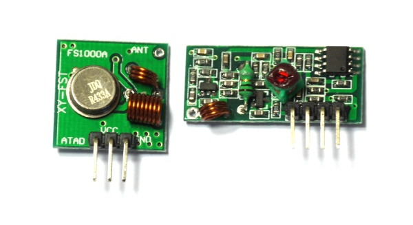
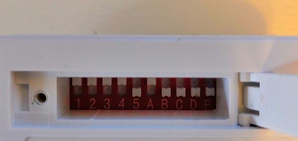

<!--- Copyright (c) 2019 Stefan Fröhlich. See the file LICENSE for copying permission. -->
RcSwitch
=====================

<span style="color:red">:warning: **Please view the correctly rendered version of this page at https://www.espruino.com/RcSwitch. Links, lists, videos, search, and other features will not work correctly when viewed on GitHub** :warning:</span>

* KEYWORDS: 433Mhz,315Mhz,433,SC5262,SC5272,HX2262,HX2272,PT2262,PT2272,EV1527,RT1527,FP1527,HS1527

Module for operate 433/315Mhz devices like power outlet sockets, relays, etc. Use the [RcSwitch](/modules/RcSwitch.js) module for it.

Support for sending is implemented, but receiving isn't.

Picture of a 433Mhz transmitter (left) and receiver (right):



Wire the 433Mhz transmitter up as follows:

| Device Pin | Espruino |
| ---------- | -------- |
| 1 (GND)    | GND      |
| 2 (VCC)    | BAT      |
| 3 (DATA)   | A0       |


How to use my module:



```javascript
  // 1 = Protocol
  // A0 = Pin
  // 10 = Repeat
  var sw = require("RcSwitch").connect(1, A0, 10);
  var on = false;
  function toggle() {
    on = !on;
    if (on) {
        sw.switchOn("11110", "10000");
        console.log("switchOn");
        }
    else{
        sw.switchOff("11110", "10000");
        console.log("switchOff");
    }
  }
  setInterval(toggle, 5000);
```
