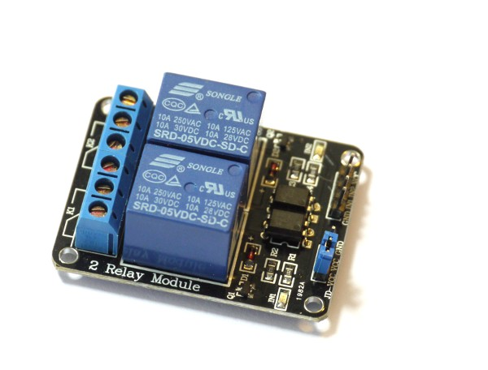
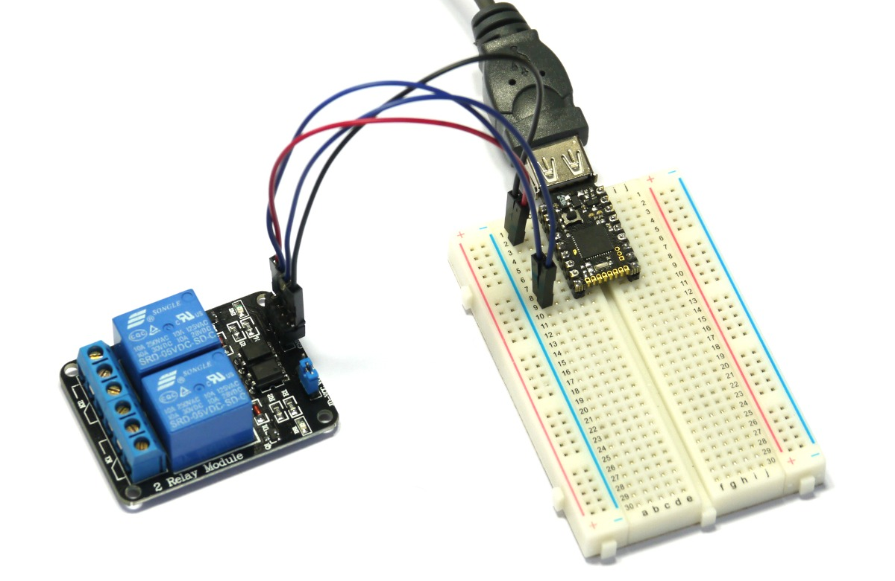
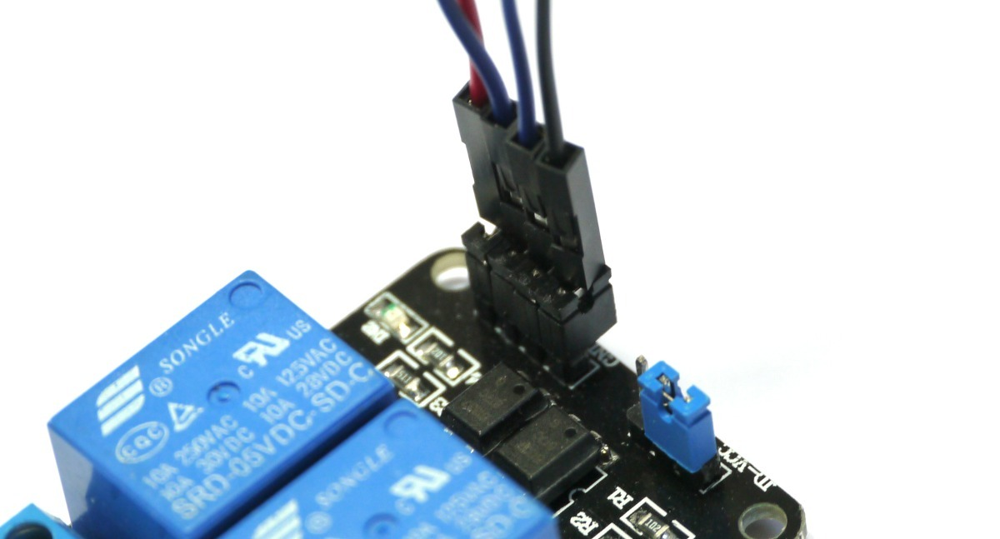

<!--- Copyright (c) 2013 Gordon Williams, Pur3 Ltd. See the file LICENSE for copying permission. -->
Relays
=====

:warning: **Please view the correctly rendered version of this page at https://www.espruino.com/Relays. Links, lists, videos, search, and other features will not work correctly when viewed on GitHub** :warning:

* KEYWORDS: Relay,Switch

[Relays](http://en.wikipedia.org/wiki/Relay) are electrically operated switches. A small current passing through one side will operate a physical switch. This means that you can control almost anything with a relay that you would turn on and off with a physical switch (batteries, motors, even mains-powered electic lights).

Pretty much all relays are electromagnetic - this means that there is a coil of wire inside that creates a magnetic field that operates a switch. When this coil is turned off it creates [Back EMF](http://en.wikipedia.org/wiki/Counter-electromotive_force) which can cause damage to your Espruino unless it is protected (with a diode). The Espruino Board will also supply a **maxiumum** current of 25mA on each pin, which is too small to make a lot of relays work unless you provide some simple form of amplification. This is covered [in many places](http://makezine.com/2009/02/02/connecting-a-relay-to-arduino/) so we won't go into it here.

**However** many companies supply 'relay modules' that contain one or more relays, screw terminals, and the circuitry needed to drive them easily from Espruino. These can be controlled simply by connecting GND, VBAT (5V), and any signal pin from Espruino.

Relay Module
----------

You can see the relay module we'd suggest in the image above. To use this as a simple switch, wire up:

* GND, IN1 and VCC to the Espruino board
* On the blue screw terminals, connect the 2nd pin (marked K1) and the 3rd pin into the circuit that you want to power.

The connections are as follows:

### Blue Screw Terminals

| Marking | Function |
| ------- | -------- |
|         | Output 1 Normally Closed |
| K1      | Output 1 Pole |
|         | Output 1 Normally Open |
|         | Output 2 Normally Closed |
| K2      | Output 2 Pole |
|         | Output 2 Normally Open |

### 4x1 pin strip

| Marking | Function |
| ------- | -------- |
| GND     | Ground |
| IN1     | Control for Output 1 ( 0 = on, 1 = off) |
| IN2     | Control for Output 2 ( 0 = on, 1 = off) |
| VCC     | 5V input |

**Note:** IN1 and IN2 must be connected to 5v tolerant pins on your Espruino board (pins not marked with `3.3v` on the pinout diagram). If you must use a non 5v tolerant pin, you can sometimes remove a jumper from the relay and power the relay from 5v while powering the optoisolator from 3.3v - however this will depend on your relay module.

### 3x1 pin srip

This contains a jumper between VCC and VCC-JD. This means that the relay will be powered from the same 5V signal as the Opto-isolators and LEDs.

### Connecting to the Pico

The Espruino Pico [Starter Kit](/Espruino+Kits) comes with breadboard and male Jumper Wires. To connect to the relay, take the 4 supplied black jumpers and place them on the 4 male pins of the Relay Module. You can then push the Jumper Wires into the top of them.

We'd suggest that you connect Relay GND to Espruino `GND`, and relay VCC to Espruino `VBAT`. The two inputs can then be connected to any of the IO pins.

Using 
-----

* APPEND_USES: Relay Module

Buying
-----

You can buy relays from any electrical component supplier. However, as discussed above, we'd suggest that you don't connect a relay directly to Espruino.

Instead, think of buying a Relay Module. These are available from many places, but [eBay](http://www.ebay.com/sch/i.html?_nkw=relay+module+5v) is probably the easiest. Look for 'Relay Module 5V' to ensure that you get one that can be powered from a simple 5V power source. In addition to the big block on the PCB that is the relay, look for smaller black chip (not a transistor). This probably means that there is an opto-isolator on board, which provides better isolation than a normal transisitor.

