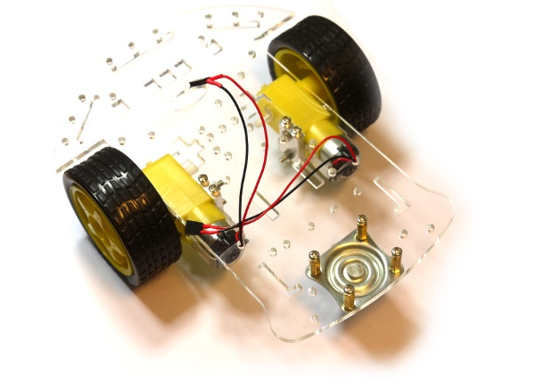

<!--- Copyright (c) 2013 Gordon Williams, Pur3 Ltd. See the file LICENSE for copying permission. -->
Robots
======

:warning: **Please view the correctly rendered version of this page at https://www.espruino.com/Robot. Links, lists, videos, search, and other features will not work correctly when viewed on GitHub** :warning:

* KEYWORDS: Robot,Buggy,Wheeled
* USES: L293D

In the KickStarter video we used an Espruino-controlled Robot, this is available from Olimex (see links below).

Additional Components
------------------

The kit contains the chassis, motors and wheels, but you still need something to control the motors.

We used:

* An [Espruino Board](EspruinoBoard) 
* A [[L293D]] Motor Driver IC soldered on to the board
* A [[HC-SR04]] Ultrasonic Distance Sensor so that the Robot could sense the distance to obstacles.

Using 
-----

* APPEND_USES: Robot

Buying
-----

* [Olimex](https://www.olimex.com/Products/RobotParts/Chassis/ROBOT-3-WHEEL-KIT/)
