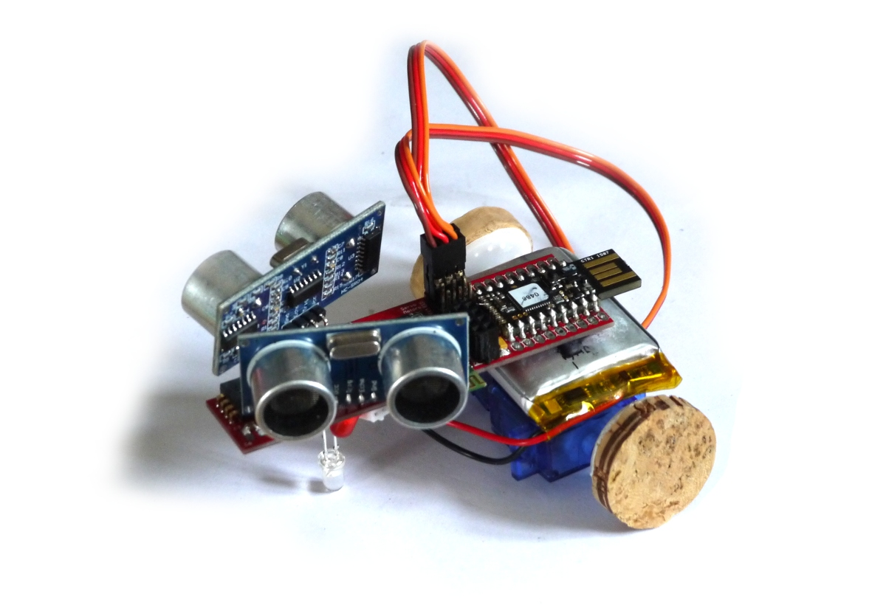
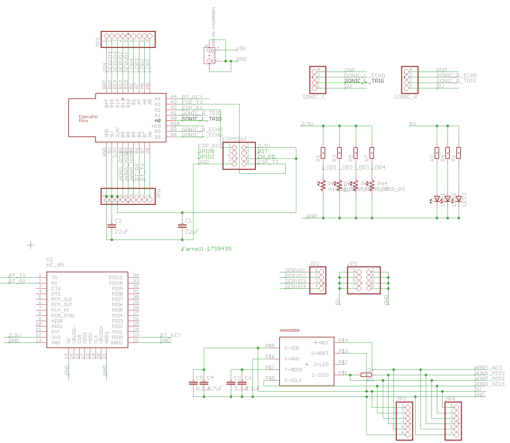
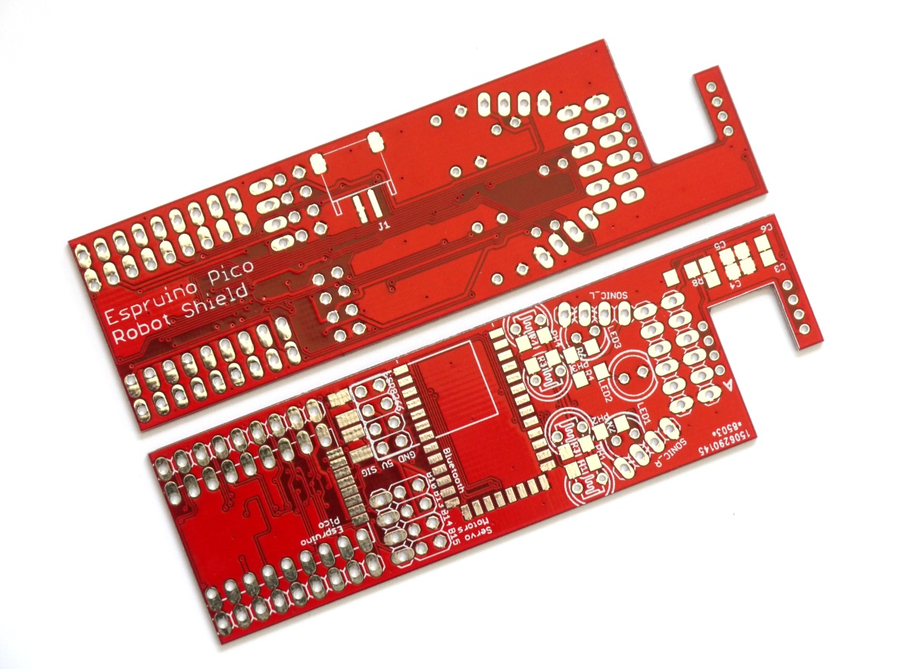
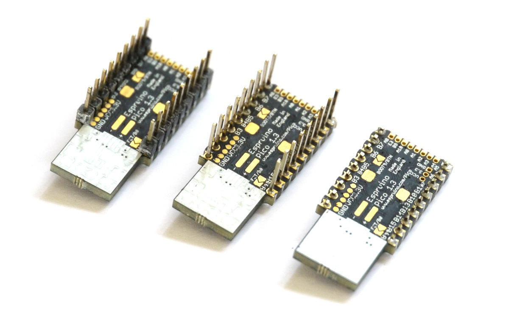
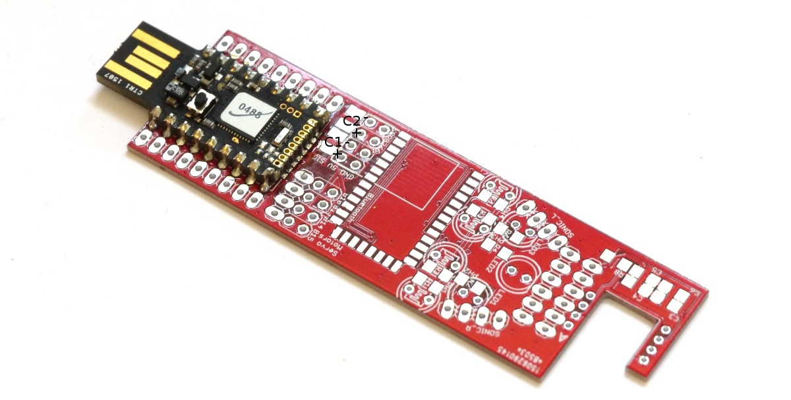
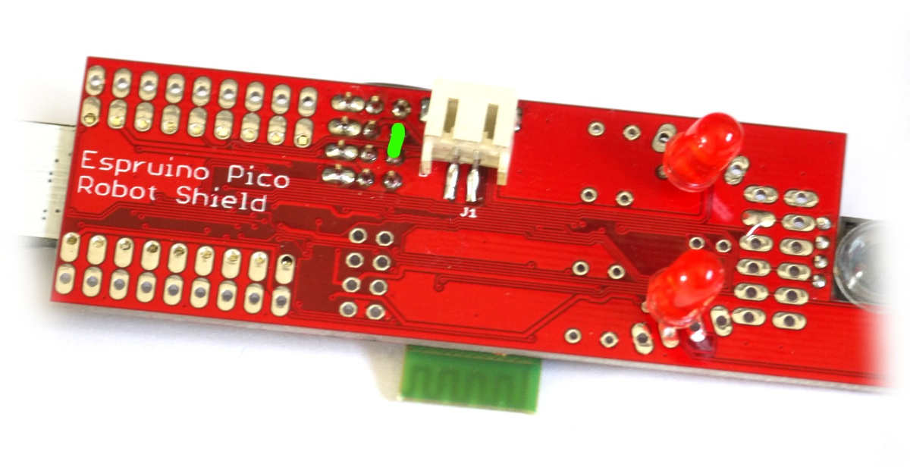
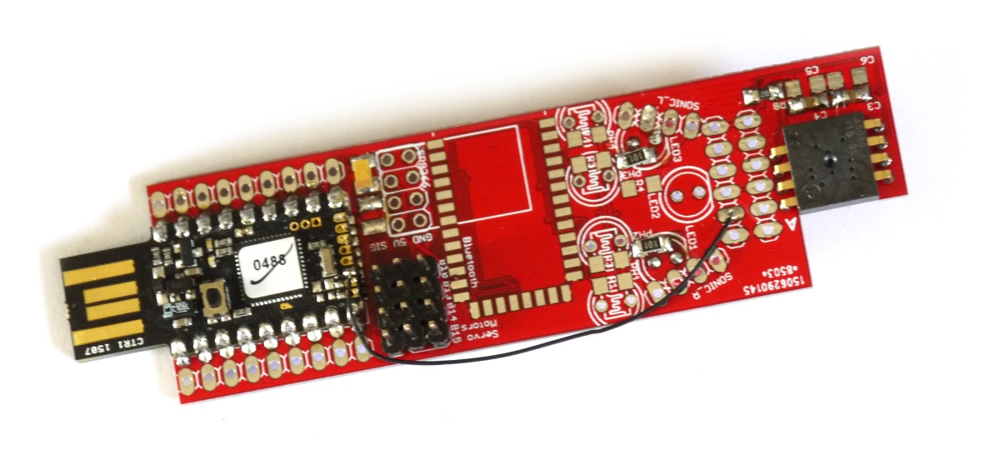
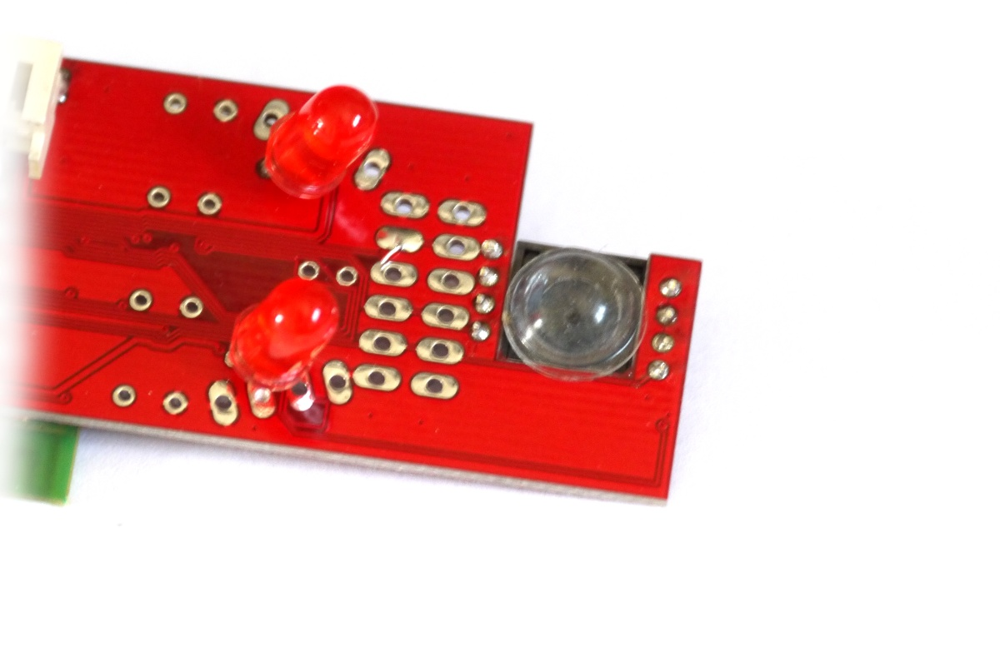

<!--- Copyright (c) 2015 Gordon Williams, Pur3 Ltd. See the file LICENSE for copying permission. -->
Espruino Pico Robot PCB
====================

<span style="color:red">:warning: **Please view the correctly rendered version of this page at https://www.espruino.com/RobotPCB. Links, lists, videos, search, and other features will not work correctly when viewed on GitHub** :warning:</span>



This is a simple PCB that allows you to make a robot with the Espruino Pico. The robot has:

* 2x continuous rotation servo motors
* 3x LEDs (not controllable)
* 4x Light sensors
* Optional [ESP8266](/ESP8266) WiFi
* Optional [HC-05](/Bluetooth) Bluetooth
* Optional [ADNS5050](/ADNS5050) optical mouse sensor (includes 19x19 camera)
* Optional 2x [HC-SR04](/HC-SR04) Ultrasonic sensors

Eagle CAD Design files available here: [board](https://github.com/espruino/EspruinoBoard/blob/master/Pico/Adaptors/eagle/robot.brd) and [schematic](https://github.com/espruino/EspruinoBoard/blob/master/Pico/Adaptors/eagle/robot.sch)


Parts List
----------



| Name | Farnell Part No | Type | Notes |
|------|-----------------|------|-------|
| J1 | 9492615 | JST PHR-2 SMD connector |
| C1 | 2309030 | 22uF 3.3v 0805/AVX-A | Only needed when using WiFi |
| C2 | 2309030 | 22uF 5v 0805 | Needed for Servos |
| C3 | 1759475 | 4.7uF 0805 (for optical sensor) |
| C4 | 1759475 | 4.7uF 0805 (for optical sensor) |
| C5 | 1759167 | 0.1uF 0805 (optional - for optical sensor) |
| C6 | 1759167 | 0.1uF 0805 (optional - for optical sensor) |
| R1 | 1653308 | 4.7k 0805 (for LDR1) |
| R2 | 1653279 | 100 Ohm 0805 (for LED1)  |
| R3 | 1653308 | 4.7k 0805 (for LDR2)  |
| R4 | 1653279 | 100 Ohm 0805 (for LED2) |
| R5 | 1653308 | 4.7k 0805 (for LDR3)  |
| R6 | 1653279 | 100 Ohm 0805 (for LED3) |
| R7 | 1653308 | 4.7k 0805 (for LDR4)  |
| R8 | 1653308 | 4.7k 0805 (for optical sensor)  |
| LED1,2,3 | 2335725 | 4.7k 0805 (for optical sensor)  |
| LDR1,2,3,4 | 1652637 | GL55xx/VT90Nx Light Dependent resistor (20x cheaper on eBay) |
| Optical Sensor | | [ADNS5050](/ADNS5050) |
| Bluetooth | | [HC-05](/Bluetooth) |
| WiFi | | [ESP8266](/ESP8266) |
| Servos | | Fitech/Feetech [FS90R](http://www.adafruit.com/products/2442) |
| Ultrasonic | | [HC-SR04](/HC-SR04) |

Connections
----------



| Device           |   | Pico      |
|------------------|---|-----------|
| LEDs             |   | Always on |
| LDRs             | 1 (Right) | A5 |
|                  | 2 (Mid Right) | A6 |
|                  | 3 (Mid Left) | A7 |
|                  | 4 (Left) | B1 |
| Servos           | 1 (Left) | B10 |
|                  | 2 (Mid Left) | B13 |
|                  | 3 (Mid Right) | B14 |
|                  | 4 (Right) | B15 |
| [Ultrasonic](/HC-SR04) Left  | Trig | A0 |
|                  | Echo | B8 |
| [Ultrasonic](/HC-SR04) Right | Trig | A1 |
|                  | Echo | B9 |
| [Optical Sensor]   | SCL  | B3 |
|                  | MISO | B5 (see errata) |
|                  | MOSI | B4 (see errata) |
|                  | CS   | A10 (see errata) |
| Bluetooth        | TX   | B7 (Serial1 default console if no USB) |
|                  | RX   | B6 (Serial1 default console if no USB) |
|                  | Key  | A4 (used with [BLE](/Bluetooth+BLE)) |
| ESP8266          | TX   | A3 |
|                  | RX   | A2 |

Errata
------

On the current board (the one with no version number):

* GND on the JST connector isn't connected due to a PCB layout issue. You'll need to short the middle two GND pins of the servo connector together (see Assembly section below).
* GND on C1 isn't connected, and if C1 is used it'll need shorting to C2 next to it.
* JP5 (the breakout for the side of the Pico with `Bat,B15,B14,B13,B10,B1,A7,A6,A5` on it is **backwards**
* The markings for the LEDs are **wrong**. The flat side of the LED should be **opposite** the board's flat side marking.
* A10 should be connected to the Optical sensor's CS pin - a wire needs adding.
* B4 and B5 (MISO and MOSI) are mixed up, meaning you must use software SPI instead of hardware SPI

Assembly
-------

First off, take your Espruino Pico, and if it is pinned then place the pins face-down on a table and then carefully push the black plastic spacer off the bottom of the pins. Take side-cutters and cut the pins down so they're about 1mm proud of the PCB.



Then place the Pico on the PCB, on the side that **doesn't** say 'Robot Shield'. Solder along all 3 edges of castellated pads, making sure the solder 'wicks' up between the PCB and the pad.

Once done, use a multimeter meter and quickly check that done of the pad are shorted.



Solder on the surface mount resistors and capacitors as shown in the parts list. The only two parts not marked on the PCB are C1 and C2 by the Pico (they're shown in black above).

**Note:** The current board has a problem where C1's GND connection is not made, so if C1 is used you must connect C1's GND to C2's GND.

Then, insert and wire up the through-hole components (LEDs, light sensors, and the pin header needed for connecting the Servo motors). If you're using the optical sensor it's a good idea to angle LED1 and LED3 forwards, and LED2 should stick down as far as possible as this will rub along the floor and keep the PCB off the ground.

**Note:** The current board's silkscreen markings for the flat on the LED are the *wrong way around!* Place the flat side of the LED facing the Pico, not the front of the board.

Turn the board over and solder on the SMD JST power connector as shown below. Due to a problem with the board layout, you'll have short the two Servo GND pins together (shown in green) for it to be connected properly though.



### Optical Sensor assembly

Solder on the optical sensor as shown below. The `A` marking on the sensor should match up with the `A` marking on the PCB.

**Note:** The current board has another issue - the CE pin from the sensor isn't connected. You'll need to run a wire from this pin to pin A10 on the Pico - shown in the picture below.



The sensor itself doesn't have a lens (it usually relies on the lens that is built into the bottom of the mouse). Without the lens the small hole acts as a pinhole, but as it is almost as big as the sensor, the image you get is very blurry.

To get something a bit better, you can stick on a clear rubber foot, as shown below:




Software
-------

This basic code has the pin definitions and examples for all the things that you could solder onto the board.

```
var SONICL_TRIG = A0;
var SONICL_ECHO = B8;
var SONICR_TRIG = A1;
var SONICR_ECHO = B9;
var LDR = [A5,A6,A7,B1];
var SERVO = [B10,B13,B14,B15];

//Ultrasonic
var SONICL = require("HC-SR04").connect(SONICL_TRIG, SONICL_ECHO, function(dist) {
  console.log("left "+dist+" cm away");
});
var SONICR = require("HC-SR04").connect(SONICR_TRIG, SONICR_ECHO, function(dist) {
  console.log("right "+dist+" cm away");
});
//SONICL.trigger();
//SONICR.trigger();

// Optical sensor
var sensorSPI = new SPI();
sensorSPI.setup({mosi:B4,miso:B5,sck:B3,mode:3});
var sensor = require("ADNS5050").connect(sensorSPI,A10);
// sensor.getImage() returns a Uint8Array of 19x19 pixels
// sensor.getLine() returns a Uint8Array of 19 pixels (the first line)
//sensor.drawImage(sensor.getImage()); // this will draw that array to the console

// LDRs
//for (var i in LDR)
//  console.log(i, analogRead(LDR[i]));

// WiFi
/*Serial2.setup(9600, { rx: A3, tx : A2 });
var wifi = require("ESP8266WiFi").connect(Serial2, function(err) {
  if (err) throw err;
  console.log("Connecting to WiFi");
  wifi.connect("WiFi_Name","WPA2_Key", function(err) {
    if (err) throw err;
    console.log("Connected");
    // Now you can do something, like an HTTP request
    require("http").get("http://www.pur3.co.uk/hello.txt", function(res) {
      console.log("Response: ",res);
      res.on('data', function(d) {
        console.log("--->"+d);
      });
    });
  });
});*/

// Bluetooth
Serial1.println("Hello World");
Serial1.on('data', function(d) { console.log("Got "+JSON.stringify(d)); });
/* When USB is disconnected you can program the Espruino via bluetooth,
  Or to keep the above working add a call to USB.setConsole(); */

// Servos
var pos = [0.5,0.5,0.5,0.5];
setInterval(function() {
  for (var i in SERVO)
    digitalPulse(SERVO[i], 1, 1+pos[i]);
}, 20);
// Now set pos[x] to any values between 0 and 1
// eg. function forward() { pos=[0.5,0.5,0,1]; }
//     function back() { pos=[0.5,0.5,1,0]; }
```
