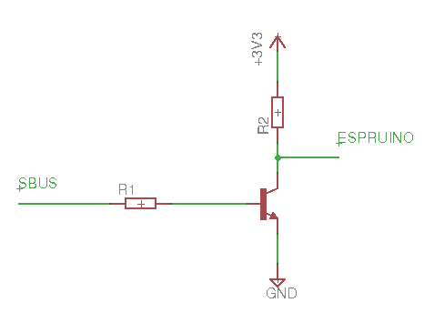

<!--- Copyright (c) 2018 Gordon Williams, Pur3 Ltd. See the file LICENSE for copying permission. -->
Futaba S.Bus System
=====================

<span style="color:red">:warning: **Please view the correctly rendered version of this page at https://www.espruino.com/SBus. Links, lists, videos, search, and other features will not work correctly when viewed on GitHub** :warning:</span>

* KEYWORDS: Module,Futaba,Frsky,SBus,S.Bus,Servo,RC,Remote Control

The [S.Bus System](https://www.futabarc.com/sbus/index.html) is a way of
controlling [RC servo Motors](/Servo+Motors) more accurately using serial data.
Normally servo motors use [[PWM]] - you can only have one servo motor
per signal wire, and accuracy is usually around 1 in 200.

S.Bus servos accept an 11 bit signal (so theoretically are accurate to 1 in 2048) and
you can normally have 16 servos per signal wire (each servo needs programming
so that it knows what channel it is on).

The [[SBus.js]] module allows you to decode this signal in Espruino.

S.Bus uses a standard Serial protocol (even parity, 2 stop bits, 100000 baud),
however the polarity is inverted so you must use an external inverter (a transistor,
FET, or an optoisolator). The data format is:

* SBUS header (0x0F)
* 16 servos (11 bits each) packed together into 22 bytes.
* Final byte showing if failsafe activated, plus channels 17,18
* SBUS final byte (0x00)

Wiring Up
---------

There are only three wires:

* Black (GND)
* Red (+5v)
* White (Signal)

Unfortunately the signal wire can't be connected straight to Espruino as it needs
inverting. To do this, connect a transistor and resistors as shown:




Software
--------

**Note:** This module needs a firmware *after* Espruino 1v99 in order
to be able to decode the SBus data.

When `require("SBus").connect` is called with a Serial device
and a pin to receive on, the following object is returned:

```
{
  channels : new Uint16Array(18), // 18 channels, ranging from 0..2047
  frameLoss : false,
  failSafe : false
}
```

**Note:** `sbus.channels` is a zero-based array. `sbus.channels[0]` is
actually SBus channel 1, and so on.

Each time a frame is received the data in `sbus` is updated and
a `frame` event is emitted. For instance to light each of the
3 LEDs depending on whether the channel is over halfway you could do:

```
var sbus = require("SBus").connect(Serial2, A3);
sbus.on('frame', function(sbus) {
  LED1.write(sbus.channels[0]>1023);
  LED2.write(sbus.channels[1]>1023);
  LED3.write(sbus.channels[2]>1023);
});
```

Or to control normal [RC servo Motors](/Servo+Motors) from the SBus servo
data:

```
var sbus = require("SBus").connect(Serial2, A3);
sbus.on('frame', function(sbus) {
  digitalPulse(SERVO1, 1, 0.5+sbus.channels[0]­/1024);
  digitalPulse(SERVO2, 1, 0.5+sbus.channels[1]­/1024);
  // you could also use analogWrite to use the on-chip PWM hardware
  // ...
});
```
