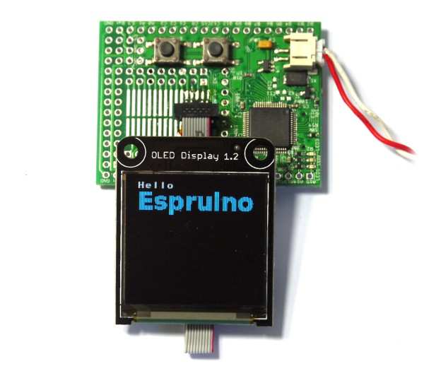

<!--- Copyright (c) 2013 Gordon Williams, Pur3 Ltd. See the file LICENSE for copying permission. -->
SSD1351 OLED display driver
========================

<span style="color:red">:warning: **Please view the correctly rendered version of this page at https://www.espruino.com/SSD1351. Links, lists, videos, search, and other features will not work correctly when viewed on GitHub** :warning:</span>

* KEYWORDS: Module,SPI,SSD1351,Graphics,Graphics Driver,OLED,LCD,Color,Colour,Gadgeteer,ILSoft
* USES: NET Gadgeteer



This is an 18 bit OLED controller - commonly used in 128x128 OLED Displays.

Support is included in the [[SSD1351.js]] module, using the [[Graphics]] library.

Just wire up as follows. **Note:** The Seeed module uses a .[[NET Gadgeteer]] plug. See that link for wiring suggestions.

| .[[NET Gadgeteer]] | Espruino | OLED Name |
|-----------|----------|---------|
| 1 | 3.3v       | 3.3v |
| 2 | Bat (5v)   | 5V   |
| 3 | A3 (GPIO)  | Data/Cmd |
| 4 | B11 (GPIO) | Reset |
| 6 | B10 (GPIO) | Chip Select |
| 7 | A7 (MOSI)  | Data In |
| 9 | A5 (SCK)   | Clock |
| 10 | GND       | Gnd |

You can use other pins if it is easier (for instance when using the ILSoft module).

```
SPI1.setup({ mosi:A7, sck:A5, baud:4000000 });
var g = require("SSD1351").connect(SPI1, A3, B10, B11, function() {
  g.clear();
  g.drawString("Hello",0,0);
  g.setFontVector(20);
  g.setColor(0,0.5,1);
  g.drawString("Espruino",0,10);
});
```

Note:

* The display takes around 100ms to initialise after calling 'connect'. There's an optional callback that is called after this time (shown in the example). Sending data to it before initialisation may cause it not to initialise correctly.
* This module doesn't use a double-buffer as there isn't enough RAM. Pixels are written to the display as they are drawn, and the driver is written in JavaScript so it is relatively slow.

Using 
-----

* APPEND_USES: SSD1351

Buying
-----

* [Adafruit](http://www.adafruit.com/product/1431)
* [ILSoft OLED](http://electronics.ilsoft.co.uk/ColourOLED.aspx)
* [Seeed OLED](http://www.seeedstudio.com/depot/Oled-Display-Module-NET-Gadgeteer-Compatible-p-1019.html) (discontinued)
