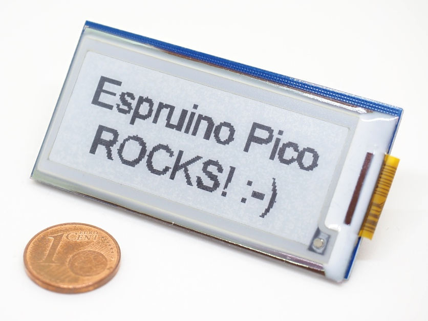

<!--- Copyright (c) 2016 Michael Pralow http://programmicha.de/. See the file LICENSE for copying permission. -->
SSD1606 e-Paper display driver
======================

<span style="color:red">:warning: **Please view the correctly rendered version of this page at https://www.espruino.com/SSD1606. Links, lists, videos, search, and other features will not work correctly when viewed on GitHub** :warning:</span>

* KEYWORDS: Module,SPI,Graphics,Graphics Driver,e-Paper,e-Ink,Monochrome,Grayscale



[SSD1606](http://www.solomon-systech.com/en/product/advanced-display/Dot-Matrix_Bistable_Display/ssd1606/) SSD1606 is a CMOS active matrix bistable display driver with controller, that can support a maximum display resolution 128x180. It is used e.g. with [e-paper or e-ink displays](https://en.wikipedia.org/wiki/Electronic_paper) like the [GDE021A1](http://smart-prototyping.com/E-ink-E-paper-new-version-display-module-3.3V-2.04-inch-177x72.html) (shown above) with a resolution of 177x72.

Because of the needed power supply with 2.4 to 3.3V and a typical operating current of 8mA, it is a perfect match for the [Espruino Pico](http://www.espruino.com/Pico). You can even drive it from one of the GPIO pins (they provide up to 20mA current).

Functionality is provided by the [[SSD1606.js]] module, using the [Graphics](http://www.espruino.com/Graphics) library.

Notes
-------

* The display can be read perfectly in harsh sunlight, but has no backlighting.
* E-paper displays are not known for fast refresh cycles.
* E-paper displays need only power for updating the display, not for keeping it up.

Wiring Up
--------

The bare display and controller module needs to be connected with a 24pin FPC connector with 0.5mm pitch and an additional driving circuit. There are rather huge and expensive ready to use development boards available from the display manufacturer. You can even try to build the minimum circuit yourself, e.g. like [Jaroslav Sýkora](http://www.jsykora.info/2014/05/attempt-at-soldering-an-fpc-connector-with-0-5mm-pitch-and-a-prototyping-pcb-design/) did.

The following infos apply only to the connection between SSD1606 and a microcontroller, ignoring the driving circuit.

### Pin overview

| SSD1606 | Notes |
|---------|-------|
| GND     | Ground |
| SDA     | SPI mosi pin. The SSD1606 provides no miso pin. |
| SCL     | SPI Clock pin |
| CS1     | Chip select pin, is used to prepare the SSD1606 to receive data over SPI. Pull High before you send data over SPI. |
| D/C     | Data/Command control pin, is used to prepare the SSD1606 to receive either commands (pulled LOW) or data (pulled HIGH) over SPI. |
| Res     | Hardware Reset pin, pull LOW to reset the SSD1606. |
| BU      | This pin is Busy state output pin When Busy is High, the operation of the chip should not be interrupted, command should not be sent. |
| BS1     | Pin for selecting SPI wire mode, pull LOW for 4-wire mode and HIGH for 3-wire mode. |
| 3.3v    | Power pin. |


The SSD1606 provides two types of [SPI](https://en.wikipedia.org/wiki/Serial_Peripheral_Interface_Bus) interface modes, but the module supports 4-wire mode only.

### SPI-Mode 4-wire

In 4-wire mode you need to set the D/C pin before each SPI send to signal either a command or data will be send. The module takes care of that for you.

### Wiring example for SPI 4-wire mode

| SSD1606 |  Espruino Pico | Notes |
|---------|----------------|-------|
| GND     | GND            |       |
| SDA     | B5             | B5 is SPI-1 mosi on Espruino Pico, you can also use SPI-2 or SPI-3. |
| SCL     | B3             | B3 is SPI-1 clock on Espruino Pico, you can also use SPI-2 or SPI-3. |
| CS1     | B6             | You can use any of the GPIO pins on the Espruino Pico. |
| D/C     | B7             | You can use any of the GPIO pins on the Espruino Pico. |
| Res     | A5             | You can use any of the GPIO pins on the Espruino Pico. |
| BU      | A8             | You can use any of the GPIO pins on the Espruino Pico. |
| BS1     | A6             | You can use any of the GPIO pins on the Espruino Pico or connect it to either GND or 3.3v. |
| 3.3v    | A7            | You can use any of the GPIO pins on the Espruino Pico to have full control or connect it to 3.3v.|

Software
-------

### Example

```
// per default turn display off
digitalWrite(A7, LOW);

// run following code onInit
E.on('init', function() {
  // SPI configuration
  var spi = SPI1;
  spi.setup({
    mosi: B5,
    sck:  B3
  });
  // create display instance
  var display = require('SSD1606').connect({
    displayType: 'GDE021A1',
    spi        : spi,
    cs1Pin     : B6,
    dcPin      : B7,
    resetPin   : A5,
    busyPin    : A8,
    bs1Pin     : A6, // optional, but if not provided, you need to set the correct SPI mode 4-wire by yourself
    powerPin   : A7  // optional, just do not use the on() or off() function if you do not provide it
  });
  // activate the power to run the display, just a comfort function,
  // you can control the power by yourself as well
  display.on();
  display.hwReset(function(){
    display.init(
      function(err){
        // (optional) fill the internal buffer for all pixels with color white,
        // without this the default color will be black
        display.g.clear(0xFF);
        // not optional - rotate the display x and y coordinates 90 degrees to the right
        display.g.setRotation(1);
        // from here it shows the normal usage
        // set color black for subsequent uses
        display.g.setColor(0x00);
        // set fontsize, see Graphics and Fonts modules for further options
        display.g.setFontVector(20);
        display.g.drawString('Hello World!', 22, 22);
        // from here it shows the needed part
        // (needed) copy internal buffer to display buffer
        display.g.flip();
        // run the display update
        display.refreshScreen(function(err){
          // do whatever you like here, e.g. turn it off when the update is done
          // again just a comfort function
          display.off();
        });
      },
      // clearScreenColor is optional, but prevents e-paper ghosting
      // shadow of an image may be visible after refreshing (only) parts of the screen
      { clearScreenColor: 0x00 }
    );
  });
});
```

**This code will only start after sending it to the Pico and run the save(); command on the left side of web ide.**

### Double Buffer

This module uses a double buffer, which means **you need to call ```display.g.flip()``` before any changes take effect**.

### Rotation

The software example uses ```display.g.setRotation(1);``` which is needed for a proper function at least for the GDE021A1 display.

It might be possible to work around this with fiddling around with the gate scanning mechanism (see specification).
Right now this seems to be the easiest solution.

### Colors

#### Default background color

The [Graphics](http://www.espruino.com/Graphics) library is used with a [buffer](http://www.espruino.com/Reference#l_Graphics_createArrayBuffer) in this module.
Per default all pixels in this buffer have their color set to ```0```. For the SSD1606 this means ```black```. To adjust the buffer default values, a ```clear(color)``` function is provided, use as:

```
 display.hwReset(function(){
    display.init(function(err){
      // fill the internal buffer for all pixels with one color
      display.g.clear(0xFF);

      // copy internal buffer to display buffer
      display.g.flip();

      // run the display update
      display.refreshScreen(function(err){
        // and turn it off when the update is done
        display.off();
      });
    });
  });
```

#### Color values

| Color      |  Values for using with ```clear()```               | Values for using with setColor() or for for the ```clearScreenColor``` option |
|------------|----------------------------------------------|------------------------------------------------------------------|
| white      | decimal ```255```, or hexadecimal ```0xFF``` | decimal ```3``` or hexadecimal ```0x03``` |
| light grey | decimal ```85```, or hexadecimal ```0xAA```  | decimal ```2``` or hexadecimal ```0x02``` |
| dark grey  | decimal ```255```, or hexadecimal ```0x55``` | decimal ```1``` or hexadecimal ```0x01``` |
| black      | decimal ```0```, or hexadecimal ```0x00```   | decimal ```0``` or hexadecimal ```0x00``` |

#### Pixel Colors under the hood

The display works with an internal ram which maps 1 Byte to 4 Pixels.

|Pixel 1|Pixel 2|Pixel 3|Pixel 4|
|-------|-------|-------|-------|
|Bit 7-6|Bit 5-4|Bit 3-2|Bit 1-0|

This reverse order of pixels to concrete bits is taken care of by the module with a suitable Graphics configuration.

```
Graphics.createArrayBuffer(
            displaySizeX,
            displaySizeY,
            bpp,
            {msb: true} // this does the magic for the reverse part
);
```

The ```clear()``` function works with setting a complete byte for 4 pixels at once. All other function set individual pixels.

### Pin Configurations

For the module to work you need to provide:

* ```displayType```, right now only ```GDE021A1``` is supported
* ```resetPin```
* ```dcPin```
* ```busyPin```
* ```cs1Pin```
* a configured [SPI](http://www.espruino.com/Reference#SPI) without miso pin.

#### Notes on the optional power pin

If you do not provide a power pin, the ```on();``` and ```off();``` functions do not work.

#### Notes for the optional bs1 pin

The module can set the SPI wire mode independently for you, just provide the ```BS1``` pin.

Example with provided ```BS1``` pin:

```
  var display = require('SSD1606').connect({
    // other configurations
    dcPin      : a Espruino GPIO pin,
    bs1Pin     : a Espruino GPIO pin
  });
```

Example without provided ```BS1``` pin, ```D/C``` pin is still needed:

```
  var display = require('SSD1606').connect({
    // other configurations
    dcPin      : a Espruino GPIO pin
  });
```

### Display Configuration

This module needs a concrete display configuration. For the GDE021A1 display the configuration is provided, just set the proper display type as ```GDE021A1```.

```
  var display = require('SSD1606').connect({
    displayType: 'GDE021A1',
    ... other configrations
  });
```

If you want to use another display, you can provide its configuration with:

```
  var display = require('SSD1606').connect({
    display: {
      bpp               : 1 or 2,
      displaySizeX      : up to 128,
      displaySizeY      : up to 180,
      lutRegisterData   : new Uint8Array([LUT Register data 90 bytes provided by display manufacturer]),
      maxScreenBytes    : up to 5580,
      ramXStartAddress  : 0x00,
      ramXEndAddress    : adequate for displaySizeX,
      ramYStartAddress  : 0x00,
      ramYEndAddress    : adequate for displaySizeY
    },
    ... other configrations
  });
```

It would be really nice if you provide configurations for other displays to all module users, either with creating a pull request(see [writing or changing Modules](http://www.espruino.com/Writing+Modules)) or posting to the [Espruino Forum for Interfacing](http://forum.espruino.com/microcosms/112/).

### Optional Configurations

Different displays might need different times for refreshing the display and for the hardware reset. You can overwrite the defaults (right now 100ms each).

```
  var display = require('SSD1606').connect({
    ... the other config
    clearScreenTimeOut: time in ms,
    hardwareResetTimeOut: time in ms
  });
```

### Further Informations

* All SSD1606 commands are documented inside the module, look for the documentation on the ```sc``` function.
* Specification for the usage of the busy pin differ between GDE021A1 and SSD1606 documents. The Javascript module is modelled after the SSD1606 spefication.

Using
-----

* APPEND_USES: SSD1606

Buying
-----

The display and controller combinations are avaible on many online shops, e.g. [ebay.com](http://www.ebay.com/sch/i.html?_nkw=GDE021A1).

For the GDE021A1 ready to use modules including the driving circuit are available at:

* [tindie.com](https://www.tindie.com/products/alexchu/e-ink-e-paper-new-version-display-module-33v-204/)
* [smart-prototyping](http://smart-prototyping.com/E-ink-E-paper-display-IPS-2.04-inch-GDE021A1-172x72.html)

Note for german users: be aware of customs charges.

Reference
---------

* APPEND_JSDOC: SSD1606.js
