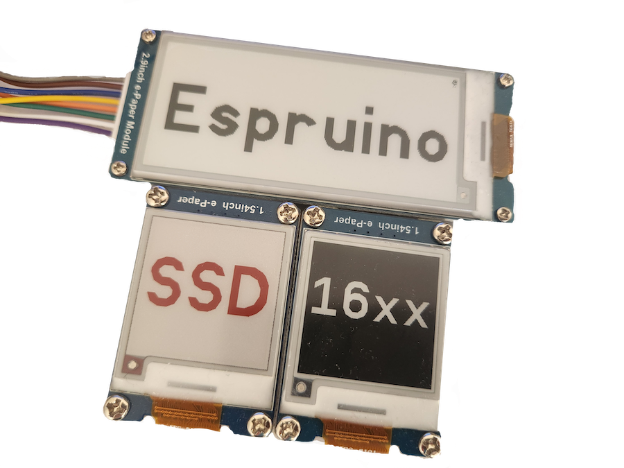

<!--- Copyright (c) 2023 Brenden Adamczak Mozilla Public License Version 2.0 -->
SSD16XX e-Paper display driver
======================

<span style="color:red">:warning: **Please view the correctly rendered version of this page at https://www.espruino.com/SSD16XX. Links, lists, videos, search, and other features will not work correctly when viewed on GitHub** :warning:</span>

* KEYWORDS: Module,SPI,Graphics,Graphics Driver,e-Paper,e-Ink,epaper,eink,Monochrome,Grayscale



E-ink display with a display driver of SSD16XX (Ex - SSD1681) are a family of similar controller set with different properties.  Some with color options or with the ability to do partial refreshes.  

Tested with
* SSD1681 (W)(C)

Functionality is provided by the [[SSD16XX.js]] module, using the [Graphics](http://www.espruino.com/Graphics) library.

Notes
-------

* The display can be read perfectly in harsh sunlight, but has no back lighting.
* E-paper displays are not known for fast refresh cycles.
* E-paper displays need only power for updating the display, not for keeping it up.

Wiring Up
--------

The bare display and controller module needs to be connected with a 24pin FPC connector with 0.5mm pitch and an additional driving circuit. There are rather huge and expensive ready to use development boards available from the display manufacturer. You can even try to build the minimum circuit yourself, e.g. like [Jaroslav Sýkora](http://www.jsykora.info/2014/05/attempt-at-soldering-an-fpc-connector-with-0-5mm-pitch-and-a-prototyping-pcb-design/) did.

The following infos apply only to the connection between a common display and a microcontroller, ignoring the driving circuit.

### Pin overview

| SSD16XX | Notes |
|---------|-------|
| GND     | Ground |
| SDA     | SPI mosi pin. The SSD16XX provides no miso pin. |
| SCL     | SPI Clock pin |
| CS1     | Chip select pin, is used to prepare the SSD16XX to receive data over SPI. Pull High before you send data over SPI. |
| D/C     | Data/Command control pin, is used to prepare the SSD16XX to receive either commands (pulled LOW) or data (pulled HIGH) over SPI. |
| Res     | Hardware Reset pin, pull LOW to reset the SSD16XX. |
| BU      | This pin is Busy state output pin When Busy is High, the operation of the chip should not be interrupted, command should not be sent. |
| BS1     | Pin for selecting SPI wire mode, pull LOW for 4-wire mode and HIGH for 3-wire mode. |
| 3.3v    | Power pin. |


The SSD16XX provides two types of [SPI](https://en.wikipedia.org/wiki/Serial_Peripheral_Interface_Bus) interface modes, but the module supports 4-wire mode only.

### SPI-Mode 4-wire

In 4-wire mode you need to set the D/C pin before each SPI send to signal either a command or data will be send. The module takes care of that for you.

### Wiring example for SPI 4-wire mode

| SSD16XX |  Espruino Pico | Notes |
|---------|----------------|-------|
| GND     | GND            |       |
| SDA     | B5             | B5 is SPI-1 mosi on Espruino Pico, you can also use SPI-2 or SPI-3. |
| SCL     | B3             | B3 is SPI-1 clock on Espruino Pico, you can also use SPI-2 or SPI-3. |
| CS1     | B6             | You can use any of the GPIO pins on the Espruino Pico. |
| D/C     | B7             | You can use any of the GPIO pins on the Espruino Pico. |
| Res     | A5             | You can use any of the GPIO pins on the Espruino Pico. |
| BU      | A8             | You can use any of the GPIO pins on the Espruino Pico. |
| BS1     | A6             | You can use any of the GPIO pins on the Espruino Pico or connect it to either GND or 3.3v. |
| 3.3v    | A7            | You can use any of the GPIO pins on the Espruino Pico to have full control or connect it to 3.3v.|

Software
-------

### Example

```
//Example using a Nordict NRF52840DK 
var screen = require("SSD16XX");

var sck  = D47;
var mosi = D45;
SPI1.setup({mosi:mosi, sck:sck, baud: 4000000,order:'msb', bits:8});

var cs   = D44;
var busyPin = D43;
var dcPin = D42; //Data/Command
var resetPin = D40;

var screenSettings  = {
  display: {
    bpp : 1,
    displaySizeX      : 200,
    displaySizeY      : 200,
    coloredDisplay    : 1
  },
  spi: SPI1,
  csPin: D44,
  busyPin: D43,
  dcPin: D42,
  resetPin: D40
};

console.log("[Program started]");

screen.fullReset().then(() => {
  console.log("[screen init]");
  return screen.init();
}).then(() => {
  screen.g.clear(0x00);
  screen.g.cw.setFontVector(100);
  screen.g.cw.setColor(1).drawString("1",75,50);
  console.log("drawing a one");
  return screen.g.flip();
}).then(()=>{
  console.log("[got here 2]");
  screen.g.clear(0x00);
  screen.g.cw.setFontVector(100);
  screen.g.cw.setColor(1).drawString("2",75,50);
  console.log("[drawing a two]");
  return screen.g.flip();
}).then(()=>{
  console.log("done");
  screen.sleep();
})

```

**This code will only start after sending it to your device and run the save(); command on the left side of web ide.**

### Double Buffer

This module uses a double buffer, which means **you need to call ```display.g.flip()``` before any changes take effect**.

### Rotation

You can rotate the display with  ```display.g.setRotation(1);```.

It might be possible to work around this with fiddling around with the gate scanning mechanism (see specification).
Right now this seems to be the easiest solution.

### Fast refresh rate.

When you enable ```display.setFastRefresh()``` the display will only change the changed pixels.  Instead of going through then entire refresh cycle.  This will increase the displays refresh rate, but might cause burn into the display.  So its recommended to do a ```setFullRefresh``` to fully reset the display pixels.  But if you do this. You'll have to use this ```SetFastRefresh``` to make the display only refresh partially.  

### Colors

#### Default background color

The [Graphics](http://www.espruino.com/Graphics) library is used with a [buffer](http://www.espruino.com/Reference#l_Graphics_createArrayBuffer) in this module.
Per default all pixels in this buffer have their color set to ```0```. For the SSD1606 this means ```black```. To adjust the buffer default values, a ```clear(color)``` function is provided, use as:


#### Color black and white displays

| Color B/W  |  Values for using with ```clear()```         | Values for using with setColor()  |
|------------|----------------------------------------------|------------------------------------------------------------------|
| white      | decimal ```255```, or hexadecimal ```0xFF``` | decimal ```1``` or hexadecimal ```0x01``` |
| black      | decimal ```0```, or hexadecimal ```0x00```   | decimal ```0``` or hexadecimal ```0x00``` |

#### Color black and white and color (Red or Yellow) displays

| Color Red/Yellow  |  Values for using with ```clear()```         | Values for using with setColor() |
|------------|----------------------------------------------|------------------------------------------------------------------|
|red decimal |```255```, or hexadecimal ```0xFF``` | decimal ```1``` or hexadecimal ```0x01``` |
|white/black | decimal ```0```, or hexadecimal ```0x00```   | decimal ```0``` or hexadecimal ```0x00``` |

#### Pixel Colors under the hood
The way color is handle is with black and white is with a single buffer, but to have color it requires 2 buffers.  One for black and white and one that either enables or disables the given (red/yellow) color in that given pixel.  Its structured this way because thats how hardware registers hold the data.  

The reverse order of pixels to concrete bits is taken care of by the module with a suitable Graphics configuration.

```
Graphics.createArrayBuffer(
            displaySizeX,
            displaySizeY,
            bpp,
            {msb: true} // this does the magic for the reverse part
);
```

The ```clear()``` function works with setting a complete byte for 4 pixels at once. All other function set individual pixels.

### Pin Configurations

For the module to work you need to provide:

* ```resetPin```
* ```dcPin```
* ```busyPin```
* ```csPin```
* a configured [SPI](http://www.espruino.com/Reference#SPI) without miso pin.

#### Notes on the optional power pin

If you do not provide a power pin, the ```on();``` and ```off();``` functions do not work.

#### Notes for the optional bs1 pin

The module can set the SPI wire mode independently for you, just provide the ```BS1``` pin.

Example with provided ```BS1``` pin:

```
  var display = require('SSD16XX').connect({
    // other configurations
    dcPin      : a Espruino GPIO pin,
    bs1Pin     : a Espruino GPIO pin
  });
```

Example without provided ```BS1``` pin, ```D/C``` pin is still needed:

```
  var display = require('SSD16XX').connect({
    // other configurations
    dcPin      : a Espruino GPIO pin
  });
```

### Display Configuration

This module needs a concrete display configuration.

If you want to use another display, you can provide its configuration with:

```
  var display = require('SSD16XX').connect({
    display: {
      bpp               : 1 or 2 or 4,
      displaySizeX      : int,
      displaySizeY      : int,
      lutRegisterData   : new Uint8Array(),
      coloredDisplay    : boolean
    },
    ... other configurations
  });
```


Developing notes - helpful resources
-----
* [How e-ink displays work](https://www.youtube.com/watch?v=MsbiO8EAsGw)
* [code inspired](https://www.espruino.com/SSD1606)
* [c driver](https://github.com/samuelleeuwenburg/ssd1608-driver/blob/main/ssd1608.c)
* [waveshare doc](https://www.waveshare.com/wiki/1.54inch_e-Paper_Module_Manual#Introduction)
* [forum where this driver started](https://forum.espruino.com/conversations/391901/)


Reference
---------

* APPEND_JSDOC: SSD16XX.js
