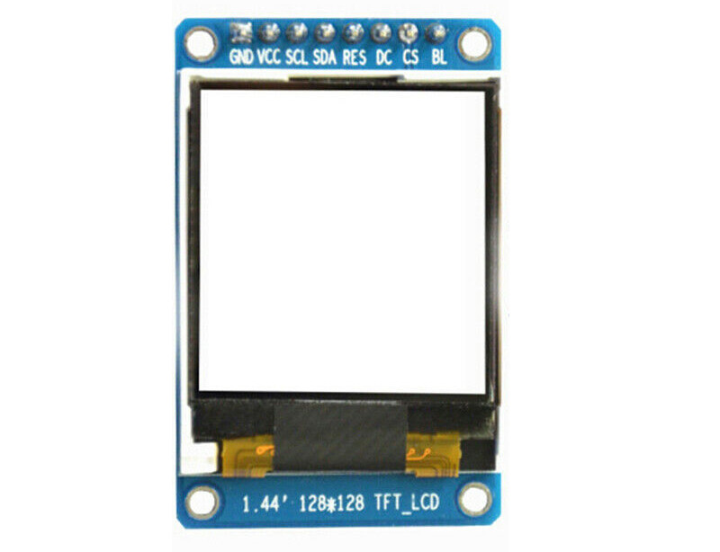

<!--- Copyright (c) 2013 Gordon Williams, Pur3 Ltd. See the file LICENSE for copying permission. -->
ST7735 LCD controller
===================

<span style="color:red">:warning: **Please view the correctly rendered version of this page at https://www.espruino.com/ST7735. Links, lists, videos, search, and other features will not work correctly when viewed on GitHub** :warning:</span>

* KEYWORDS: Module,SPI,ST7735,ST7735R,Graphics,Graphics Driver,LCD,Color,Colour,128x128,128x160



This is an extremely common LCD controller for 128x128 and 128x160 LCDs. These are available cheaply from various suppliers online.

Support is included in the [[ST7735.js]] module, using the [[Graphics]] library.

Just wire up as follows:

| LCD pin | Example pin |
|---------|----------|
| VCC   | 3.3 |
| GND   | GND |
| CS/CE | D15 |
| RST   | D2 |
| A0/DC | D21 |
| SDA   | D19  |
| SCL   | D18  |
| LED   | D5 |

**Note:** In the example, software SPI is used - you can wire up to *any*
data pins on Espruino that you want to as long as you update the pins
in the code below.

**Note:** The display takes around 200ms to initialise after calling 'connect'. 
There's an optional callback that is called after this time (shown in the examples). 
Sending data to it before initialisation may cause it not to initialise correctly.


Different Configurations
------------------------

ST7735 displays come in a few different types. Depending on your display you may need 
to uncomment some of the options to `require("ST7735").connect` shown in the example below.

* If your screen is 160px high, not 128px, use `height : 160`
* If the very top left and top right pixels aren't shown, use `padx : 2, pady : 3`


Paletted Mode
-------------

```JS
D5.set(); // Backlight On
var colorPalette = new Uint16Array([0, 0xF80F, 0x001F, 0xFFFF]);
var spi = new SPI();
spi.setup({mosi:D19 /* sda */, sck:D18 /* scl */});
var g = require("ST7735").connect({
  palette:colorPalette,
  spi:spi,
  dc:D21,
  cs:D15,
  rst:D2,
  // height : 160 // optional, default=128
  // padx : 2 // optional, default=0
  // pady : 3 // optional, default=0
}, function() {
  g.clear();
  g.setColor(3);
  g.drawString("Hello",0,0);
  g.setFontVector(20);
  g.setColor(1);
  g.drawString("Espruino",0,10);
  g.setColor(2);
  g.drawString("Espruino",0,40);
  g.flip(); //<--- Send to the display
});
```

As there isn't enough RAM to store full 16 bit pixels of the LCD display in Espruino's RAM, this module stores a paletted version of the data. For instance if you only need 4 colours, these can be stored as 2 bits per pixel rather than 16. The buffer then takes `128 * 128 / 4 = 4096 bytes` which will fit into the available RAM.

This means that all drawing functions can be done much more quickly offscreen, and then the LCD can be updated in one go (removing flicker).

The palette can be either 1, 2, 4 or 8 bits - so the array should be either 2, 4, 16 or 256 elements. Then, when you use `setColor`, the number you supply corresponds to that array element in the palette array.


Hardware SPI
------------
Using hardware SPI can speed up the time it takes to flip the screen content.

```JS
SPI1.setup({mosi:D19 /* sda */, sck:D18 /* scl */, baud:20000000}); // Setup HW SPI1 with 20MHz

var colorPalette = new Uint16Array([0, 0xF80F, 0x001F, 0xFFFF]);
var g = require("ST7735").connect({
  palette:colorPalette,
  spi:SPI1, // Use the HW SPI1
  dc:D21,
  cs:D15,
  rst:D2,
  // height : 160 // optional, default=128
  // padx : 2 // optional, default=0
  // pady : 3 // optional, default=0
}, function() {
  g.clear();
  g.setColor(3);
  g.drawString("Hello",0,0);
  g.flip(); //<--- Send to the display
});
```


Using
-----

* APPEND_USES: ST7735

Buying
-----

* [eBay](http://www.ebay.com/sch/i.html?_nkw=ST7735)
