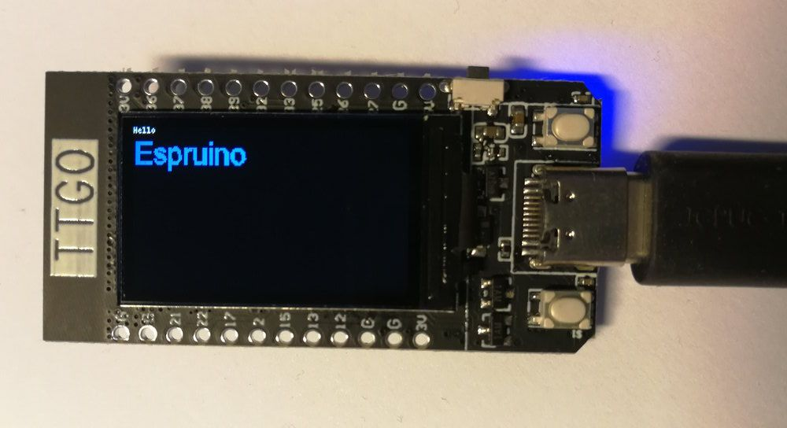

<!--- Copyright (c) 2013 Gordon Williams, Pur3 Ltd. See the file LICENSE for copying permission. -->
ST7789 LCD controller
=====================

<span style="color:red">:warning: **Please view the correctly rendered version of this page at https://www.espruino.com/ST7789. Links, lists, videos, search, and other features will not work correctly when viewed on GitHub** :warning:</span>


* KEYWORDS: Module,SPI,ST7789,Graphics,Graphics Driver,LCD,Color,Colour,135x240,135*240,TTGO,T-Display,TTGO T-Display



This is a driver for ST7789 LCD controller for 135x240 LCDs. These are available on [TTGO's T-Display boards](https://github.com/Xinyuan-LilyGO/TTGO-T-Display). Note: Different resolution might need different memory offset to work properly.

Support is included in the [[ST7789.js]] module, using the [[Graphics]] library.

It's already wired up on the T-Display board as follows:

| LCD pin  | Pin type | Example pin on TTGO T-Display / remark |
|----------|----------|----------------------------------------|
| VCC      | Power    | Already connected to 3.3v              |
| GND      | Power    | Already connected to GND               |
| TFT_MISO | GPIO     | N/A                                    |
| TFT_MOSI | GPIO     | D19                                    |
| TFT_SCLK | GPIO     | D18                                    |
| TFT_CS   | GPIO     | D5                                     |
| TFT_DC   | GPIO     | D16                                    |
| TFT_RST  | GPIO     | D23                                    |
| TFT_BL   | GPIO     | D4, LCD backlight, consumes ~7mA       |


**Note:** The display takes around 150ms to initialise after calling 'connect'. There's an optional callback that is called after this time (shown in the examples). Sending data to it before initialisation may cause it not to initialise correctly.


Normal mode
-----------

```
// ST7789 demo code on TTGO T-Display
D4.set(); // LCD backlight on

var spi = new SPI();
spi.setup({mosi:D19 /* sda */, sck:D18 /* scl */});
var g = require("ST7789").connect(spi, D16 /* DC */, D5 /* CE */, D23 /* RST */, function() {
  g.clear();
  g.setRotation(1);
  g.drawString("Hello",0,0);
  g.setFontVector(20);
  g.setColor(0,0.5,1);
  g.drawString("Espruino",0,10);
});
```

This module doesn't use a double-buffer as it would use up almost all the RAM - `135 * 240 * 16bpp = 64800 bytes`. Pixels are written to the display as they are drawn, so you will get some flicker and relatively slow updates. See the next heading for another option

Paletted Mode
-------------
Paletted mode is not yet supported

Using 
-----

* APPEND_USES: ST7789

Buying
-----

* [eBay ST7789 135x240](http://www.ebay.com/sch/i.html?_nkw=ST7789+135x240)
* [eBay TTGO T-Display](http://www.ebay.com/sch/i.html?_nkw=TTGO+T-Display)

