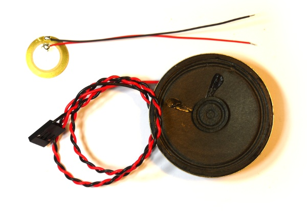
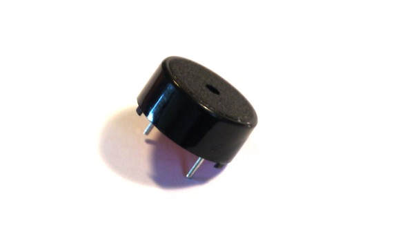

<!--- Copyright (c) 2013 Gordon Williams, Pur3 Ltd. See the file LICENSE for copying permission. -->
Speaker
=======

:warning: **Please view the correctly rendered version of this page at https://www.espruino.com/Speaker. Links, lists, videos, search, and other features will not work correctly when viewed on GitHub** :warning:

* KEYWORDS: Speaker,Sound,Buzzer,Audio,Piezo

Espruino can either output square waves using [[PWM]], or low sample rate can be output using the [[Waveform]] class.

To use a speaker with Espruino you'll have to connect it to pins marked with [[PWM]] or [[DAC]].

Useful sources of speakers are:

* Inside old Personal Computers. They usually also come with a wire and a [[Pin Strip]] connector attached, and look like the larger speaker in the picture above.
* Musical Christmas cards have a small piezoelectric speaker inside them that looks like the small gold disc above. This won't be very loud.
* Old headphones can also be a good source

Please bear in mind that Espruino can supply only 20mA at 3.3v on its outputs, so you shouldn't attach a huge speaker to it!

Using 
-----

* APPEND_USES: Speaker
