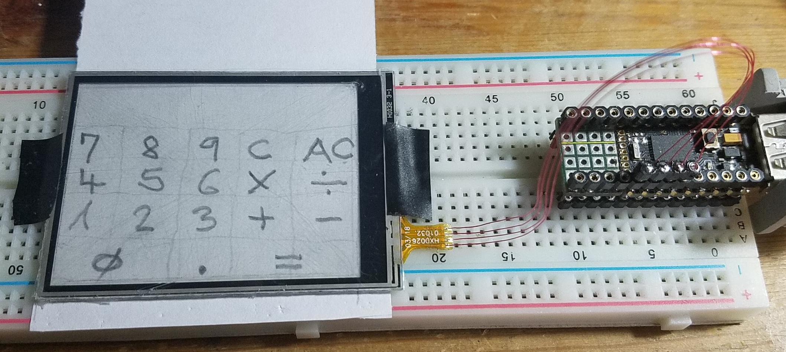
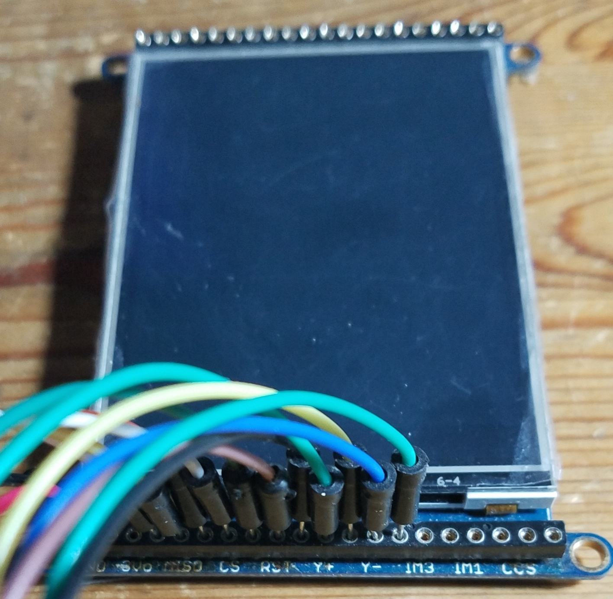

<!--- Copyright (c) 2018 allObjects / Pur3 Ltd. See the file LICENSE for copying permission. -->
Resistive Touchscreen Controller with Espruino
=================================================

<span style="color:red">:warning: **Please view the correctly rendered version of this page at https://www.espruino.com/TouchRD. Links, lists, videos, search, and other features will not work correctly when viewed on GitHub** :warning:</span>

* KEYWORDS: UI,LCD,display,resistive,touch,screen,touchscreen,controller,Graphics,ILI9341,ADS7843,XPT2046

Overview
------------------

This [[TouchRD.js]] module makes Espruino the controller for resistive touchscreens that do *NOT* have
a built-in controller, such as [ADS7843](/ADS7843) or XPT2046. The module supports standalone resistive touch screens
as well as resistive touch screens mounted on displays.

Resistive Touch Screen only application as key pad input device for a simple calculator:



Resistive Touch Screen as part of a TFT display:



The implementation allows to have multiple, independent, simultaneously operating controllers (Every
`new TouchRD(...)` returns a new instance). Configuration / calibration can happen on creation and while
running, including change of callback to allow the application to implement a runtime calibration function
as well as different callbacks.

A resistive touchscreen exposes four (4) leads which are usually labeled Y-, X-, Y+, X+. The leads can be
wired up directly to four (4) pins. At least two (2) of the four (4) pins have to be ADC pins - pins that
can read analog values. One ADC pin has to be connected to either Y- or Y+, and one to either X- or X+.

While X- and X+ are powered with 0V (GND) and 3.3V with two pins in auto output mode, voltage on Y- or Y+
is read with an ADC pin in input-pulldown mode. The fourth pin has to be in plain input mode in order to not
interfere with ADC reading. For Espruino, the [analog value read is between 0 and 1](https://www.espruino.com/ADC)
and is proportional to the touch position on the x-axis of the touch screen (and the display). Powering Y-
and Y+ and reading X- or X+ provides the value for the y-axis.

Sketch of Top Portrait view of a 2.6" Touch Screen w/ YUp, XLeft, YDown and XRight edge drive and sense
lines with film connector cable ([datasheet ER-TP026-1](/datasheets/ER-TP026-1_Drawing.pdf) of [BuyDisplay.com
by EastRising](https://www.buydisplay.com/default/2-6-inch-4-wire-resistive-touch-panel-screen)).

```
`
.........................................
:.------------------------------------  :
:| . 0/0 X/Y       YUp                 .:
:| | origin                            |:
:| |              width:               |:
:| |      over all:  [45.60]           |:
:| |     window + 2.50+40.60+2.50      |:
:| |      borders left and right       |:
:| |                                   |:
:| | XLeft                      XRight |:
:| |                                   |:
:| |                 border top: 2.05+ |:
:| |    height over all: [63.45] 53.91 |:
:| |                 border bot: +7.49 |:
:| |             at bottom additional  |:
:| |                Porch non-   3.65: |:
:| |                window     (57.60) |:
:| |                           (+3.73) |:
:| |                                   |:
:| |           thick: 1.1              |:
:| |                                   |:
:| | XXXXXXXXXXXXXXXXXXXXXXXXXXXXXXXXX |:
:| | XXXXXXXXXXXX  PORCH  XXXXXXXXXXXX |:
:| | XXXXXXXXXXXXXXXXXXXXXXXXXXXXXXXXX |:
:| | -------+------------------------- |:
:| '-----.  |    YDown                 |:
:'----.  |  |  .-----------------------':
'''\''|''|''|''|''/''''''''''''''''''''''
    \_|  |  |  |_/
      |  |  |  |
      |  |  |  |
      |  |  |  |
      |  |  |  |
      |  |  |  |
      1  2  3  4  <--- pin#, pitch: 1.15[0.05"]
      YU XL YD XR <--- symbol (edge of screen)
      Y- X- Y+ X+ <--- x/y coord, +/- ends
      A5 A6 A7 B1 <--- Pico ADC pins 2.54(0.1")
      A0 A1 A2 A3                   1.27(0.05")
      A1 A2 A3 A4                   1.27(0.05")
`
```

The basic formulas for calculating the x and y touch coordinates from the read analog value are (simplified):

```
var x = Math.floor(xAxisValue * xAxisScreenPixels); // 0..239 (0..X-1)
var y = Math.floor(yAxisValue * yAxisScreenPixels); // 0..319 (0..Y-1)
```

The actual formulas used to calculate accurate touch coordinates are a bit more complex and use values from
center touch as base, rather than 0/0. This applies to touch screen only as well to displays with touch screen,
because for latter the size and position of most touch screen do not always exactly match those of the display
and the minimumb and maximum values read are not exactly 0.000 and 1.000

For touch screen only use, gathering the calibration values for (custom) configuration is relatively simple:

 - while connected to the IDE:
   - upload the touch-screen-only calibration application in calibrate mode
   - perform four (4) touch down in the center with moving into each corner of the screen for untouch
   - transfer suggest values displayed in the console into the provided basic configuration
   - uploadi the touch-screen-only calibration application in non-calibration mode
   - validate touch coordinates by touch donws and moving into the cornersk, along and over all for edges
     of the screen

For display with touch screen display, gather calibration data from touching markers displayed at known display
coordinates.

Rough calibration values can be calculated from values obtained from touching two (2) markers of known position
diagonally displayed (near) minimum and (near) maximum for both x and y axis. To balance out non-linearities,
it is best to take averages from values per pixel and offsets obtained and calculated from combinations of two
of markers in all corners and in the center of the display.

When the touch screen area overlaps the display area - touch screen has porches - and the configuration for
minimum (lowest) and maximum (highest) permits returning x and y coordinates outside of the display, then the
application configuration has to catch the display limits and process outliers differently. Even though the
porches do not map to the display, they are sensitive and can be used as fixed buttons Some screens have even
symbos / icons printed on them for that purpose, such as mail, calendar, music, home, escape, etc. icons. To
enable porches, configuration has to allow for the extra Y or X values. See Configuration section.

For more details about how a resistive touch screen is built and works and how they can be calibrated, see forum
conversation at [Resistive Touchscreen directly (no touch controller)](http://forum.espruino.com/conversations/256122/).


Wiring Up
-------------------

Example for wiring up Espruino Pico.

| Touchscreen | Espruino | Connect | Comment                                          |
|--------|----------|---------|-------------------------------------------------------|
| Y-     | A5       | yn      | matches 1st argument/pin in connect, MUST be ADC pin  |
| X-     | A6       | xn      | matches 2nd argument/pin in connect, MUST be ADC pin  |
| Y+     | A7       | yp      |                                                       |
| X+     | B1       | xp      |                                                       |

*Note that pins passed as 1st and 2nd argument in constructor `TouchRD(...)` have to be an ADC (Analog to Digital
Converter) pin, no matter what board is used. The touch controller module uses them in the analogRead(adcPin)
function. Luckily, Espruino boards have all sufficient ADC enabled pins, so wiring all to ADC enabled pins allows
to switch them around without concerns to achieve the desired 0/0 origin. Should it become and issue, then - in the
the module code - one or both of the `digitalWrite([pinB-,pinB+],1)`s that happen before the `analogRead(pinA-)`s -
have to change to `2` from `1` to change polarity and with that direction of one or both of the axis:*

```
  pinMode(_.yn,"input_pulldown"); // prep reading raw y
  pinMode(_.yp); _.yp.read();
  pinMode(_.xn); pinMode(_.xp);
  digitalWrite([_.xn,_.xp],1); // 1 xor 2 <--- defining polarity / direction of x-axis
  _.xr = (analogRead(_.yp)+analogRead(_.yp))/2;
  pinMode(_.xn,"input_pulldown"); // prep reading raw x
  _.xp.read();
  pinMode(_.yn);
  digitalWrite([_.yn,_.yp],1); // 1 xor 2 <--- defining polarity / direction of y-axis
  _.yr = (analogRead(_.xp)+analogRead(_.xp))/2;
  _.yn.read(); _.yn.read();
```


Usage
-------------------

This example uses the - module / class built-in configuration with default calibration for [adafruit's 2.8" TFT
LCD with (Resistive) Touchscreen Breakout Board w/MicroSD Socket - ILI9341](https://www.adafruit.com/products/1770)
in *Portrait format*. Even though built-in configuration is calibrated for specific display, it works pretty well
for all portrait with 3:4 ratio format with porch at the bottom.

*Note: when you plan to [save()](http://www.espruino.com/Reference#l__global_save) the code, overwrite the default
enabled configuration place the line with `.enable()` invocation into the `onInit() {...}` function to ensure reliable
start up upon power on.*

```
var touchRD = new (require("TouchRD"))(A5, A6, A7, B1, function(x,y,t) {
    if (x !== undefined) { // or simplified: if (t.t) { ...  // touching
      console.log(x,y);
    } else { // untouching
      console.log("up - last: ", t.x, t.y, "moved: ", t.moved());
    }
  },{en:false}); // placed in level 0 of the code uploaded
touchRD.enable(); // placed in onInit() function
```

For use in *Landscape format*, a simple reassignment for x and y as first thing in the callback does the trick:

```
var touchRD = new (require("TouchRD"))(A5, A6, A7, B1, function(x,y,t) {
    if (x !== undefined) { // or simplified: if (t.t) { ...  // touching
      x = t.y; y = t.X - t.x - 1; // Landscape, 90 degrees clockwise turned
      console.log(x,y);
    } else { // untouching
      x = t.y; y = t.X - t.x - 1; // Landscape, 90 degrees clockwise turned
      console.log("up - last: ", x, y, "moved: ", t.moved());
    }
  },{en:false}); // placed in level 0 of the code / executed on uploaded
touchRD.enable(); // placed in onInit() function
```

Reassignment of x and y values in callback for *Landscape format* wit a *Portrait format configuration* is a bit
a quick and dirty and has performance impact - especially on touch-move/drag. It is better to crate a *Landscap
format configuration* and pass it into the constructor at creation time combined with reversed pin argument list.

Configurations can be stored as modules as well and retrieved with, for example, `require("P240x320")`:

```
var touchRD = new (require("TouchRD"))(B1, function(x,y,t) {
    if (x !== undefined) { // or simplified: if (t.t) { ...  // touching
      console.log(x,y);
    } else { // untouching
      console.log("up - last: ", t.x, t.y, "moved: ", t.moved());
    }
  },require("P240x320"); // placed in level 0 of the code uploaded
touchRD.enable(); // placed in onInit() function
```


For *probing* use - when controller is in touching / tracking mode (t.t, !tourchRD.w - not watching for a touch
down) or *NOT* enabled (!touchRD.en). Probing can be done with or without using callback. Example shows probing
without callback.

```
if (touchRD.xy().t) {
   console.log("touch at: ",touchRD.x,touchRD.y); // ...code for touched
} else {
   console.log("untouched"); // ...code for untouched
}
```

*NOTE:* Probing while controller is enabled interferes with touch down watch - pin modes - and most likely create
        false touch events.


Configuration
-------------------

Touch Controller has has a default configuration bilt in that can be full or partially overwritten with  custom
configuration on construction.

The default configuration can be overridden by passing a configuration object *C* as the 6th argument in the
constructor. The configuration object can be built upfront and passed or provided inline. Latter is shown in code
example below (which also shows the default values the module comes with).

```
var touchRD = new (require("TouchRD"))( // can be placed in level 0
    A5 // yp / Y- - MUST be ADC enabled pin
  , A6 // xp / X- - MUST be ADC enbled pin
  , A7 // yn / Y+
  , B1 // xn / X+
  , function(x,y,t) { // callback cb
      if (x !== undefined) { // or: (t.t) // for touched
        console.log(x,y);
      } else {
        console.log("up");
    } }           // default C(onfig) overwriting custom config+
  , { X: 240      // x horizontal pixels / resolution (0 = left edge)
    , Y: 320      // y vertical   pixels / resolution (0 = top  edge)
    , xm: 3       // x moved threshold - abs(1st-last)>=xm means moved
    , ym: 3       // y moved threshold - abs(1st-last)>=ym means moved
    , xt: 0.0015  // x threshold analog value for touch detection
    , yt: 0.0012  // y threshold analog value for touch detection
    , xc: 0.4960  // x center analog value on touch
    , yc: 0.4795  // y center analog value on touch
    , xd: 0.00318 // x delta per pixel analog value
    , yd: 0.00251 // y delta per pixel analog value
    , ti: 100     // track interval in [ms] while touching
    , db: 5       // debounce on touch begin
    , en: false   // enabled (truthy) touch detection
    }
  );
touchRD.endable(); // usually placed in onInit() { ... } function
```

Use this code example override the values that need to be adjusted for the particular touch screen and display
at hand. Only the values that have to be overridden have to be provided as properties in the custom configuration
object. Merging of the configuration's properties in the controller are accomplished with a simple mixin by
looping through the configuration object's present properties controlled by the default configuration and
applying them to the controller.


API and bits of the implementation
------------------

Controller Constructor and Callback:

- `TouchRD(yn,xn,yp,xp,callback,customConfig)` returns a controller instance. The arguments are:
  - `yn, xn, yp, xp` pins connected to the leads of the resistive touch screen and become properties of the controller (same name)
  - `callback` a `function(x,y,touch)` invoked on a touch down, on configurable interval while touching and moving, of which the last occurrence is *the* 'untouch'. Untouch is detectable by `x === undefined`. `callback` becomes property of controller with abbreviated name `cb`. Callback arguments are:
    - `x, y` coordinates of touch point with `x === undefined` for 'untouch' for compatibility reasons with existing `Touchscreen` module.
    - `t` touchRD controller instance (useful to access other and internal touch controller properties and methods for manipulation and calibration in application on touch / drag / move / untouch events AND to test if (t.t) touched or untouched (!t.t). Properties and methods are (same as the default config properties, pins, and callback, plus some additional, very useful properties, such as last `.xf`, `.yf` and time `.td` of last touch down.

Controller value and function properties:     

- `.X`  x-axis / horizontal pixel # or resolution
- `.Y`  y-axis / vertical pixel # or resolution
- `.x`  x last x scanned / detected touch
- `.y`  y last y scanned / detected touch
- `.t`  touch state - true for touching, false for untouch
- `.td` touch down time (Espruino's getTime() at touch down detection with watch on xp pin
- `.xf` x of touch down (x first)
- `.yf` y of touch down (y first)
- `.en` touch detection enabled (or disabled)
- `.w`  watch id (truthy) when listening to next touch down (falsy when not enabled or while touching)
- `.X2` .X / 2 + 0.5 - if .x < .X2 touch is in left half else in right
- `.Y2` .Y / 2 + 0.5 - if .y < .Y2 touch is in upper half else in lower
- `.xr` last x raw analog read (0.000..1)
- `.yr` last y raw analog read (0.000..1)
- `.xm` x moved threshold - abs(1st-last)>=xm means moved
- `.ym` y moved threshold - abs(1st-last)>=ym means moved
- `.xt` x threshold analog value for touch detection
- `.yt` y threshold analog value for touch detection
- `.xc` x center analog value on touch
- `.yc` y center analog value on touch
- `.xd` x delta per pixel analog value
- `.yd` y delta per pixel analog value
- `.ti` track interval in [ms] while touching
- `.db` 5 debounce time in [ms] for touch down detection
- `.moved()` : returns true when x or y difference between touch down (firtst touch0 and last touch x or y
- `.enable()` or `.enable(truthy | falsy)` initiate listening to touch events when not listening (yet) on invocation with *no* or *truthy* argument, and stop listening to touch events with *falsy* argument.
- `.xy(callback)` can be directly used when controller is not listening to probe whether touching is going on or not. Properties are updated and can be queried. Callback is optional and works the same way as described above.

 *NOTE that some properties (`.w`, `.t`) should never be changed and pins (`yn`, `xn`, `yp`, `xp`) never be written to in order to keep touch controller state and state machine valid and working.*


Calibration of Touchscreen
------------------

General calibration is simple and delivers the custom configuration object. The custom configuration
object can the be copied into the application or stored as a module in modules folder of the sandbox.

When touching, apply some but not too much pressure. Use a touch pen or soft, non scratching and
rounded down pencil. You may see untouch in the console when coming close to the edges before you
reach your expected 'last' pixel. This is expected. Youy can press harder to go closer to the edges
but will overuse the touch screen, make dents into it, and shorten the touch screens life. The window
or active area of screens on displays usually overlap the display's active area and to reach the
'last' display pixel should be possible without getting an untouch.

On display, you can complement the calibration callback code with tracing your dragging
to see that you reached the 'last' pixel / border. The code can be found at
[ADS7843 Touchscreen](https://www.espruino.com/ADS7843).Setup your display and add the
following line in the callback in the touching branch:

```
g.fillRect(x-1,y-1,x+1,y+1); // g being your graphics object / LCD display / ...
```

The calibration process goes as follows:

1. Copy-paste either calibration code into the IDE editor and upload it to the Espruino board.
2. Set the pins ***of your wiring*** in line [11]
3. Set the desired resolution for X and Y properperties in the custom config object [62 and 63]
4. Set `calibrate = true;` in line [75]
5. Upload the code to the board
6. Touch at the center and drag diagonally into the top left corner (min x, min y).
7. Touch at the center and drag diagonally into the bottom right corner (max x, max y).
8. Touch at the center and drag diagonally into the top right corner (max x, min y).
9. Touch at the center and drag diagonally into the bottom left corner (min x, max y).
10. Repeat several times 5. thru 9. until you see about same values in console.
11. Update the custom config object with values as mamed an shown in console.
12. Set `calibrate = false;` in line [75]
13. Validate that you can reach each corner with the values you expect (0..max X / max Y)
14. Use first them same touch and drags as in steps 6. thru 9. and observe values.
15. Move along edges / borders of touchscreen and check that you see the x and y min and max.
16. Repeat from 4. until you got good averages and your validation pleases you.
17. Make your config object a module - or at minimum take note about it.

Calibration code for Portrait use:

```
// touchRDPortraitWithCalibrationTest.js
// (c)20181004_allObjects
// PICO A5,A6,A7,B1 - 1v3 1v99 - Portrait
// PICO B1,A5,A6,A7 - 1v3 1v99 - Landscape
// 2.6" YU XL YD XR - EastRising Technology Co. Ltd
//      yn xn yp xp - https://www.buydisplay.com/download/manual/ER-TP026-1_Drawing.pdf

var TouchRD = require("TouchRD");
var touchRD, calibrate, xMin=1, yMin=1, xMax=0, yMax=0;
function onInit() {  // yn,xn,yp,xp
  touchRD = new TouchRD(A5,A6,A7,B1
  , function(x,y,t){
      if (t.t) { // x != undefined
        // touch
        if (calibrate) {
          // calibration (calculates xd, yd config values)
          if (t.xr < xMin) {
            xMin=t.xr; t.xc=xMin+(xMax-xMin)/2;
            t.xd = (xMax-xMin) / t.X; }
          if (t.xr > xMax) {
            xMax=t.xr; t.xc=xMin+(xMax-xMin)/2;
            t.xd = (xMax-xMin) / t.X; }
          if (t.yr < yMin) {
            yMin=t.yr; t.yc=yMin+(yMax-yMin)/2;
            t.yd = (yMax-yMin) / t.Y; }
          if (t.yr > yMax) {
            yMax=t.yr; t.yc=yMin+(yMax-yMin)/2;
            t.yd = (yMax-yMin) / t.Y; }
          console.log(x,y,getTime() - t.td, t.moved()
            ,"|"
            ,(""+t.xr).substr(0,6),(""+t.yr).substr(0,6)
            ,(""+xMin).substr(0,6)+"-"+(""+xMax).substr(0,6)
            ,(""+yMin).substr(0,6)+"-"+(""+yMax).substr(0,6)
            );
        } else {
          // regular touch
          console.log(x,y,getTime() - t.td, t.moved()
            ,"|"
            ,(""+t.xr).substr(0,6),(""+t.yr).substr(0,6)
          );
        }
      } else {
        if (calibrate) {
          // 'untouch' (showing desired config values)
          console.log(
`--- untouch ( calibrate )--- ${t.x} ${t.y} ${getTime() - t.td} ${t.moved()}
xr=${t.xr}<xt(${t.xt}) yr=${t.yr}<yt(${t.yt}) - untouch
xt=${xMin * 0.90} yt=${yMin * 0.90}
xc=${t.xc} yc=${t.yc} - center
xd=${t.xd} yd=${t.yd} - deltas per pixel
`         );
        } else{
          // 'untouch'
          console.log(
`--- untouch --- ${t.x} ${t.y} ${getTime() - t.td} ${t.moved()}
`         );
        }
      }
    }
  // Custom configuration - all in portrait format)
  // TSRD26_104x142
  , { X: 104     // pixel / resolution width  (x: 0..239)
    , Y: 142     // pixel / resolution height (y: 0..319)
    , xm: 5      // x move detection threshold; ignore for now
    , ym: 5      // y move detection threshold; ignore for now
    , xt: 0.0100 // threshold; start with 0.0100
    , yt: 0.0100 // threshold; start with 0.0100
    , xc: 0.4800 // center w/ left to right; start w/ 0.4800
    , yc: 0.4800 // center w/ top to bottom; start w/ 0.4800
    , xd: 0.00777 // delta x per px / res unit; start w/ 0.8/X
    , yd: 0.00555 // delta x per px / res unit; start w/ 0.8/Y
    }
  );
}
calibrate = true; // enable calibration / config value calculation

setTimeout(onInit,1000);
```

Calibration output for Portrait use:


```
         |_| espruino.com
 1v99 (c) 2018 G.Williams
>
=undefined
48 64 0.01509571075 false | 0.4488 0.4390 0.4488-0.4488 0.4390-0.4390
103 141 0.13050270080 true | 0.4624 0.4510 0.4488-0.4624 0.4390-0.4510
0 0 0.24538612365 true | 0.4305 0.4221 0.4305-0.4624 0.4221-0.4510
0 0 0.36030769348 true | 0.3889 0.3772 0.3889-0.4624 0.3772-0.4510
0 0 0.47515869140 true | 0.3376 0.3303 0.3376-0.4624 0.3303-0.4510
0 0 0.59004497528 true | 0.2823 0.2678 0.2823-0.4624 0.2678-0.4510
0 0 0.70496463775 true | 0.2226 0.2105 0.2226-0.4624 0.2105-0.4510
0 0 0.81984519958 true | 0.1688 0.1578 0.1688-0.4624 0.1578-0.4510
0 0 0.93475437164 true | 0.1258 0.1215 0.1258-0.4624 0.1215-0.4510
--- untouch ( calibrate )--- 0 0 1.04930400848 true
xr=0.00061036087<xt(0.01) yr=0.00097657740<yt(0.01) - untouch
xt=0.11327077134 yt=0.10942549782
xc=0.29413290608 yc=0.28632028686 - center
xd=0.00323608641 yd=0.00232023099 - deltas per pixel
71 125 0.01326179504 false | 0.3540 0.4117 0.1258-0.4624 0.1215-0.4510
84 141 0.12767887115 true | 0.3972 0.4483 0.1258-0.4624 0.1215-0.4510
103 141 0.24293708801 true | 0.4759 0.5401 0.1258-0.4759 0.1215-0.5401
103 141 0.35808849334 true | 0.5836 0.6499 0.1258-0.5836 0.1215-0.6499
103 141 0.47320938110 true | 0.6313 0.6904 0.1258-0.6313 0.1215-0.6904
103 141 0.58839225769 true | 0.6969 0.7551 0.1258-0.6969 0.1215-0.7551
103 141 0.70355606079 true | 0.7616 0.7957 0.1258-0.7616 0.1215-0.7957
103 141 0.81870269775 true | 0.8001 0.8260 0.1258-0.8001 0.1215-0.8260
103 141 0.93385601043 true | 0.8289 0.8484 0.1258-0.8289 0.1215-0.8484
103 141 1.04901218414 true | 0.8521 0.8567 0.1258-0.8521 0.1215-0.8567
103 141 1.16422271728 true | 0.8661 0.8603 0.1258-0.8661 0.1215-0.8603
103 141 1.27940940856 true | 0.8847 0.8686 0.1258-0.8847 0.1215-0.8686
103 141 1.39418029785 true | 0.8922 0.8678 0.1258-0.8922 0.1215-0.8686
--- untouch ( calibrate )--- 103 141 1.50882720947 true
xr=0.00097657740<xt(0.01) yr=0.00097657740<yt(0.01) - untouch
xt=0.11327077134 yt=0.10942549782
xc=0.50904097047 yc=0.49512474250 - center
xd=0.00736893380 yd=0.00526113881 - deltas per pixel
52 63 0.01324367523 false | 0.5122 0.4537 0.1258-0.8922 0.1215-0.8686
51 68 0.12766551971 false | 0.5048 0.4802 0.1258-0.8922 0.1215-0.8686
44 78 0.24208164215 true | 0.4471 0.5312 0.1258-0.8922 0.1215-0.8686
37 93 0.35630416870 true | 0.3952 0.6113 0.1258-0.8922 0.1215-0.8686
30 107 0.47051811218 true | 0.3504 0.6822 0.1258-0.8922 0.1215-0.8686
23 117 0.58473491668 true | 0.2943 0.7359 0.1258-0.8922 0.1215-0.8686
15 124 0.69899654388 true | 0.2387 0.7734 0.1258-0.8922 0.1215-0.8686
11 128 0.81319808959 true | 0.2045 0.7950 0.1258-0.8922 0.1215-0.8686
5 131 0.92742919921 true | 0.1615 0.8128 0.1258-0.8922 0.1215-0.8686
0 134 1.04205417633 true | 0.1191 0.8278 0.1191-0.8922 0.1215-0.8686
0 137 1.15662193298 true | 0.1058 0.8411 0.1058-0.8922 0.1215-0.8686
--- untouch ( calibrate )--- 0 137 1.27131748199 true
xr=0.00122072175<xt(0.01) yr=0.00012207217<yt(0.01) - untouch
xt=0.09525291828 yt=0.10942549782
xc=0.49903105210 yc=0.49512474250 - center
xd=0.00756143223 yd=0.00526113881 - deltas per pixel
39 73 0.01325321197 false | 0.3992 0.5062 0.1058-0.8922 0.1215-0.8686
43 72 0.12769889831 false | 0.4333 0.4978 0.1058-0.8922 0.1215-0.8686
53 57 0.24214935302 true | 0.5095 0.4196 0.1058-0.8922 0.1215-0.8686
64 45 0.35641860961 true | 0.5893 0.3603 0.1058-0.8922 0.1215-0.8686
72 37 0.47068405151 true | 0.6478 0.3182 0.1058-0.8922 0.1215-0.8686
79 28 0.58491039276 true | 0.6997 0.2684 0.1058-0.8922 0.1215-0.8686
85 17 0.69919872283 true | 0.7486 0.2114 0.1058-0.8922 0.1215-0.8686
90 6 0.81338691711 true | 0.7854 0.1553 0.1058-0.8922 0.1215-0.8686
94 0 0.92806911468 true | 0.8194 0.1190 0.1058-0.8922 0.1190-0.8686
97 0 1.04261302947 true | 0.8366 0.1013 0.1058-0.8922 0.1013-0.8686
98 0 1.15717697143 true | 0.8498 0.0946 0.1058-0.8922 0.0946-0.8686
100 0 1.27171230316 true | 0.8656 0.0899 0.1058-0.8922 0.0899-0.8686
101 0 1.38623237609 true | 0.8667 0.0778 0.1058-0.8922 0.0778-0.8686
--- untouch ( calibrate )--- 101 0 1.50089645385 true
xr=0.00061036087<xt(0.01) yr=0.00073243305<yt(0.01) - untouch
xt=0.09525291828 yt=0.07009384298
xc=0.49903105210 yc=0.47327382314 - center
xd=0.00756143223 yd=0.00556889824 - deltas per pixel
>
```

Calibration code for Landscape use:

```
// touchRDLandscapeWithCalibrationTest.js
// (c)20181004_allObjects
// PICO A5,A6,A7,B1 - 1v3 1v99 - Portrait
// PICO B1,A5,A6,A7 - 1v3 1v99 - Landscape
// 2.6" YU XL YD XR - EastRising Technology Co. Ltd
//      yn xn yp xp - https://www.buydisplay.com/download/manual/ER-TP026-1_Drawing.pdf

var TouchRD = require("TouchRD");
var touchRD, calibrate, xMin=1, yMin=1, xMax=0, yMax=0;
function onInit() {  // yn,xn,yp,xp
  touchRD = new TouchRD(B1,A5,A6,A7
  , function(x,y,t){
      if (t.t) { // x != undefined
        // touch
        if (calibrate) {
          // calibration (calculates xd, yd config values)
          if (t.xr < xMin) {
            xMin=t.xr; t.xc=xMin+(xMax-xMin)/2;
            t.xd = (xMax-xMin) / t.X; }
          if (t.xr > xMax) {
            xMax=t.xr; t.xc=xMin+(xMax-xMin)/2;
            t.xd = (xMax-xMin) / t.X; }
          if (t.yr < yMin) {
            yMin=t.yr; t.yc=yMin+(yMax-yMin)/2;
            t.yd = (yMax-yMin) / t.Y; }
          if (t.yr > yMax) {
            yMax=t.yr; t.yc=yMin+(yMax-yMin)/2;
            t.yd = (yMax-yMin) / t.Y; }
          console.log(x,y,getTime() - t.td, t.moved()
            ,"|"
            ,(""+t.xr).substr(0,6),(""+t.yr).substr(0,6)
            ,(""+xMin).substr(0,6)+"-"+(""+xMax).substr(0,6)
            ,(""+yMin).substr(0,6)+"-"+(""+yMax).substr(0,6)
            );
        } else {
          // regular touch
          console.log(x,y,getTime() - t.td, t.moved()
            ,"|"
            ,(""+t.xr).substr(0,6),(""+t.yr).substr(0,6)
          );
        }
      } else {
        if (calibrate) {
          // 'untouch' (showing desired config values)
          console.log(
`--- untouch ( calibrate )--- ${t.x} ${t.y} ${getTime() - t.td} ${t.moved()}
xr=${t.xr}<xt(${t.xt}) yr=${t.yr}<yt(${t.yt}) - untouch
xt=${xMin * 0.90} yt=${yMin * 0.90}
xc=${t.xc} yc=${t.yc} - center
xd=${t.xd} yd=${t.yd} - deltas per pixel
`         );
        } else{
          // 'untouch'
          console.log(
`--- untouch --- ${t.x} ${t.y} ${getTime() - t.td} ${t.moved()}
`         );
        }
      }
    }
  // Custom configuration - all in landscape format)
  // TSRD26_142x104
  , { X: 142     // pixel / resolution width  (x: 0..319)
    , Y: 104     // pixel / resolution height (y: 0..239)
    , xm: 5      // x move detection threshold; ignore for now
    , ym: 5      // y move detection threshold; ignore for now
    , xt: 0.0100 // threshold; start with 0.0100
    , yt: 0.0100 // threshold; start with 0.0100
    , xc: 0.4800 // center w/ left to right; start w/ 0.4800
    , yc: 0.4800 // center w/ top to bottom; start w/ 0.4800
    , xd: 0.00555 // delta x per px / res unit; start w/ 0.8/X
    , yd: 0.00777 // delta y per px / res unit; start w/ 0.8/Y
    }
  );
}
calibrate = true; // enable calibration / config value calculation

setTimeout(onInit,1000);
```

Calibration output for Landscape use:

```
         |_| espruino.com
 1v99 (c) 2018 G.Williams
>
=undefined
69 59 0.01512432098 false | 0.4707 0.5339 0.4707-0.4707 0.5339-0.5339
0 0 0.13021945953 true | 0.4495 0.4884 0.4495-0.4707 0.4884-0.5339
0 0 0.24510669708 true | 0.3700 0.4082 0.3700-0.4707 0.4082-0.5339
0 0 0.35993289947 true | 0.2921 0.3286 0.2921-0.4707 0.3286-0.5339
0 0 0.47483730316 true | 0.2202 0.2659 0.2202-0.4707 0.2659-0.5339
0 0 0.58969593048 true | 0.1626 0.2100 0.1626-0.4707 0.2100-0.5339
0 0 0.70454311370 true | 0.1154 0.1688 0.1154-0.4707 0.1688-0.5339
0 0 0.81937885284 true | 0.0948 0.1411 0.0948-0.4707 0.1411-0.5339
0 0 0.93420219421 true | 0.0811 0.1142 0.0811-0.4707 0.1142-0.5339
--- untouch ( calibrate )--- 0 0 1.04878234863 true
xr=0.00073243305<xt(0.01) yr=0.00073243305<yt(0.01) - untouch
xt=0.07306019684 yt=0.10283360036
xc=0.27594415197 yc=0.32410162508 - center
xd=0.00274318528 yd=0.00403542440 - deltas per pixel
139 94 0.01328468322 false | 0.4633 0.4937 0.0811-0.4707 0.1142-0.5339
141 99 0.12777614593 false | 0.4677 0.5150 0.0811-0.4707 0.1142-0.5339
141 103 0.24325752258 true | 0.5360 0.6176 0.0811-0.5360 0.1142-0.6176
141 103 0.35866069793 true | 0.6399 0.7114 0.0811-0.6399 0.1142-0.7114
141 103 0.47400665283 true | 0.7440 0.7922 0.0811-0.7440 0.1142-0.7922
141 103 0.58937168121 true | 0.8209 0.8635 0.0811-0.8209 0.1142-0.8635
141 103 0.70472621917 true | 0.8368 0.8829 0.0811-0.8368 0.1142-0.8829
141 103 0.82007408142 true | 0.8547 0.8932 0.0811-0.8547 0.1142-0.8932
141 103 0.93542957305 true | 0.8675 0.9011 0.0811-0.8675 0.1142-0.9011
--- untouch ( calibrate )--- 141 103 1.05019283294 true
xr=0.00073243305<xt(0.01) yr=0.00061036087<yt(0.01) - untouch
xt=0.07306019684 yt=0.10283360036
xc=0.47437247272 yc=0.50769817654 - center
xd=0.00553795036 yd=0.00756612731 - deltas per pixel
78 48 0.01331043243 false | 0.5130 0.4746 0.0811-0.8675 0.1142-0.9011
73 51 0.12776470184 false | 0.4845 0.4967 0.0811-0.8675 0.1142-0.9011
47 69 0.24221134185 true | 0.3400 0.6350 0.0811-0.8675 0.1142-0.9011
33 80 0.35641384124 true | 0.2613 0.7177 0.0811-0.8675 0.1142-0.9011
18 89 0.47065639495 true | 0.1831 0.7851 0.0811-0.8675 0.1142-0.9011
10 96 0.58487606048 true | 0.1357 0.8375 0.0811-0.8675 0.1142-0.9011
--- untouch ( calibrate )--- 10 96 0.69962120056 true
xr=0.00024414435<xt(0.01) yr=0.00061036087<yt(0.01) - untouch
xt=0.07306019684 yt=0.10283360036
xc=0.47437247272 yc=0.50769817654 - center
xd=0.00553795036 yd=0.00756612731 - deltas per pixel
51 70 0.01331806182 false | 0.3653 0.6463 0.0811-0.8675 0.1142-0.9011
65 58 0.12779998779 true | 0.4421 0.5535 0.0811-0.8675 0.1142-0.9011
91 39 0.24208068847 true | 0.5857 0.4127 0.0811-0.8675 0.1142-0.9011
110 25 0.35638999938 true | 0.6887 0.3021 0.0811-0.8675 0.1142-0.9011
124 13 0.47068214416 true | 0.7666 0.2097 0.0811-0.8675 0.1142-0.9011
132 6 0.58491992950 true | 0.8131 0.1578 0.0811-0.8675 0.1142-0.9011
138 2 0.69914340972 true | 0.8452 0.1273 0.0811-0.8675 0.1142-0.9011
139 0 0.81373500823 true | 0.8536 0.1048 0.0811-0.8675 0.1048-0.9011
139 0 0.92838859558 true | 0.8529 0.1019 0.0811-0.8675 0.1019-0.9011
139 1 1.04265594482 true | 0.8504 0.1070 0.0811-0.8675 0.1019-0.9011
--- untouch ( calibrate )--- 139 1 1.15741539001 true
xr=0.00048828870<xt(0.01) yr=0.00085450522<yt(0.01) - untouch
xt=0.07306019684 yt=0.09173723964
xc=0.47437247272 yc=0.50153353170 - center
xd=0.00553795036 yd=0.00768467818 - deltas per pixel
>
```
