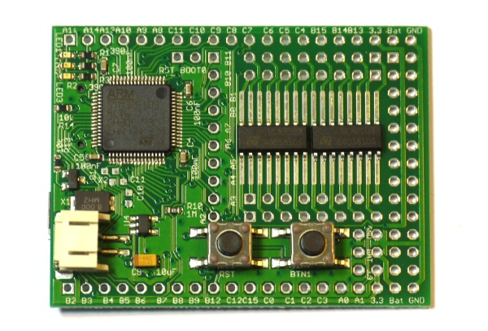
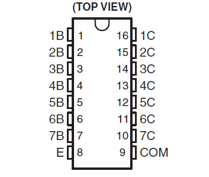
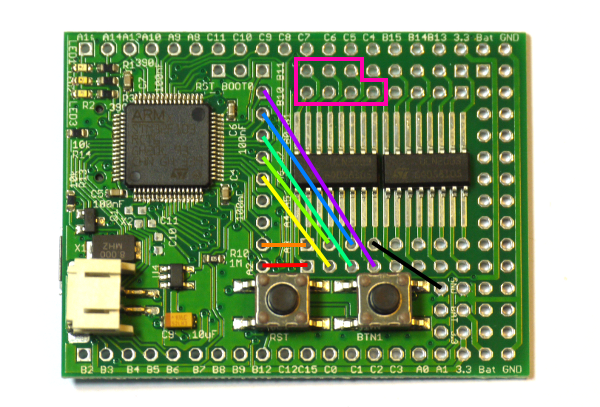
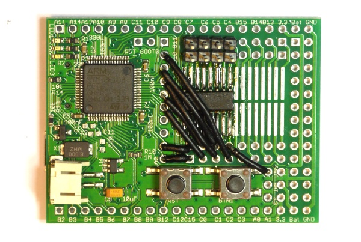

<!--- Copyright (c) 2013 Gordon Williams, Pur3 Ltd. See the file LICENSE for copying permission. -->
ULN2003 Transistor Array
=====================

<span style="color:red">:warning: **Please view the correctly rendered version of this page at https://www.espruino.com/ULN2003. Links, lists, videos, search, and other features will not work correctly when viewed on GitHub** :warning:</span>

* KEYWORDS: ULN2003,ULN2803,UDN2981,TPL7407,Transitor Array



([Datasheet](/datasheets/ULN2003.pdf)) and [product at RS Components](http://uk.rs-online.com/web/p/motor-driver-ics/0426229/)

The ULN2003 has 7 x 500mA outputs, but they can only pull down to 0v. This makes it great for powering relays, solenoids and stepper motors - but only useful for motors if you only need them to run in a single direction.

The ULN2003 comes in many different packages, but the SO16 package can be soldered directly onto Espruino's prototype area. It is also small enough that you can solder two ULN2003 chips on for a total of 14 powered outputs.

Connections
---------



With the writing on the IC the correct way around, Pin 1 is on the bottom left.

To use, simply connect as follows:

| Pin | Function | Connect To |
|-----|----------|------------|
| E | Emitter | Connect to Ground |
| 1-7 B | Transistor Base | Any logic pin on the Espruino board |
| 1-7 C | Transistor Collector | Your Motors/etc |
| COM | Common | Nothing, or other side of load being driven |

  **Note:** COM is connected to each output (1-7 C) via a diode. If you're driving inductive loads then you can connect it to the other side of the load being driven, and it will help to clamp the Back EMF generated when the load is turned off. If the load is powered by BAT on the Espruino, connect it to that - otherwise, connect it to the positive side of the power source that's driving the load. 

If you're soldering onto the board, we'd suggest that you connect as follows:



| ULN2003 | Espruino |
|---------|----------|
| 1 - 1B  | A2 |
| 2 - 2B  | A3 |
| 3 - 3B  | A6 |
| 4 - 4B  | A7 |
| 5 - 5B  | B0 |
| 6 - 6B  | B1 |
| 7 - 7B  | B10 |
| 8 - E   | GND |
| 9 - COM | See above |
| 10-16   | Connect to pin strip |

That way, every output can have [[PWM]].



Software
-------

To use this, you just need to send a 1 or a 0 out of Espruino. If you've wired up as suggested, the simplest code to turn output 1 on is `digitalWrite(A2,1)`.

However with multiple outputs it's often easier to reference them by number:

```
var outputs = [A2,A3,A6,A7,B0,B1,B10];

digitalWrite(outputs[0],1); // output 1
digitalWrite(outputs[4],1); // output 5
```

You can also use analogWrite (using [[PWM]]) to turn an output on for half of the time:

```
var outputs = [A2,A3,A6,A7,B0,B1,B10];

analogWrite(outputs[1], 0.5, { freq: 100 }); // Turn output 2 on, 50% of the time, at 100 Hz
```


Caveats
-------

These devices are not meant to carry high (ie, near their 500ma/ch limit) current continuously, and they don't perform very well at that task. This can be partially alleviated by ganging channels together. Also, these exhibit a marked voltage drop - close to 1 volt under 300ma load, and even more at higher currents. For switching large loads, a MOSFET (either discrete mosfets, or an array of them) may be more effective. 

Variants
------
`ULN2803` - This is identical to the ULN2003, except that it has 18 pins and 8 channels, instead of 16 pins and 7 channels.

`UDN2981` - This is much like the ULN2803, however, it acts as a high side driver, pulling the outputs up to Vs, rather than down to ground. Accordingly, these have a diode between the outputs and ground (instead of the outputs and positive supply) for the same reason. 

`TPL7407` - This is just like the ULN2003, but instead of using darlington pairs, it uses MOSFETs. This gives it the capacity to handle 600ma current continuously per channel, with lower voltage drop, however, it requires the Com pin to be held at 8.5v or higher (internally, the logic level inputs drive transistors that connect the gates of the output FETs to a higher voltage drive). This pretty much limits this part to switching loads at 8.5v or higher. 

`ULN2065B/2075B` - These are much like the ULN2003, except that the 4 darlington pairs are fully separated, and they can handle currents up to 1.75A. The 2065B has clamping diodes (to the pin marked K on the diagram - this can be used as the COM pin would be), the 2075B does not. 


Using 
-----

* APPEND_USES: ULN2003
