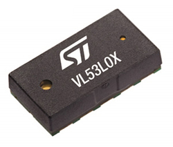
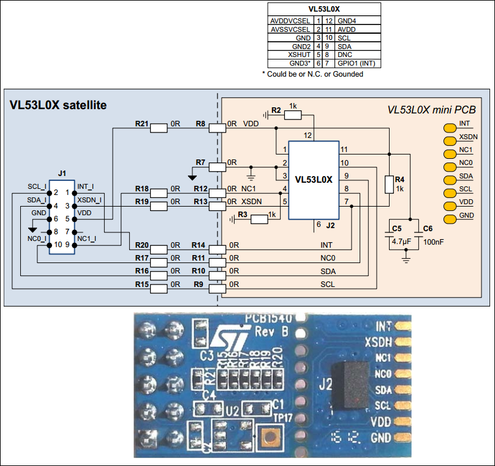

<!--- Copyright (c) 2017 Gordon Williams, Pur3 Ltd. See the file LICENSE for copying permission. -->
VL53L0X 
=======

<span style="color:red">:warning: **Please view the correctly rendered version of this page at https://www.espruino.com/VL53L0X. Links, lists, videos, search, and other features will not work correctly when viewed on GitHub** :warning:</span>

* KEYWORDS: Module,Laser,Range,Distance,VL53L0X,53L0A1,VL53L0A1,I2C,Sensor



The VL53L0X is an amazing laser time of flight range sensor that connects via [[I2C]]. It can be used in similar ways to  the [HC-SR04](/HC-SR04) module, but doesn't suffer from many of the HC-SR04's problems.

It'll measure distances up to 2m, accurate to around 5%, and needs between 2.5 and 3.6 volts.

It's possible to use more than one sensor on the same I2C Interface.

Wiring
------

The easiest solution is to use a 'VL53L0X satellite' board from the X-NUCLEO-53L0A1:
 


You need to wire up as follows:

| Pin | Name | Espruino |
|-----|------|----------|
| 1   | INT  | N/C      |
| 2   | SCL  | I2C SCL (B10)  |
| 3   | XSDN | Any GPIO (B4)  |
| 4   | SDA  | I2C SDA (B3)   |
| 5   | VDD | 3.3v      |
| 6   | GND | GND       |
| 7   |     | N/C       |
| 8   |     | N/C       |
| 9   |     | N/C       |
| 10  |     | N/C       |

**The square pin on the PCB is pin 1**

**XSDN is for shutting down/waking up the device.** 
You can just connect it straight to VDD if needed.

Software
--------

You can use the [[VL53L0X.js]] module with the VL53L0X as follows:

```
I2C2.setup({sda:B3,scl:B10});
digitalWrite(B4,1); // set XSDN -> turn the sensor on
var laser;
setTimeout(function() {
  laser = require("VL53L0X").connect(I2C2);
  // make one reading
  console.log(laser.performSingleMeasurement().distance+" mm");
  // or repeatedly measure
  setInterval(function() {
    // sets LED brightness depending on distance
    var dist = laser.performSingleMeasurement().distance;
    analogWrite(LED1, (300-dist)/300, { soft:true, freq:200 });
  }, 50);
});
```

**XSDN** isn't needed and can be connected to 3.3v. It is used
for powering the device on and off (and you must leave a 2ms 
delay between powering the VL53L0X on and using it).

Currently there is no calibration performed so the results aren't
as accurate as they could be. ST don't appear to have documented
the sensor's interface properly, so to calibrate you would need
to reverse engineer their libraries.

Using more than one Sensor
--------

This example shows how to use more than one sensor by calling the changeAddress function. 
Things you have to considere: This example uses different pins than the example before.
The table shows how the pins are connected:

| Name | Espruino | VL53 (1) | VL53 (2) |
|------|----------|-------|-------|
| SCL  | I2C SCL (B8)   | X | X |
| SDA  | I2C SDA (B9)   | X | X |
| XSDN1 | Any GPIO (B3) | X |   |
| XSDN2 | Any GPIO (B5) |   | X |
| VDD | 3.3v            | X | X |
| GND | GND             | X | X |

* **XSDN** should be both conected to different IO pins. 
  It's not possible to use two sensors if XSDN of one is connected to VDD.
* **STARTUP** B3 and B5 have to be set to 0 during startup. This will reset the VL53 
  Sensor. This means: the sensor starts allways with the default address.
* **TIMING** I2C Communication needs time! A datarate of 400k is supported. 
  If you combine the VL53 with a slow I2C device this will increase the time to get the sensor data!
  The slowest device will determine the busspeed!
* **RESISTORS** I2C needs Pull up resistors. The VL53 Modules from ST don't inlcude pullup-resistors. 
This means you need one extensionmodule with I2C Pull up resistors or you connect two resistors yourself!

The example below will init two VL53 Sensors and the read the sensors every 200ms. Each sensor will get a address which is different from the default address (0x52). The result is written on the serial interface.

```
/** global variables */
var laser1;
var laser2;

/** 
Enable first VL53 Sensor, Change Adress
Enable Second VL53 Sensor, 
 */
function InitVL53( ) {
  console.log("Init VL53 1");
  digitalWrite(B3,1); // set XSDN -> turn the sensor on
  laser1 = require("VL53L0X").connect(I2C1, {address:0x54 });

  console.log("Init VL53 2");
  digitalWrite(B5,1); // set XSDN -> turn the sensor on
  laser2 = require("VL53L0X").connect(I2C1, {address:0x56 });
}

function onTimer() {
  var l1 = laser1.performSingleMeasurement().distance;
  var l2 = laser2.performSingleMeasurement().distance;
  console.log("Sensor 1: "+ l1 +" mm, Sensor 2: "+l2+" mm" );
}

/** 
Set IO Pins to low for VL53 Sensors (turn off)
Enable I2C Interface, Set IO Interrupts
*/
function InitHW( ) {
  console.log("Turn off VL53 vSensors");
  digitalWrite(B3,0); // set XSDN -> turn the sensor off
  digitalWrite(B5,0); // set XSDN -> turn the sensor off
  
  console.log("I2C Interface on, 400k");
  I2C1.setup({ sda:B9, scl:B8, bitrate:400000} );
}

function DoStart() {
  console.log("Init");
  InitHW();
  InitVL53();
  setInterval(onTimer, 200);
  console.log("Running");
}

DoStart();
```

Reference
---------
 
* APPEND_JSDOC: VL53L0X.js

Buying
------

The cheapest way to get a VL53L0X at the moment seems to be [from eBay](http://www.ebay.com/sch/i.html?_nkw=VL53L0X)

However you can also use ST's X-NUCLEO-53L0A1 kit (shown above):

* [Mouser](http://www.mouser.co.uk/ProductDetail/STMicroelectronics/X-NUCLEO-53L0A1)
* [Digikey](http://www.digikey.co.uk/product-detail/en/stmicroelectronics/X-NUCLEO-53L0A1/497-16533-ND/6023686)

Or can also buy boards from:

* [Adafruit](https://www.adafruit.com/product/3317)
* [Pololu](https://www.pololu.com/product/2490)
* and others...
