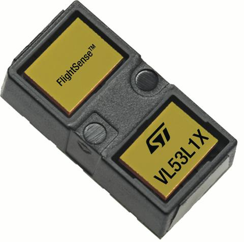
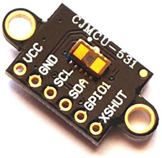

<!--- Copyright (c) 2019 Jose A. Hurtado. See the file LICENSE for copying permission. -->

# VL53L1X

-   KEYWORDS: Module,Laser,Range,Distance,VL53L1X,VL53L0X,53L0A1,VL53L0A1,I2C,Sensor



From the datasheet: "The VL53L1X is a state-of-the-art, Time-of-Flight (ToF),
laser-ranging sensor, enhancing the ST FlightSense™ product family. It is the
fastest miniature ToF sensor on the market with accurate ranging up to 4 m and
fast ranging frequency up to 50 Hz."

## Wiring

The wiring is the same than any other I2C module. Most of the already available
modules also have pins for shutdown (`SHUT`) and an interrupt (`GPIO1`).



You need to wire up as follows:

| Pin | Name  | Espruino     |
| --- | ----- | ------------ |
| 1   | GPIO1 | N/C          |
| 2   | SCL   | I2C SCL (B6) |
| 3   | XSHUT | 3.3v         |
| 4   | SDA   | I2C SDA (B7) |
| 5   | VDD   | 3.3v         |
| 6   | GND   | GND          |

## Software

You can use the [[VL53L1X.js]] module with the VL53L1X as follows:

```
I2C2.setup({sda:B3,scl:B10});
digitalWrite(B4,1); // set XSDN -> turn the sensor on
var laser;
setTimeout(function() {
  laser = require("VL53L1X").connect(I2C2);
  // make one reading
  console.log(laser.performSingleMeasurement().distance+" mm");
  // or repeatedly measure
  setInterval(function() {
    // sets LED brightness depending on distance
    var dist = laser.performSingleMeasurement().distance;
    analogWrite(LED1, (300-dist)/300, { soft:true, freq:200 });
  }, 50);
});
```

**XSHUT** isn't needed and can be connected to 3.3v. It is used
for powering the device on and off (and you must leave a 2ms
delay between powering the VL53L1X on and using it).

### VL53L0X Compatibility

The API of the module is partially compatible with VL53L0X. Just
replace `require("VL53L0X")` by `require("VL53L1X")` in your code
and it should work. The function `performSingleMeasurement` is
provided as an alias of `readMeasurement` in order to keep the
backward compatibility.

## Reference

-   APPEND_JSDOC: VL53L1X.js

## Buying

The cheapest way to get a VL53L1X at the moment seems to be [from eBay](https://www.ebay.com/itm/VL53L1X-Module-for-arduino-ranging-gesture-detection/323225185271)
