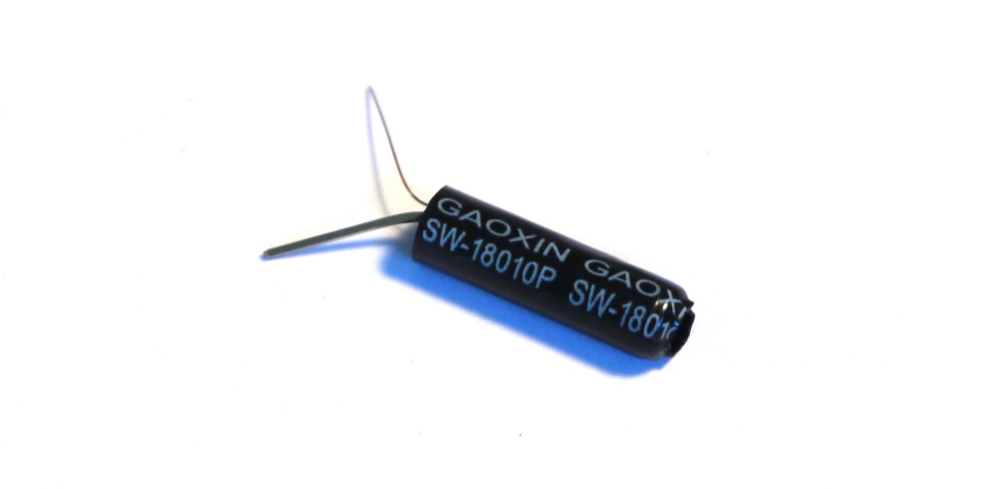
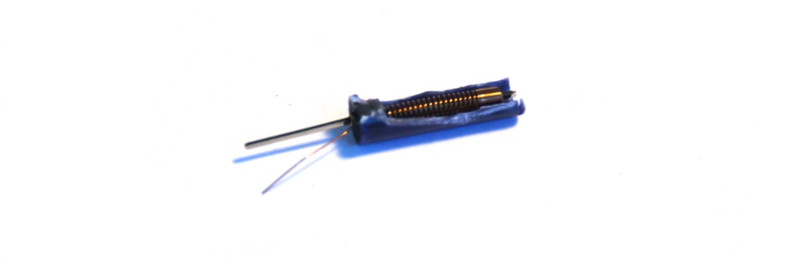

<!--- Copyright (c) 2015 Gordon Williams, Pur3 Ltd. See the file LICENSE for copying permission. -->
Vibration Sensor
================

<span style="color:red">:warning: **Please view the correctly rendered version of this page at https://www.espruino.com/Vibration. Links, lists, videos, search, and other features will not work correctly when viewed on GitHub** :warning:</span>

* KEYWORDS: Vibration,Switch,Shake,Movement,SW18010P,SW18015P,SW18020P



The SW18010P, SW18015P, SW18020P, etc Vibration sensors are effectively just a
delicate spring with a sturdy piece of metal in the middle. When moved, the
spring wobbles around and touches the metal, momentarily making 
contact.



These are very useful little devices as they draw absolutely no power. They
could easily be used in something like a toy, causing it to be activated
when shaken, but otherwise not causing the battery to run down. 

The number after `SW18` specifies how much force is needed for them to
make contact. We'd recommend the SW18010P, as a sensor such as the SW18020P
requires quite a large amount of vibration before it'll trigger. 


Wiring
-------

Wire these up exactly like is described for a [[Button]].

Software
---------

You can use these exactly like a [[Button]] as well. The only difference 
is that you can't use `debounce` - as the spring inside the sensor will
almost always be bouncing!

Instead, you'll want to detect the first vibration and then ignore
everything else for a few milliseconds:

```
function shaken() {
  // do things here
}

// 'watch' B3 for shakes
var shakeTimeout;
setWatch(function() {
  if (shakeTimeout) return;
  shaken();
  shakeTimeout = setTimeout(function() { shakeTimeout = undefined; }, 200);
}, B3, {repeat:true, edge:"rising"});
```

Using 
-----

* APPEND_USES: Vibration,SW18010P,SW18015P,SW18020P

Buying
-----

* [eBay](http://www.ebay.com/sch/i.html?_nkw=SW18010P)

