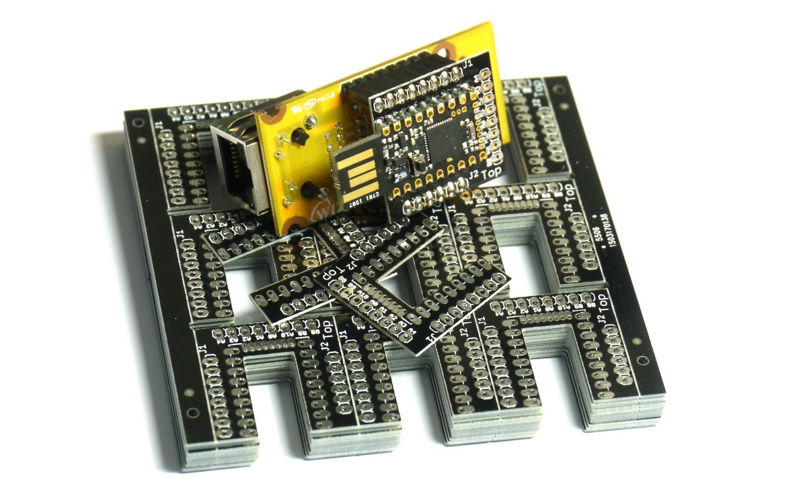

<!--- Copyright (c) 2013 Gordon Williams, Pur3 Ltd. See the file LICENSE for copying permission. -->
WIZnet WIZ550io/W5500 Ethernet module
================================

<span style="color:red">:warning: **Please view the correctly rendered version of this page at https://www.espruino.com/WIZnet. Links, lists, videos, search, and other features will not work correctly when viewed on GitHub** :warning:</span>

* KEYWORDS: Module,Wireless,WIZnet,WIZ550io,W5500,Ethernet,Internet,LAN,Web Server,HTTP,Built-In


The [WIZnet WIZ550io module](http://wizwiki.net/wiki/doku.php?id=products:wiz550io:allpages) contains a W5500 chip - it implements TCP/IP on-chip, so you just plug an Ethernet cable in one end, and SPI into the other.

For the WIZnet W5100, [see this page](/arduino-w5100)

Support is provided in Espruino, but **you will have to use a special build of Espruino designed for it** as there isn't enough space in flash to hold both CC3000 and WIZnet drivers.

To get the latest WIZnet binary:

* Go to http://www.espruino.com/binaries and look for a file titled `espruino_XXX_espruino_1r3_wiznet.bin`, where `XXX` is the latest version
* Right-click on it, and click `Copy Link Address`
* Open the Web IDE, and click on Settings in the top-right
* Click on `Flasher`
* Paste the link into the `Advanced Firmware Update` text box
* Click the `Advanced Firmware Update` button and follow the instructions.

You can also [get a recent Espruino Git build](http://www.espruino.com/binaries/git) or can build it yourself.

To build yourself, follow [the instructions here](http://www.github.com/espruino/Espruino) and build with `WIZNET=1 RELEASE=1 ESPRUINO_1V3=1 make`.

Espruino Pico Shim
----------------



The Shim available for the Espruino Pico helps to adapt the W550io to fit onto the Pico. Please see the video below:

[[http://youtu.be/YZzKH_41WUU]]

Wiring Up
--------

Just wire up J1 as follows. J2 does not need wiring up.

| WIZ550io J1 | Name | Espruino |
|-------------|------|----------|
| 1 | GND |     |
| 2 | GND | GND |
| 3 | MOSI | B5 |
| 4 | MISO | B4 |
| 5 | SCK | B3 |
| 6 | CS | B2 |
| 7 | 3V3 | 3V3 |
| 8 | 3V3 |   &nbsp; |

On the Espruino Pico, the [adaptor shim](/Shims) uses the following connections:

| WIZ550io J1 | Name | Espruino |
|-------------|------|----------|
| 1 | GND |     |
| 2 | GND | GND |
| 3 | MOSI | B15 |
| 4 | MISO | B14 |
| 5 | SCK | B13 |
| 6 | CS | B10 |
| 7 | 3V3 | 3V3 |
| 8 | 3V3 |   &nbsp; |

Software
-------

Just connect as follows:

```
var eth = require("WIZnet").connect();
```

Or for the Espruino Pico adaptor:

```
SPI2.setup({ mosi:B15, miso:B14, sck:B13 });
var eth = require("WIZnet").connect(SPI2, B10);
```

You can check your IP with:

```
eth.getIP()
```

The module gets its own IP, however it does not configure DNS by default (for looking up domain names). To do this either:

```
eth.setIP({ dns : "8.8.8.8" }); // google's DNS
```

Or use DHCP:

```
eth.setIP();
```

Create an HTTP server like this:

```
require("http").createServer(function (req, res) {
  res.writeHead(200, {'Content-Type': 'text/plain'});
  res.write('Hello World');
  res.end();
}).listen(80);
```

Or load a webpage like this:

```
require("http").get("http://192.168.1.50", function(res) {
  res.on('data', function(data) { console.log(data);	});
});
```

For more examples, please see the [[Internet]] page.

Using
-----

* APPEND_USES: WIZnet

Buying
-----

You can buy this module from:

* from [Digi-Key US](http://www.digikey.com/product-detail/en/WIZ550IO/1278-1022-ND/4425703)
* from [WIZnet EU](http://shop.wiznet.eu/w5500-89.html)
* from [WIZnet US](http://www.shopwiznet.com/wiz550io)

However when buying direct from WIZnet, the cost of postage may end up being particularly high.
