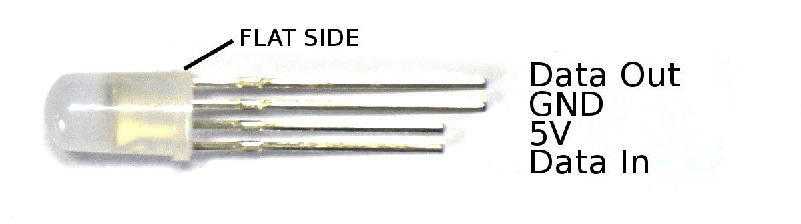

<!--- Copyright (c) 2017 Gordon Williams, Pur3 Ltd. See the file LICENSE for copying permission. -->
WS2811/WS2812/WS2812B/APA104/APA106/SK6812 LED String/Strip
===========================================================

<span style="color:red">:warning: **Please view the correctly rendered version of this page at https://www.espruino.com/WS2811. Links, lists, videos, search, and other features will not work correctly when viewed on GitHub** :warning:</span>

* KEYWORDS: Individually Addressable LEDs,Light,Lights,LED,LEDs,WS2811,WS2812,WS2812B,APA104,APA106,SK6812,Multicolour,Fairy,String,Strip,Built-In,neopixel


These are individually addressable RGB LEDs - this means with just 3 wires, you can make each LED turn any one of 16 million colours. They come in many different forms - LED Strings (like above), LED Strip, Matrices like Adafruit's NeoPixels or the [[RGB123]], or even 5mm LEDs. Note that while physically different (some are built into LEDs, some are separate chips), the WS2811/WS2812/WS2812B/APA104/APA106/SK6812 all work the same way electrically.

| Part Number | Type |
|-------------|------|
| WS2811  | a separate SOIC8 LED driver chip - often used in LED strings. LED *strip* with WS2811 may have separate red, green and blue LEDs ([buy string on eBay](http://www.ebay.com/sch/i.html?_nkw=ws2811+string)) |
| WS2812  | All-in-one 5050 (5mm x 5mm) RGB LED - 6 pins (hard to buy now) |
| WS2812B  | All-in-one 5050 (5mm x 5mm) RGB LED - 4 pins (this is by far the post popular at the moment) ([buy on eBay](http://www.ebay.com/sch/i.html?_nkw=WS2812B+-APA104)) |
| APA104  | A clone of the WS2812B. All-in-one 5050 (5mm x 5mm) RGB LED - 4 pins. **Lights blue when power first applied** ([buy on eBay](http://www.ebay.com/sch/i.html?_nkw=APA104)) |
| APA106  | All-in-one 5mm or 8mm diameter leaded LED ([buy on eBay](http://www.ebay.com/sch/i.html?_nkw=APA106)) |
| SK6812  | All-in-one 3535 (3.5mm x 3.5mm) RGB LED - 4 pins ([buy on eBay](http://www.ebay.com/sch/i.html?_nkw=SK6812)) |




Above, you can see a single LED. In the LED strings, the WS2811 controller chip is separate to the LED (you can see it as the black blob encased in plastic).

Wiring Up
--------

[[http://youtu.be/hanahdauDiE]]

Check out [the neopixel library reference](/Reference#neopixel) - WS2811 style LEDs can be quite picky about the voltage of the data wire. Using the Original [Espruino](/Original) and [Pico](/Pico) is easy, but other boards may require a little more thought.

WS2811-based LEDs need just 3 wires, however because they're a string (and can be chained together), they have two ends. While you can often peer through the casing to see the letters ```DI``` (Data In) or ```DO``` (Data Out), if you have the LED Strings from the [[Espruino Kits]] then the end you need is the 'Female' end (the one without the visible metal spikes in the plug). Included in the kit should be a matching connector so that you can plug and unplug the LED string.

We'd suggest you wire up as follows. The only condition is that the data wire is connected to an SPI MOSI port on the Espruino Board:

| LED String | Espruino   |
| -------    | ---------- |
| White	(GND)     | GND        |
| Green (DI / Data In) | B15        |
| Red (5V)       | VBAT       |

**CHECK YOUR WIRING AND DO NOT WIRE UP THE VOLTAGE BACKWARDS** - WS2811 chips are quite delicate and the **entire** string of lights can be easily blown up by doing this.

Software
-------

**Note:** This is currently covered in the [Individually Addressable LEDs](/Individually+Addressable+LEDs) tutorial.

To control the LEDs, just send a series of bytes to them. The first 3 bytes are red, green and blue for the first LED, the second are for the second LED, and so on.

```
require("neopixel").write(B15, [255,0,0]); // turn first LED Red
require("neopixel").write(B15, [255,0,0, 0,255,0, 0,0,255]); // turn first 3 LEDs, Red, Green, and Blue
```

If you want to control more LEDs (for instance the whole string), we'd recommend using an [ArrayBuffer](/Reference#Uint8ClampedArray) for speed, and to save on memory.
Using `Uint8ClampedArray` also means that any values greater than 255 or less than 0 are 'clamped'. If you used `Uint8Array` instead than a value would just have the top bits removed, turning 256 into 0, 257 to 1 and so on.

```
// random colours
var arr = new Uint8ClampedArray(25*3);
var n = 0;
for(var i=0;i<25;i++) {
  arr[n++] = Math.random()*255;
  arr[n++] = Math.random()*255;
  arr[n++] = Math.random()*255;
}
require("neopixel").write(B15, arr);
```

If you'd like to animate all the colours, you could do something like this:

```
var arr = new Uint8ClampedArray(25*3);
var pos = 0;

function getPattern() {
  pos++;
  for (var i=0;i<arr.length;i+=3) {
    arr[i  ] = (1 + Math.sin((i+pos)*0.1324)) * 127;
    arr[i+1] = (1 + Math.sin((i+pos)*0.1654)) * 127;
    arr[i+2] = (1 + Math.sin((i+pos)*0.1)) * 127;
  }
}

function onTimer() {
  getPattern();
  require("neopixel").write(B15, arr);
}

setInterval(onTimer, 50);
```

Want to experiment and see what your pattern will look like without uploading it to an Espruino device? Check out [Ben's Neopixel test website](https://benjaminbenben.com/espruino-pixels/)

Using
-----

* APPEND_USES: WS2811

Buying
-----

WS2811/WS2812Bs can be purchased from many places, as bare parts (not recommended unless you're making your own PCBs), single lights on a breakout board, matrices, and long flexible strips (not to be confused with very similar strips that are not individually addressable). Although WS2811 and WS2812/2812B are different parts, the numbers are used interchangabley in product advertisements. Some sources:

* [WS2811 string on eBay](http://www.ebay.com/sch/i.html?_nkw=ws2811+string)
* [WS2812B strip on eBay](http://www.ebay.com/sch/i.html?_nkw=WS2812B+-APA104)
* [APA104 strip on eBay](http://www.ebay.com/sch/i.html?_nkw=APA104)
* [APA106 LEDs on eBay](http://www.ebay.com/sch/i.html?_nkw=APA106)
* [SK6812 strip on eBay](http://www.ebay.com/sch/i.html?_nkw=SK6812)
* As [[RGB123]] matrices from [RGB-123](http://rgb-123.com)
* As [AdaFruit Neopixels](http://www.adafruit.com/index.php?main_page=adasearch&q=neopixel)
* [digitalmeans.co.uk](https://digitalmeans.co.uk/shop/index.php?route=product/search&tag=ws2812)
