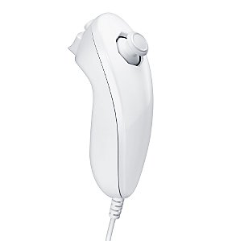

<!--- Copyright (c) 2013 Gordon Williams, Pur3 Ltd. See the file LICENSE for copying permission. -->
Wii Nunchuck
====================================

<span style="color:red">:warning: **Please view the correctly rendered version of this page at https://www.espruino.com/Wii. Links, lists, videos, search, and other features will not work correctly when viewed on GitHub** :warning:</span>

* KEYWORDS: Module,Accelerometer,I2C,Sensor,Wii,Nunchuck,Joystick,Joy Stick,Button



The Wii Nunchuck is an optional accessory that plugs into the Wiimote for for the Wii games console. It is a small, rugged, hand-held device that contains two buttons, a JoyStick, and a 3 axis accelerometer. While the original is relatively expensive, cheap copies are available for less than $10.

The Nunchuck itself is an I2C peripheral, and needs just 4 wires - GND, VDD (3.3v), SDA and SCL. SDA and SCL just need wiring up to the corresponding I2C pins (of the same I2C port) on your Espruino.

The connector itself is non-standard with 6 pins (the middle two on each side are unused) but can be connected with either a double-sided PCB, a connector from a scrapped Wiimote, a special adaptor PCB (for example from SparkFun), or the connector can just be cut off.


The connector viewed from the end is connected like this:

```
                   ________
                  |        |
            GND   |   X  X |  SDA
                   \       |
                    | X  X |
                   /       |
            SCL   |   X  X |   VDD (3.3v)
                  |________|
```

Once wired up, you can use the Wii nunchuck with just the following - using the [[wii_nunchuck.js]] module:


```
I2C1.setup({scl:B6,sda:B7});
var wii = require("wii_nunchuck").connect(I2C1);
console.log(JSON.stringify(wii.read()));
```

This will output something like:

```
{"joy":{"x":0,"y":0},"acc":{"x":0,"y":0,"z":1},"btn":{"z":false,"c":false}}
```

Where the values for joy are between -1 and 1, and values for 'acc' are in G (that is, 1 for normal gravity).

Using 
-----

* APPEND_USES: Wii
 
