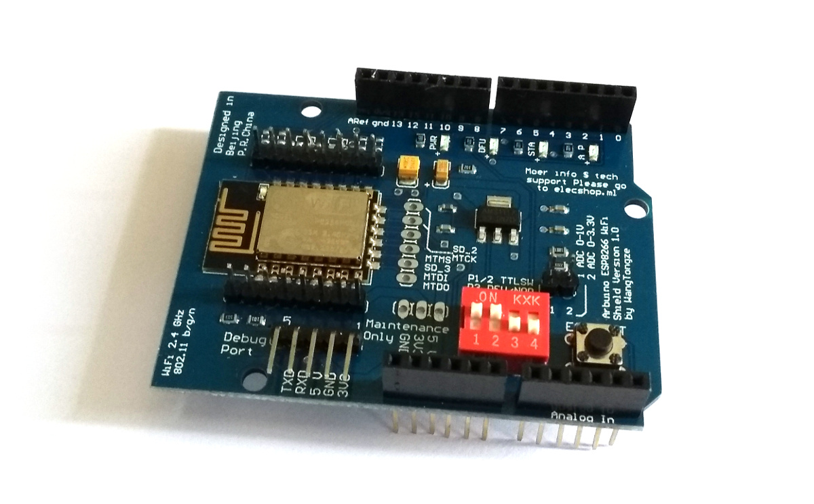
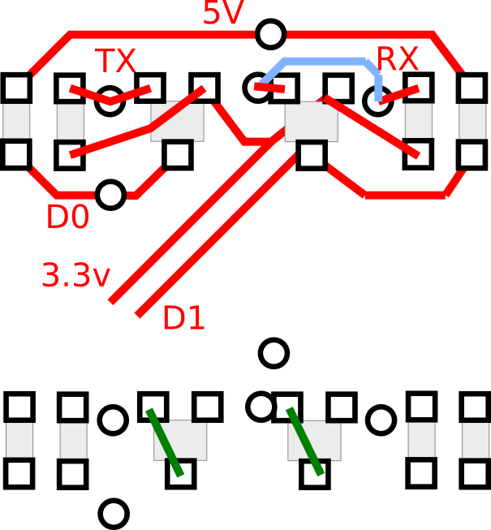
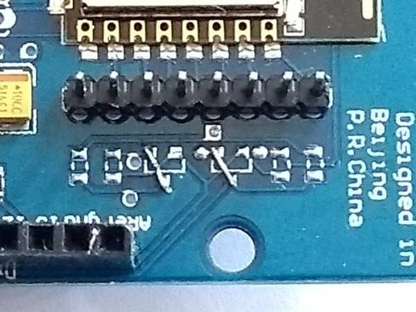

<!--- Copyright (c) 2018 Gordon Williams, Pur3 Ltd. See the file LICENSE for copying permission. -->
Arduino ESP8266 WiFi Shield
===========================

<span style="color:red">:warning: **Please view the correctly rendered version of this page at https://www.espruino.com/arduino-esp8266. Links, lists, videos, search, and other features will not work correctly when viewed on GitHub** :warning:</span>

* KEYWORDS: Arduino,Shield,Arduino Shield,ESP8266,WangTongze,Moer info $,WiFi,Wireless
* USES: ESP8266,Pixl.js



This is a common ESP8266 Arduino shield with the following markings:

```
WiFi 2.4 GHz
802.11 b/g/n
```

```
Designed in
Beijing
P.R.China
```

```
Moer info $ tech
support Please go
to elecshop.ml
```

```
Arduino ESP8266 WiFi
Shield Version 1.0
by WangTongze
```

The voltage switching circuitry on this shield doesn't work properly as it
arrives, so you'll have to modify it slightly if you intend it to work as
a shield (with `SW1` and `SW2` set to `ON`).

The DIP switches are:

| Switch | Function |
|-----|-------------------|
| SW1 | Connect ESP8266 TX to pin D0 |
| SW2 | Connect ESP8266 RX to pin D1 |
| SW3 | Enable bootloader mode |
| SW4 | Use DFU LED to show serial activity (?) |

Power is drawn from the `5v` pin (not `Vin`) so if connecting to [Pixl.js](/Pixl.js)
ensure that [`Vin` and `5V` are shorted on the solder jumper ](/Pixl.js#shield-power)
unless you plan to power the shield separately.

# Using as-is

* Ensure `SW1` and `SW2` are `OFF`
* Connect a jumper lead from the `TXD` pin on `Debug Port` to `D0` on the Arduino header
* Connect a jumper lead from the `RXD` pin on `Debug Port` to `D1` on the Arduino header

# Rewiring




* Unsolder all the surface mount components to the *right-hand side* of the ESP8266
* Short across the two transistor outlines from the right pad to the bottom-left pad
* Ensure `SW1` and `SW2` are `ON`
* `TXD` and `RXD` should now be available on `D0` and `D1` at 3.3v levels

# Pixl.js

If connecting to Pixl.js you should be aware that when if Pixl.js [detects a
connection on `D0`](/Pixl.js#serial-console) at boot, it'll start using `Serial1`
as a console device rather than the LCD.

To avoid this you'll need to explicitly set the console back to the LCD at boot
time:

```
function onInit() {
  Terminal.setConsole();
}
```

# Software

## Client

To connect to a WiFi access point.

```
var WIFI_NAME = "WiFi_Name";
var WIFI_PASS = "WPA2_Key";
var wifi;

function getPage() {
  require("http").get("http://www.pur3.co.uk/hello.txt", function(res) {
    console.log("Response: ",res);
    res.on('data', function(d) {
      console.log("--->"+d);
    });
  });
}

function go() {
  Serial1.setup(115200,{rx:D0,tx:D1});
  wifi = require("ESP8266WiFi_0v25").connect(Serial1, function(err) {
    if (err) throw err;
    console.log("Connecting to WiFi");
    wifi.connect(WIFI_NAME, WIFI_PASS, function(err) {
      if (err) throw err;
      console.log("Connected");
      // Now you can do something, like an HTTP request
      getPage();
    });
  });
}
```

## Access point

To set up as an access point called `ESP123` with password `HelloWorld`
that serves up a webpage on address `192.168.4.1`:

```
var wifi;

function pageHandler(req, res) {
  res.writeHead(200);
  res.end("Hello World");
}

function go() {
  Serial1.setup(115200,{rx:D0,tx:D1});
  wifi = require("ESP8266WiFi_0v25").connect(Serial1, function(err) {
    if (err) throw err;
    console.log("Connecting to WiFi");
    wifi.createAP("ESP123","HelloWorld",5,"wpa2_psk", function(err) {   
      if (err) throw err;
      console.log("Connected!");
      require("http").createServer(pageHandler).listen(80);
    });
  });
}
```

See [the ESP8266 page](/ESP8266#software) for more information on how to
use the ESP8266, and the [Internet](/Internet) page for more examples
of things you can do on Espruino  with an Internet connection.


Buying
-----

* [eBay](http://www.ebay.com/sch/i.html?_nkw=arduino+esp8266+serial+shield) - the
boards mentioned on this page are the ones with the red DIP switch on.
