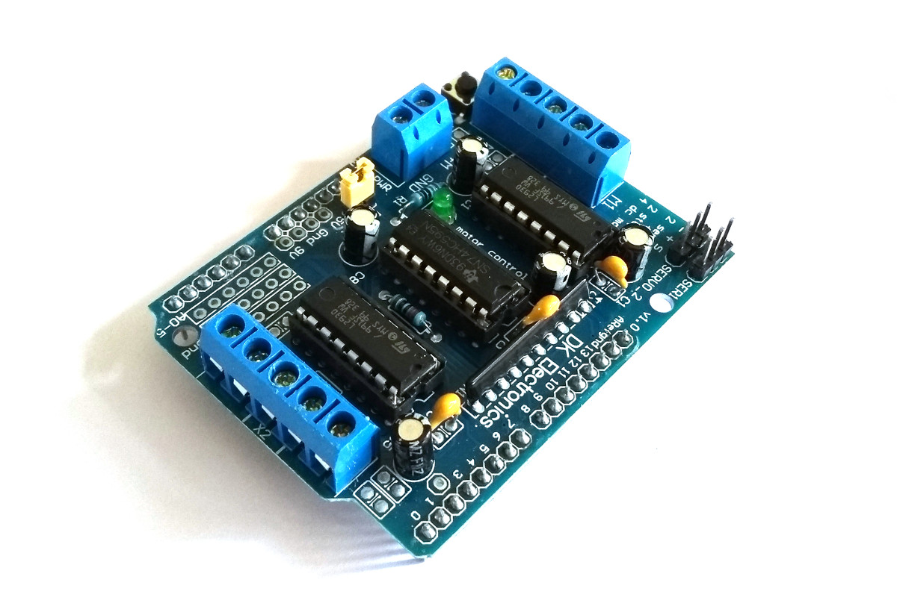

<!--- Copyright (c) 2018 Gordon Williams, Pur3 Ltd. See the file LICENSE for copying permission. -->
Arduino Motor Shield
=====================

<span style="color:red">:warning: **Please view the correctly rendered version of this page at https://www.espruino.com/arduino-motorshield. Links, lists, videos, search, and other features will not work correctly when viewed on GitHub** :warning:</span>

* KEYWORDS: Arduino,Shield,Arduino Shield,Motor Shield,Driver,L293D,DK Electronics
* USES: Pixl.js



This is a cheap motor shield for Arduino that contains L293D driver chips,
commonly with `DK Electronics` written on it.

Support is provided via the [[arduino-motorshield.js]] module.

```
var motor = require("arduino-motorshield").connect(); // Pixl.js
var motor = require("arduino-motorshield").connect(require("ArduinoPico")); // Espruino Pico Shim
var motor = require("arduino-motorshield").connect(Nucleo); // Nucleo

motor.on(); // turn driver outputs on
motor.off(); // turn driver outputs off

motor.set(0); // Set all outputs to 0
motor.set(0b00000001); // Motor 1 forwards
motor.set(0b00000010); // Motor 1 backwards
motor.set(0b00010000); // Motor 3 forwards
motor.set(0b00100000); // Motor 3 backwards

```

Buying
-----

* [eBay](http://www.ebay.com/sch/i.html?_nkw=arduino+l293d+motor+shield+-nodemcu)
