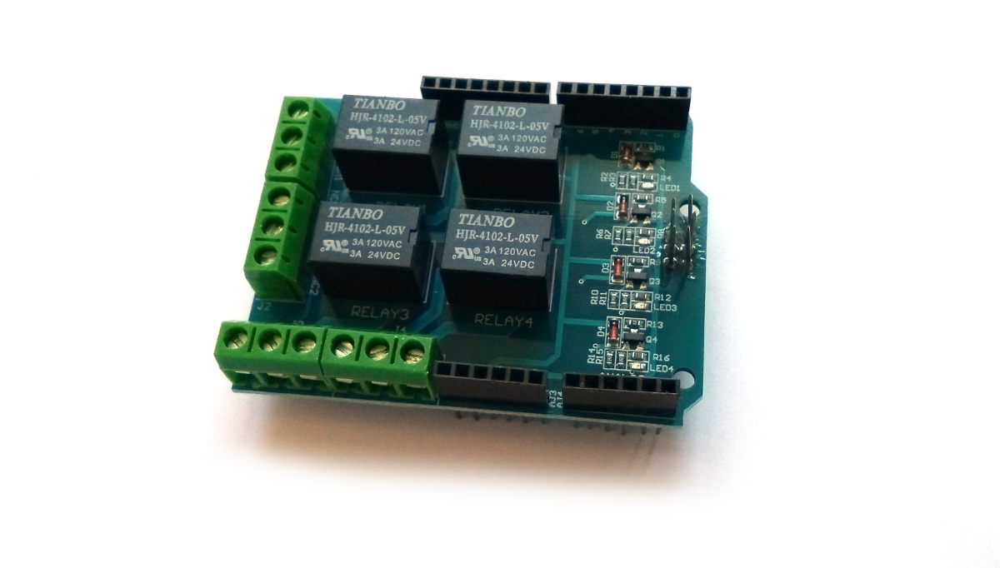

<!--- Copyright (c) 2018 Gordon Williams, Pur3 Ltd. See the file LICENSE for copying permission. -->
Arduino Relay Shield
=====================

<span style="color:red">:warning: **Please view the correctly rendered version of this page at https://www.espruino.com/arduino-relayshield. Links, lists, videos, search, and other features will not work correctly when viewed on GitHub** :warning:</span>

* KEYWORDS: Arduino,Shield,Arduino Shield,Relay,Relay Shield,Driver,CAIALEX,catalex.taobaocom
* USES: Pixl.js



This is a cheap relay shield for Arduino with four [[Relays]]. Relays are literally
just electrically actuated switches, so you can connect them pretty much anywhere
you would use a switch.

On the back side there is written:

```
CAIALEX
Relay Shield
V1.0
catalex.taobaocom
```

The relays are rated for `3A @ 120VDC` or `3A @ 24VDC`. Note that they are **not
rated for `240VAC`**, so won't be suitable for mains voltage switching in many
countries.

Wiring
------

Simply plug the shield into your Espruino board.

The shield depends on the `5V` line for voltage for the LEDs, so if connecting
to a [Pixl.js](/Pixl.js) you'll need to short `5V` to `Vin` when running off USB/LiPo
power source. This can be done either with the [solder jumper](/Pixl.js#shield-power) or just
by connecting a patch wire between `5V` and `Vin` on the Relay Board's header.

Software
--------

These shields are extremely easy to use, so no code library is currently provided.

The relay board has the 4 relays connected to pins `D4`, `D5`, `D6` and `D7`.
If you write a `1` to a pin, the relay turns on, write a `0` and it turns off.

```
// Relay 1 on
digitalWrite(D4,1);
// Relay 1 off
digitalWrite(D4,0);
// Relay 4 on
digitalWrite(D7,0);

// Write to all relays at once...
// All on
digitalWrite([D7,D6,D5,D4], 0b1111);
// Relay 2 and 4 on
digitalWrite([D7,D6,D5,D4], 0b1010);
// All off
digitalWrite([D7,D6,D5,D4], 0b0000);
```


Buying
-----

[These Relay Shields are available on eBay](http://www.ebay.com/sch/i.html?_nkw=arduino+four+relay+shield),
however many other versions of the same shield are available, and are often higher
quality. For example [Seeedstudio Relay Shield 3.0](https://m.seeedstudio.com/productDetail/2440)
