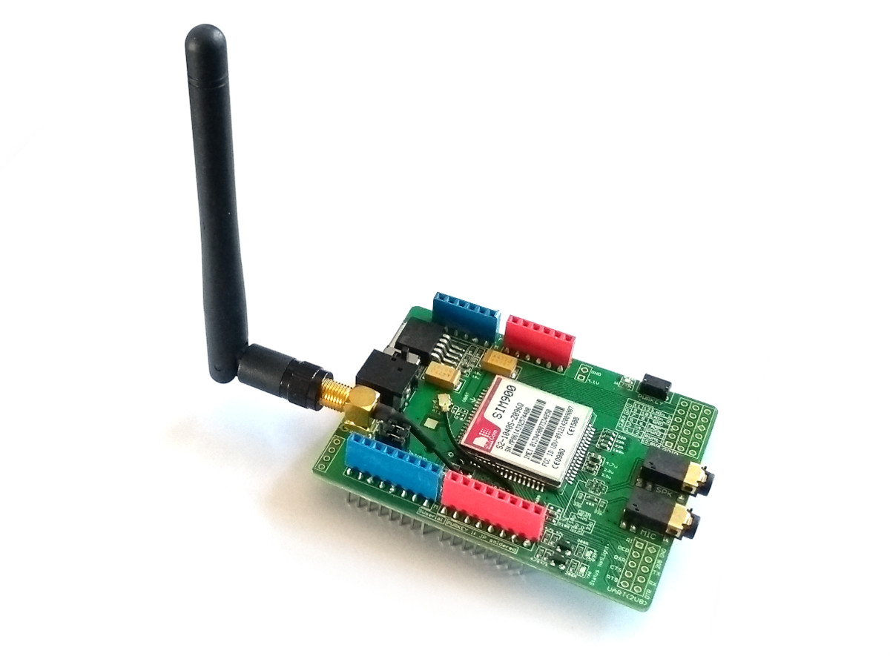

<!--- Copyright (c) 2018 Gordon Williams, Pur3 Ltd. See the file LICENSE for copying permission. -->
Arduino GPRS/GSM shield (SIM900)
==================================================

<span style="color:red">:warning: **Please view the correctly rendered version of this page at https://www.espruino.com/arduino-sim900. Links, lists, videos, search, and other features will not work correctly when viewed on GitHub** :warning:</span>

* KEYWORDS: Arduino,Shield,Arduino Shield,GSM,GPRS,SIM900,Internet
* USES: Pixl.js,SIM900,ATSMS



The SIM900 is a common shield for GSM communication on Arduino.

You can use the SIM900 in two ways with all official Espruino
boards:

* Internet using the [SIM900](/SIM900) software module
* SMS Text messages using the [ATSMS](/ATSMS) module


Wiring
------

The SIM900 can draw big burts of current and may not work reliably if
powered off of USB. For a reliable connection we'd recommend powering
it directly off a LiPo battery using the on-board connector.

Check the position of the jumpers by the aerial. If these
are in the `SWSerial` position you'll need to use `{ rx: D7, tx : D8 }`,
otherwise if it's `Xduino` use `{ rx: D0, tx : D1 }`.

**Note:** If using `D0` and `D1` on [Pixl.js](/Pixl.js) you should be aware
that if `D0` is powered at boot, Espruino's console will [automatically be moved
to it](/Pixl.js#serial-console). You can avoid this by calling `Terminal.setConsole();`
from `onInit()`.

This module needs powering on with a long press of the power key. You can however
add a blob of solder to the `JP` solder jumper (near pin `D9`) which will connect
the `D9` pin to the power key, allowing Espruino to turn the module on and off
manually.


Software
---------
## Internet

```
// Connect to serial device
Serial1.setup(115200, { rx: D0, tx : D1 });

console.log("Connecting to SIM900 module");
var gprs = require('SIM900').connect(Serial1, undefined/*reset*/, function(err) {
  if (err) throw err;
  gprs.connect('APN', 'USERNAME', 'PASSWORD', function(err) {
    if (err) throw err;
    gprs.getIP(function(err, ip) {
      if (err) throw err;
      console.log('IP:' + ip);
      require("http").get("http://www.pur3.co.uk/hello.txt", function(res) {
        console.log("Response: ",res);
        res.on('data', function(d) {
          console.log("--->"+d);
        });
      });
    });
  });
});
```

See the [SIM900 module documentation](/SIM900) for more information.

## SMS

```
// Connect to serial device
Serial1.setup(115200, { rx: D0, tx : D1 });
var ATSMS = require("ATSMS");
var sms = new ATSMS(Serial1);
//Use sms.at.debug(); here if you want debug messages

sms.init(function(err) {
  if (err) throw err;
  console.log("Initialised!");

  sms.list("ALL", function(err,list) {
    if (err) throw err;
    if (list.length)
      console.log(list);
    else
      console.log("No Messages");
  });

  // and to send a message:
  //sms.send('+441234567890','Hello world!', callback)
});

sms.on('message', function(msgIndex) {
  console.log("Got new message, index ", msgIndex);
});
```

See the [ATSMS module documentation](/ATSMS) for more information.


Using
-----

* APPEND_USES: arduino-sim900


Buying
-----

* [eBay](http://www.ebay.com/sch/i.html?_nkw=arduino+sim900+shield)
