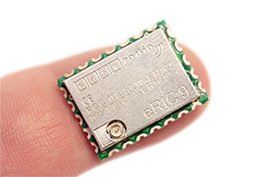
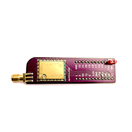

<!--- Copyright (c) 2016 Gordon Williams, Pur3 Ltd. See the file LICENSE for copying permission. -->
LPRS easyRadio (eRIC) Radio Modules
===================================

<span style="color:red">:warning: **Please view the correctly rendered version of this page at https://www.espruino.com/easyRadio. Links, lists, videos, search, and other features will not work correctly when viewed on GitHub** :warning:</span>

* KEYWORDS: Module,Wireless,Radio,Transceiver,easyRadio



The 'easy Radio Integrated Controller' (eRIC) radio transceiver module is based on the Texas Instruments CC430F5137 System-on-Chip. It combines a high performance RF transceiver, RF band pass filters (BPF), an MSP430 microcontroller, 32Kb flash memory, non-volatile flash storage, temperature sensor, and a low drop voltage regulator. The device operates on the International licence exempt Industrial, Scientific and Medical (ISM) radio bands.

While these modules can be programmed with their own code, they come pre-installed with the [easyRadio](http://www.lprs.co.uk/easy-radio/) firmware, which allows communication over a serial interface. A driver this is in the [[easyRadio.js]] module.

See [LPRS's site](http://www.lprs.co.uk/easy-radio/eric/) for more information.


Wiring Up
---------



It's easier to buy an eRIC module in a [breakout board](http://www.lprs.co.uk/wireless-modules/eric-breakout-board.html). You then just need to connect the following wires:

| Label | Espruino Pico | Notes |
|-------|---------------|-------|
| GND   | GND           |       |
| 3.3v/VCC | 3.3v       | The eRIC module can run from +2.4V to +6V |
| RX/SDO | B7 (or any UART RX pin) | Transmits data, see below |
| TX/SDI | B6 (or any UART TX pin) | Receives data, see below |

**NOTE:** 

* While the breakout board is marked with `RX` and `TX` pins, unlike many peripherals this refers to the type of pin the eRIC's should be connected to, *not* the actual type of pin. So the `RX` pin actually transmits data.
* If running the Pico when not connected to a computer, the console interface will automatically move to `Serial1`, disabling the `easyRadio` driver (see [Troubleshooting](/Troubleshooting#console) for more info and how to stop that behaviour). This will allow you to program and debug your Espruino Pico using a remote easyRadio module, but may not be what you intended.

Software
--------

The easyRadio modules default to 19200 baud. All you need to do is set up the serial port and initialise the module.

```
Serial1.setup(19200, {rx:B7, tx:B6});
var eric = require("easyRadio").connect(Serial1, function(d) {
  // Called when data received
  console.log("Got "+JSON.stringify(d));
});
```

Send data with:

```
eric.send("Hello World");
```

And the callback you supply at initialisation is called whenever data is received. For instance a second eRIC module might report the following in response to the last command:

```
Got "H"
Got "e"
Got "l"
Got "l"
Got "o "
Got "W"
Got "o"
Got "rl"
Got "d" 
```

You might for instance want to process only one line of data at a time:

```
function gotData() {
  console.log("Got "+JSON.stringify(d));
}

Serial1.setup(19200, {rx:B7, tx:B6});
var ericData = "";
var eric = require("easyRadio").connect(Serial1, function(d) {
  ericData+=d;
  var i = ericData.indexOf("\n");
  while (i>=0) {
    gotData(ericData.substr(0,i));
    ericData = ericData.substr(i+1);
    i = ericData.indexOf("\n");
  }
});
```

By default one eRIC module will broadcast to any other eRIC modules in range. To change this behaviour you can change the group ID of specific modules (to a value between 1 and 65535) with `eric.setGroupID(32)`. Then, only modules with the same group ID will communicate.

eRIC modules also provide other functionality such as a temperature sensor and EEPROM. See the reference below for more information about these - note that the easyRadio module is **asynchronous**, so functions will return immediately without a return value and will call a `callback` argument with the result or an error at some later time.

```
// Quickly
eric.getTemperature(print);
// prints "null 22.4"

// Properly
eric.getTemperature(function(err, temp) {
  if (err) console.log("We got an error! "+err);
  else console.log("Temperature is "+temp);
});
```

Remote Connection to Espruino
-----------------------------

It's easy to use eRIC modules to communicate with an Espruino board as if it was connected by wire:

* Wire an eRIC module to an Espruino as above
* Write the following into Espruino

```
Serial1.setup(19200, {rx:B7, tx:B6});
var realReset = reset;
var reset = function() {}
```

* Type `save();`
* Disconnect the Espruino from the PC, and power it from something else (this will move the console on to Serial1).
* Now wire a second eRIC module to a USB-Serial converter and plug it to your computer
* Open the Web IDE, go to `Settings`, `Communications` and set `Baud Rate` to `19200`
* Connect the Web IDE to your USB-Serial converter - you should now be able to program the Espruino remotely as before.

**Note:** Espruino's `reset()` function would reset the baud rate to 9600 baud so it has to be disabled in this case.


Reference
---------
 
* APPEND_JSDOC: easyRadio.js


Using 
-----

* APPEND_USES: easyRadio


Buying
------

LPRS maintain [a list of distributors here](http://www.lprs.co.uk/distributors) 
