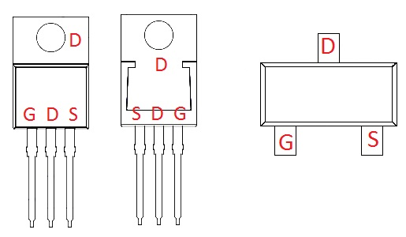
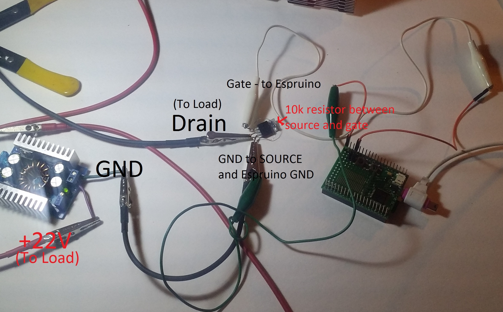
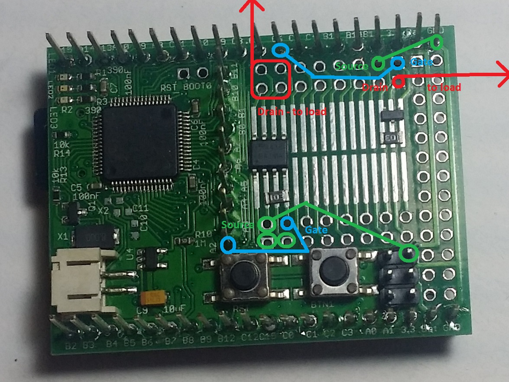
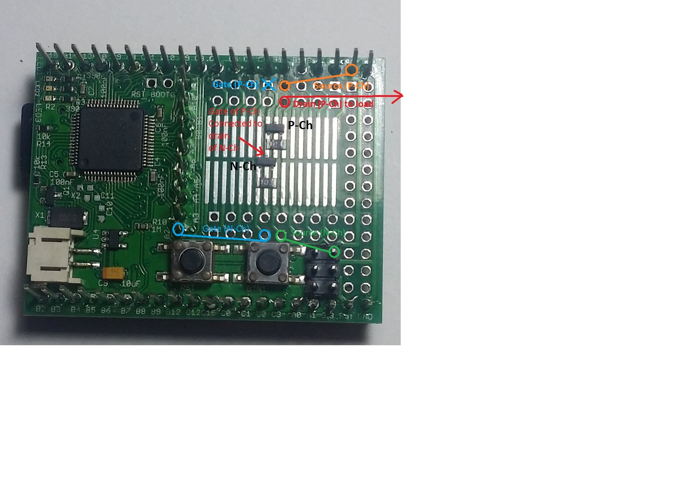
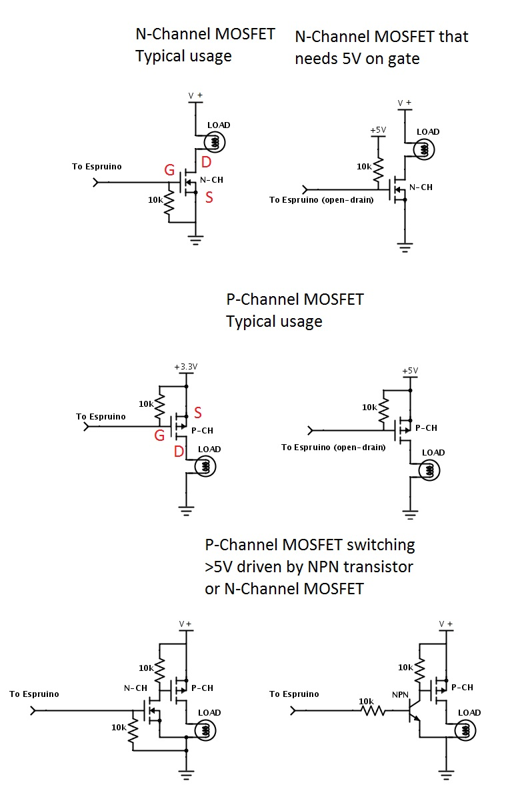

<!--- Copyright (c) 2013 Spence Konde. See the file LICENSE for copying permission. -->
MOSFETs
=====================

:warning: **Please view the correctly rendered version of this page at https://www.espruino.com/mosfets. Links, lists, videos, search, and other features will not work correctly when viewed on GitHub** :warning:

* KEYWORDS: MOSFET, Transistor

A MOSFET (Metal Oxide-Semiconductor Field Effect Transistor) is a semiconductor device that can be used as a solid state switch. These are useful for controlling loads that draw more current, or require higher voltage, than a GPIO pin can supply. In their off state, MOSFETs are non-conducting, while in their on state, they have an extremely low resistance - often measured in milliohms. MOSFETs can only be used to switch DC loads. 

MOSFETs have three pins, Source, Drain, and Gate. The source is connected to ground (or the positive voltage, in a p-channel MOSFET), the drain is connected to the load, and the gate is connected to a GPIO pin on the Espruino. The *voltage* on the gate determines whether current can flow from the drain to the load - no current flows to or from the gate (unlike a bipolar junction transistor) - this means that if the gate is allowed to float, the FET may turn on, or off, in response to ambient electrical fields, or very tiny currents. As demonstration, one can wire up a MOSFET normally, except connecting nothing to the gate pin, and then touch the gate while holding either ground or a positive voltage - even through your body’s resistance, you can turn the FET on and off! To ensure that a MOSFET remains off even if the pin is not connected (ex, after Espruino is reset), a pull-down resistor can be placed between gate and source.

MOSFETs only switch current flowing in one direction; they have a diode between source and drain in the other direction (in other words, if the drain (on an N-channel device) falls below the voltage on the source, current will flow from the source to the drain). This diode, the "body diode" is a consequence of the manufacturing process. This is not to be confused with the diode sometimes placed between the drain and the power supply for the load - this is separate, and should be included when driving an inductive load. 

Except where noted, this section assumes use of an N-channel enhancement mode MOSFET. 

N-channel vs P-channel
----------------------

In an N-channel MOSFET, the source is connected to ground, the drain to the load, and the FET will turn on when a positive voltage is applied to the gate. N-channel MOSFETs are easier to work with, and are the most commonly used type. They are also easier to manufacture, and thus are available for lower prices with higher performance than p-channel MOSFETs.

In a P-channel MOSFET, the source is connected to a positive voltage, and the FET will turn on when the voltage on the gate is below the source voltage by a certain amount (Vgs < 0). This means that if you want to use a P-channel mosfet to switch voltages higher than 5V, you'll need another transistor (of some sort) to turn it on and off.

Selection of MOSFETs
--------------------

`Gate-to-Source voltage (Vgs)` One of the most important specs is the voltage required to turn the FET completely on. This is not the threshold voltage - that's the voltage at which it first starts to turn on. Since the Espruino can only output 3.3v, for the simplest connection, we need a part that provides good performance with a 3.3v gate drive. Unfortunately, there are not many MOSFETs available in convenient through-hole packages that will work with a 3.3v gate drive. The [IRF3708PBF](http://www.irf.com/product-info/datasheets/data/irfr3708pbf.pdf) is a good choice in the large TO-220 package - it's current handling capacity is sufficient for almost any purpose, even at 3.3v on the gate. For lower current, the  5LN01SP-AC from On Semiconductor is an option; it comes in a TO-92 package, and can handle up to 100mA. 

In the datasheet for a MOSFET, a graph will typically be included showing on-state properties at various gate voltages. The key specification here will typically be given as a graph of the drain current (Id) vs drain-source voltage (Vds - this is the voltage drop across the MOSFET), with several lines for different gate voltages. For the example of the IRF3708PBF, this graph is Figure 1. Notice how at an Id of 10 amps, the voltage drop (Vds) is barely above 0.1v with a 3.3v gate drive, and one can barely tell the lines for 3.3v and higher voltages apart. 

There is a very wide variety of low-voltage MOSFETs available in surface mount packages with excellent specs, often at very low prices. The popular SOT-23 package can be soldered onto the Espruino's SMD prototyping area as shown in the pictures below, or used with one of many low-cost breakout boards available from eBay and many electronics hobby vendors.

`Continuous Current` Make sure that the continuous current rating of the part is sufficient for the load - many parts have both a peak current and continuous current rating, and naturally, the former is often the headline spec. 

`Drain-Source Voltage (Vds)` This is the maximum voltage that the MOSFET can switch. 

`Maximum Gate-Source Voltage (Vgs)` This is the maximum voltage that can be applied on the gate. This is particularly relevant in the case of a p-channel MOSFET switching a fairly high voltage, when you pull the voltage down with another transistor or FET to turn it on.

Pinouts
------------------

These show the pinout of typical TO-220 and SOT-23 MOSFETs. However, ALWAYS consult the datasheet before connecting anything, in case you find yourself using a wierdo part. 

Connection
------------------

N-Channel:

An Espruino being used to switch a 100W load using an IRF3708. Note the 10k resistor between gate and source. The load is a 100W 660nm LED array, pulling ~3.8A (per specs) at 22v (more like 85W) - it is outside the picture (it's rather bright). 

This shows two N-channel MOSFETs on the surface mount prototyping area on an Espruino, one in SOT-23 (right) and the other in SOIC-8 (left). Note that the traces between the SMD pads and the pins on the Espruino are fairly thin, so this should not be used for currents much over an amp.

P-Channel: 

This shows an N-channel MOSFET being used to turn on a P-channel MOSFET - this configuration is useful when you need to switch the high side of a circuit powered by something above 5 volts - this example assumes the Espruino's VBat is the power source.

Schematics
------------------
These schematics show a few common configurations for MOSFETs as they would be used with the Espruino. The exact values of the resistors are not essential; a higher value resistor will work fine (and may be desirable where power usage is of particular concern). As can be seen below, using a P-channel MOSFET to switch voltages above 5v involves a more complicated circuit. This is not the case when using an N-channel MOSFET to switch high voltages; since the source is grounded, the gate doesn't need to go up to the voltage being switched, like it does on a P-channel MOSFET, where the source is the positive voltage. 

MOSFETs vs Relays
----------------

* MOSFETs consume essentially no power, while relays use a significant amount of power when turned on. 
* MOSFETs can be driven with PWM. Relays can't. 
* MOSFETs require a shared ground (or supply for p-channel), while relays completely isolate the circuit being driven.
* MOSFETs can only switch DC loads, while relays, being isolated, can switch AC as well. 

MOSFETs vs Bipolar Junction Transistors
------------------

* MOSFETs are controlled by voltage, not current. There is negligible gate current, whereas a BJT has a non-negligible base current. 
* MOSFETs often have a lower voltage drop in their on state.
* MOSFETs will turn themselves on if the gate is allowed to float, BJTs require current to flow, so they will not..
* MOSFETs are often more expensive, and were historically more vulnerable to static damage.

Enhancement vs Depletion mode
----------------------
The majority of MOSFETs used are so-called enhancement mode devices, and the above writeup has assumed use of an enhancement mode MOSFET. Again, in an enhancement mode MOSFET, when the gate is at the same voltage as the source (Vgs=0), the MOSFET does not conduct. 

In a depletion mode MOSFET, when Vgs = 0, the MOSFET is on, and a voltage must be applied to the gate in order to stop conduction. The supplied voltage is the opposite of what would turn on an enhancement mode MOSFET - so for an N-channel enhancement mode MOSFET, a negative voltage must be applied to turn it off.

Buying
---------------------

* [Digikey](http://www.digikey.com/product-search/en/discrete-semiconductor-products/fets-single/1376381?stock=1) 
* [Mouser](http://mouser.com)
* [eBay](http://ebay.com) (common parts only)
