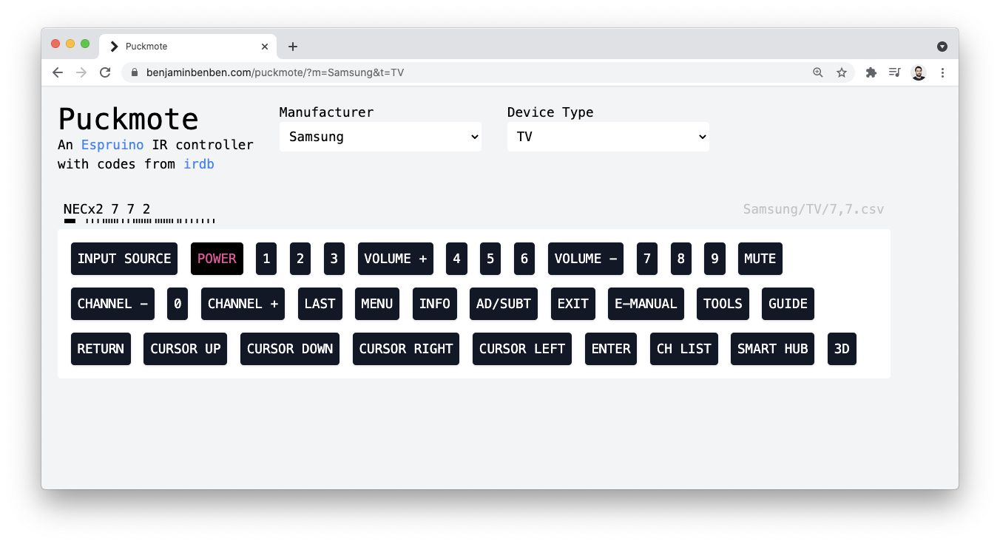

<!--- Copyright (c) 2021 Gordon Williams, Pur3 Ltd. See the file LICENSE for copying permission. -->
Puckmote - Universal Remote Control
===================================

:warning: **Please view the correctly rendered version of this page at https://www.espruino.com/Puckmote. Links, lists, videos, search, and other features will not work correctly when viewed on GitHub** :warning:

* KEYWORDS: Bluetooth,BLE,IR,Infrared,TV,Remote Control
* USES: BLE,Puck.js

[Ben Foxall](https://benjaminbenben.com/) has made webpage that allows
you to control any TV from your phone or PC using a [Puck.js](/Puck.js)

It's installable as a progressive web app, so you can "Save" a controller
on your phone homescreen for easy access.

[Try it out!](https://benjaminbenben.com/puckmote/)

Or [see the code on GitHub](https://benjaminbenben.com/puckmote/) - and there's
[a forum post](http://forum.espruino.com/conversations/363344) describing
it in more detail.
