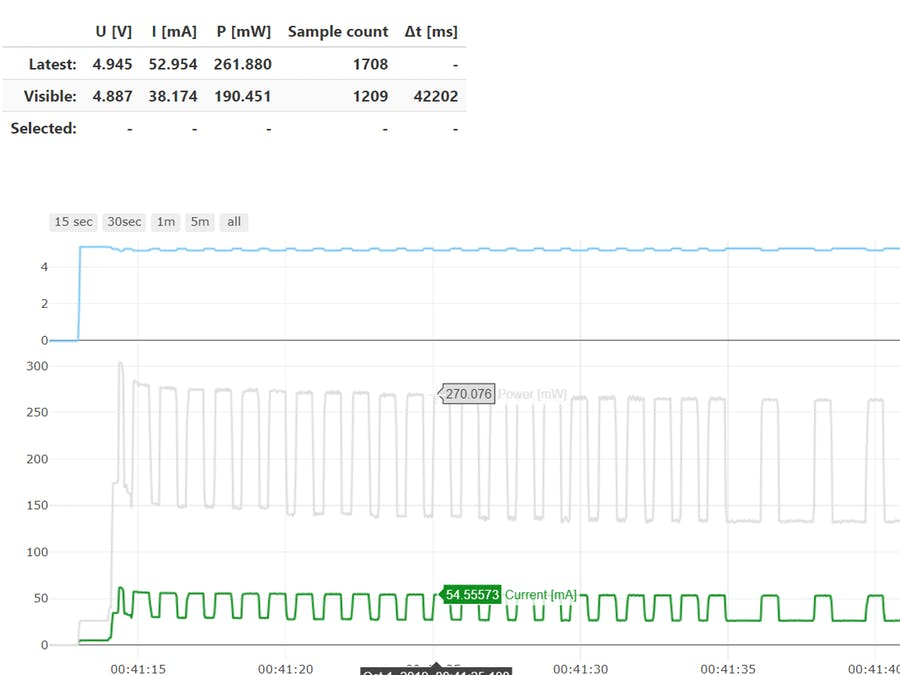

<!--- Copyright (c) 2019 Gordon Williams, Pur3 Ltd. See the file LICENSE for copying permission. -->
Bluetooth Energy Usage Monitor
==============================

:warning: **Please view the correctly rendered version of this page at https://www.espruino.com/ble_energy_graphs. Links, lists, videos, search, and other features will not work correctly when viewed on GitHub** :warning:

* KEYWORDS: BLE,Energy,Power Usage,Graphs
* USES: BLE,MDBT42Q,Web Bluetooth

BLEnergyGraphs: A Bluetooth Low Energy / Web Bluetooth tool to measure the energy needs of your embedded projects!

[See the full project on Hackster.io](https://www.hackster.io/akos-lukacs/blenergygraphs-7e7b9c)
