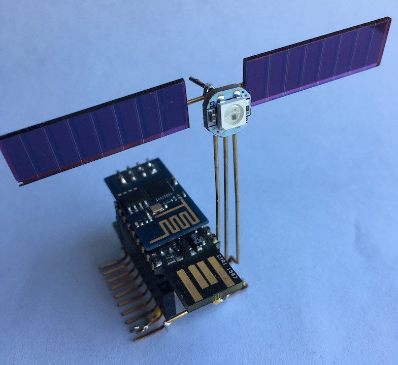

<!--- Copyright (c) 2019 Gordon Williams, Pur3 Ltd. See the file LICENSE for copying permission. -->
Espruino ISS Notifier
=====================

:warning: **Please view the correctly rendered version of this page at https://www.espruino.com/espruino_iss_notifier. Links, lists, videos, search, and other features will not work correctly when viewed on GitHub** :warning:

* KEYWORDS: ISS,JSON
* USES: Pico,WS2811,ESP8266,Internet

A WiFi-connected indicator for when the International Space Station is overhead.

[See the full project on Hackaday.io](https://hackaday.io/project/165596-espruino-iss-notifier)
