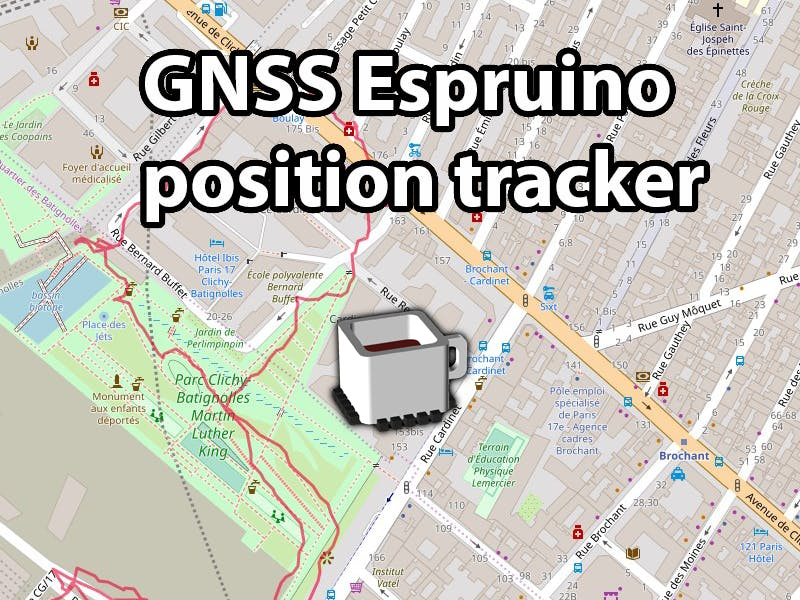

<!--- Copyright (c) 2019 Gordon Williams, Pur3 Ltd. See the file LICENSE for copying permission. -->
GNSS Espruino Position Tracker
===============================

:warning: **Please view the correctly rendered version of this page at https://www.espruino.com/geolocation_with_gnss. Links, lists, videos, search, and other features will not work correctly when viewed on GitHub** :warning:

* KEYWORDS: GNSS,Galileo,GPS,Position,Geo,Tracker,Tracking
* USES: Pico,GNSS,GPS

How to configure UBLOX GPS modules to use the Galileo/GNSS positioning
system and then log to SD card.

[See the full project on Hackster.io](https://www.hackster.io/_larry_/gnss-track-your-position-with-espruino-5e70e6)
