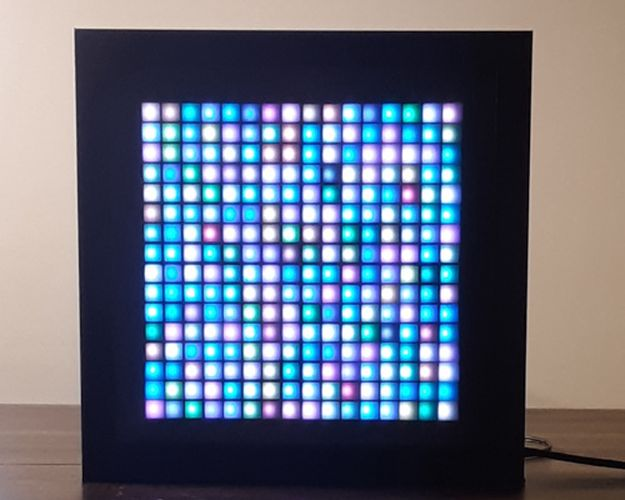

<!--- Copyright (c) 2020 Gordon Williams, Pur3 Ltd. See the file LICENSE for copying permission. -->
16x16 Neopixel Frame
=====================

:warning: **Please view the correctly rendered version of this page at https://www.espruino.com/lumiius_led_matrix. Links, lists, videos, search, and other features will not work correctly when viewed on GitHub** :warning:

* KEYWORDS: LED,Matrix
* USES: WiFi,WS2811,Internet

A 16x16 Neopixel matrix running on the Espruino microcontroller

[See the full project on Make: Projects](https://makeprojects.com/project/lumiius-led-matrix)
