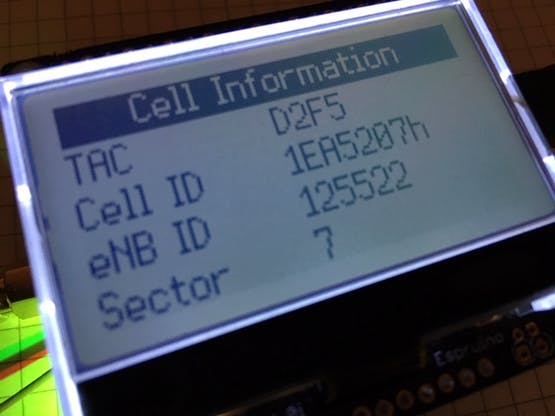

<!--- Copyright (c) 2019 Gordon Williams, Pur3 Ltd. See the file LICENSE for copying permission. -->
NB-IoT Explorer
=====================

:warning: **Please view the correctly rendered version of this page at https://www.espruino.com/nb_iot_explorer. Links, lists, videos, search, and other features will not work correctly when viewed on GitHub** :warning:

* KEYWORDS: NB-IoT,NBIOT,BG96
* USES: Pixl.js,QuectelBG96

How to use the [Quectel BG96](/QuectelBG96) NB-IoT modem with [Pixl.js](/Pixl.js)

[See the full project on Hackster.io](https://www.hackster.io/wolfgangklenk/nb-iot-explorer-explore-narrowband-iot-nb-iot-radio-netwo-a89406)
