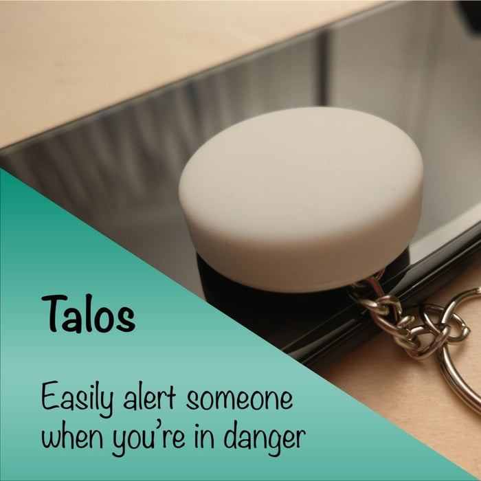

<!--- Copyright (c) 2019 Gordon Williams, Pur3 Ltd. See the file LICENSE for copying permission. -->
Talos, Keeping You Safe During Your Commute
===============================

:warning: **Please view the correctly rendered version of this page at https://www.espruino.com/talos_alert_button. Links, lists, videos, search, and other features will not work correctly when viewed on GitHub** :warning:

* KEYWORDS: Tracker,Tracking,Android,Alert,Button
* USES: Puck.js,BLE,Android

A little device that connects to your phone and allows you to send a text to the person of your choice. The SMS automatically includes your last known location and the pre-recorded text of your choice. 

[See the full project on Instructables](https://www.instructables.com/id/Talos-Keeping-You-Safe-During-Your-Commute/)
