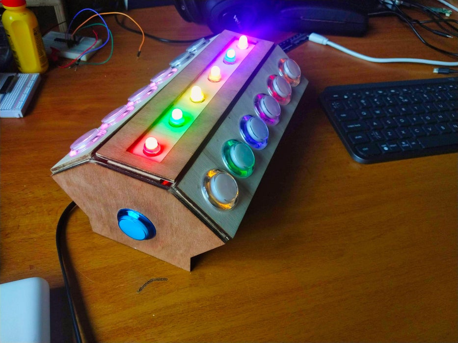

<!--- Copyright (c) 2020 Gordon Williams, Pur3 Ltd. See the file LICENSE for copying permission. -->
Tap Tap Rainbow - a 2 Player Quick Reaction Game
==============================

:warning: **Please view the correctly rendered version of this page at https://www.espruino.com/tap_tap_rainbow. Links, lists, videos, search, and other features will not work correctly when viewed on GitHub** :warning:

* KEYWORDS: Rainbow,Game
* USES: Espruino Board,WS2811

A 2-Player Quick Reaction Game using an [Espruino Board](/Original) and [WS2811 lights](/WS2811)

[See the full project on Instructables](https://www.instructables.com/id/Tap-Tap-Rainbow-a-2-Player-Quick-Reaction-Game/)
