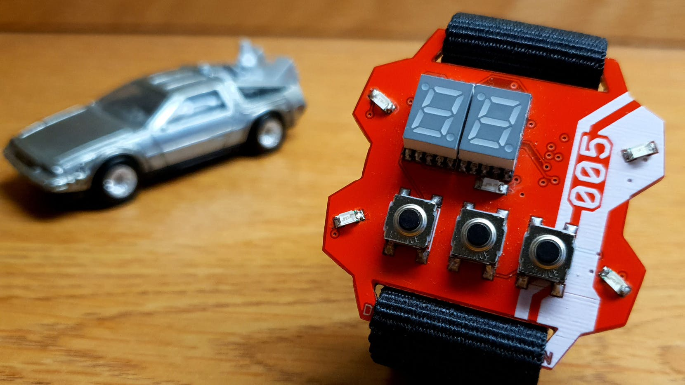

<!--- Copyright (c) 2019 Gordon Williams, Pur3 Ltd. See the file LICENSE for copying permission. -->
Time Machine Retro-Inspired Smartwatch
=======================================

:warning: **Please view the correctly rendered version of this page at https://www.espruino.com/time_machine_watch. Links, lists, videos, search, and other features will not work correctly when viewed on GitHub** :warning:

* KEYWORDS: BLE,Watch,Smartwatch,time
* USES: BLE,MDBT42Q,

An open source, retro-inspired smartwatch running JavaScript

[See the full project on Eric Min's site](https://iamericmin.github.io/tm5.html) or [GitHub](https://github.com/iamericmin/Time-Machine-Mk.-V)
