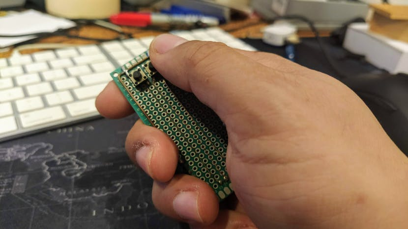

<!--- Copyright (c) 2019 Gordon Williams, Pur3 Ltd. See the file LICENSE for copying permission. -->
Turning an Espruino Puck.js Into a Universal Presentation Clicker
=============================================

:warning: **Please view the correctly rendered version of this page at https://www.espruino.com/universal_presentation_clicker. Links, lists, videos, search, and other features will not work correctly when viewed on GitHub** :warning:

* KEYWORDS: Bluetooth,BLE
* USES: BLE,Puck.js

Espruino boards are unique, because they're programmed with JavaScript. Parasquid used one to build a universal presentation clicker.

[See the full project on Hackster.io](https://www.hackster.io/news/turning-an-espruino-puck-js-into-a-universal-presentation-clicker-4921dacc0bb6)
