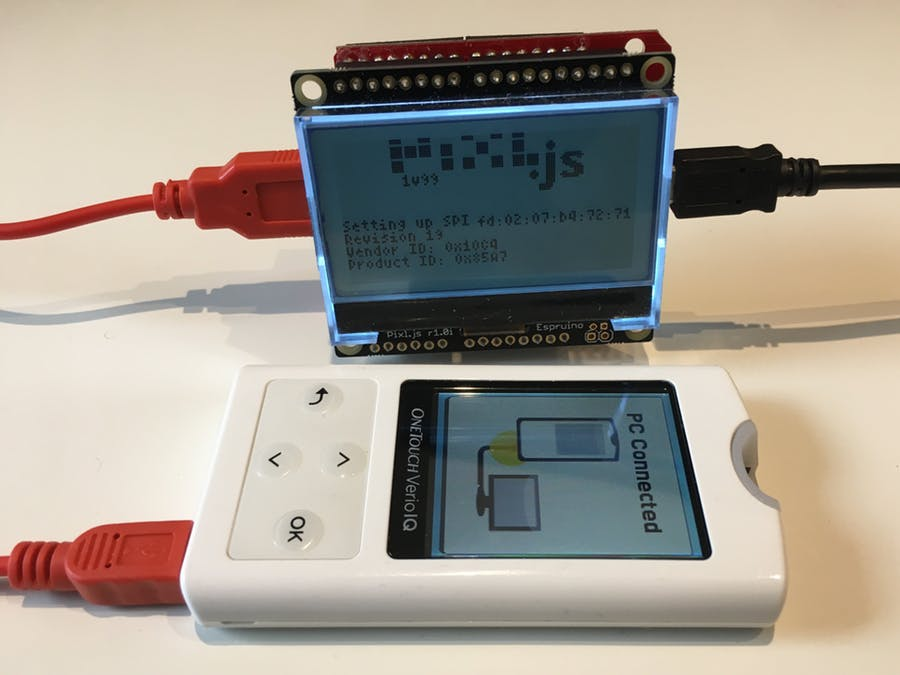

<!--- Copyright (c) 2019 Gordon Williams, Pur3 Ltd. See the file LICENSE for copying permission. -->
USB Host Support
=====================

:warning: **Please view the correctly rendered version of this page at https://www.espruino.com/usb_host_support. Links, lists, videos, search, and other features will not work correctly when viewed on GitHub** :warning:

* KEYWORDS: MAX3421E,MAX3421,USB,USB Host,OTG
* USES: Pixl.js,MAX3421E

How to add USB Host support to an Espruino [Pixl.js](/Pixl.js) board using the MAX3421E.

[See the full project on Hackster.io](https://www.hackster.io/gerrit-niezen/adding-usb-host-support-to-espruino-2c494d)
