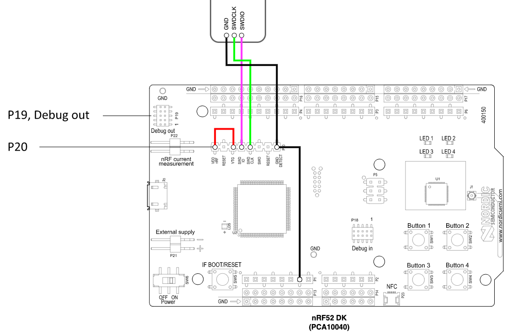
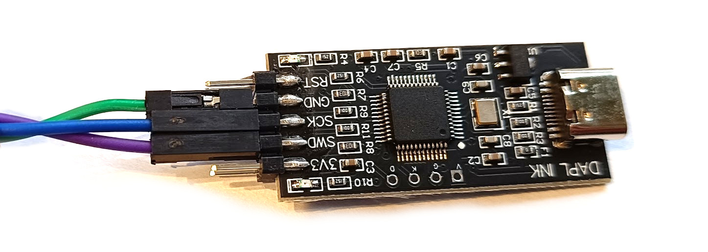

<!--- Copyright (c) 2024 Gordon Williams, Pur3 Ltd. See the file LICENSE for copying permission. -->
Advanced Debug (SWD)
====================

<span style="color:red">:warning: **Please view the correctly rendered version of this page at https://www.espruino.com/AdvancedDebug. Links, lists, videos, search, and other features will not work correctly when viewed on GitHub** :warning:</span>

* KEYWORDS: Debug,SWD,JTAG,ICD,STLink,ST-Link,CMSIS-DAP,DAPLINK
* USES: Espruino Board,Pico,EspruinoWiFi,Puck.js,Jolt.js,Pixl.js,Puck.js,MDBT42Q

While the Espruino firmware itself can be compiled for and debugged on a Host PC, sometimes you'll need to be able to reflash and/or debug the hardware itself.

* On STM32-based devices you can do this using SWD pins and an ST-Link device
* On Nordic-based devices you would ideally connect a Nordic [nRF52832DK](/nRF52832DK) to the two labelled SWD pins, but it is possible to use a DAPLINK/CMSIS-DAP dongle as well

See below for more information:

NRF52 boards
------------

Connecting up SWD just requires connecting 3 pins - GND, SWDIO and SWCLK. Connecting for each device is detailed in:

* [Bangle.js 2 Technical pages](/Bangle.js2+Technical#swd) - the charge cable has SWD/SWCLK connected to the USB data wires.
* [Bangle.js 1 Technical pages](/Bangle.js+Technical#swd-programming)
* Pixl.js SWD/SWCLK are [shown in the Pinout diagram](/Pixl.js#pinout)
* Puck.js SWD/SWCLK are [marked on the PCB](/Puck.js#pinout)
* MDBT42Q SWD/SWCLK are [shown in the Pinout diagram](/MDBT42Q#pinout)
* Jolt.js SWD/SWCLK are [marked on the PCB](/Jolt.js#pinout) as `3 D C 0` where 3=3.3v, D=SWD, C=SWCLK, 0=GND

We'd suggest using a a Nordic [nRF52832DK](/nRF52832DK), but CMSIS-DAP is possible too:

### nRF52832DK

The nRF52832DK contains an nRF52832 at one end, and a proper Segger debugger/programmer at the other. You can use the SWD pins on P20 to program devices, but to convince the debugger to use them (as opposed to programming the built-in nRF52832) you must connect the `GND DETECT` wire to GND as in this diagram:



Once connected you can either copy the hex file direct to the `SEGGER` USB drive that appears when the DK is plugged in, or the better way (allowing you to see the status of programming) is to use the [nRF Connect for Desktop](https://www.nordicsemi.com/Products/Development-tools/nRF-Connect-for-Desktop) tools.


### DAPLINK / CMSIS-DAP dongle

There are many different types of dongle available, but the one we have used and know works is [this one from Amazon](https://www.amazon.com/DKARDU-Replaces-downloader-Emulator-Interface/dp/B0BGQZHL75/ref=sr_1_5):



Steps to write firmware:

* If using Bangle.js, get a USB socket and wire it up to the dongle as below, then plug the Bangle.js charge cable into the socket
  * GND -> GND
  * DATA+ -> SCK
  * DATA- -> SWD
  * 5V -> don't connect
* If using another device, just wire up the GND, SWD and SCK pins as detailed in the links above.
* Install OpenOCD from https://github.com/openocd-org/openocd/releases/tag/v0.12.0 - you just need to extract the `tar.gz` file to a directory on your windows PC
* Get a `.hex` hex file for the firmware (see 'Building Firmware' below), and copy it into the directory you extracted OpenOCD to
* Open Windows command prompt/powershell in the OpenOCD directory
* OPTIONAL: We don't 'lock' nRF52 devices we sell, but if you're trying to flash some other nRF52 based chip it may need 'recovering' first, which deletes everything on it and removes the 'read protect' bit. To do this run: `.\bin\openocd.exe -d2 -f interface/cmsis-dap.cfg -f target/nrf52.cfg -c "init;nrf52_recover;exit"`
* Now run the following (with your firmware file): `.\bin\openocd.exe -d2 -f interface/cmsis-dap.cfg -f target/nrf52.cfg -c "init;reset init;halt;program espruino_2v21_banglejs2.hex verify;reset;exit"` to write the new firmware. It'll take a few minutes and doesn't say a great deal, but after that firmware will be written.

For debugging, you'll have to follow tutorials online for setting up GDB with OpenOCD.


STM32 boards
--------------

We'd suggest using an STM32DISCOVERY board (not the VLDISCOVERY) if you're going to use the STLINK part of it.

Make sure you disconnect the two ST-LINK jumpers first, then connect as detailed below. You can then use a normal debugger such as [st-link](https://github.com/texane/stlink) on linux.

When trying to debug, you may find that your PC doesn't recognise the Espruino as a USB device. To solve this, power the Espruino up without USB and start the debugger. Then plug into USB when the firmware is actually running.

### Original Espruino Board

Connect wires onto the 6 pin SWD connector as follows:

| Pin No. | F3/F4 Discovery Pin  | Espruino Pin |
|----------------|------|--------------|
| 1 | VDD Target | |
| 2 | SWCLK      | A14 |
| 3 | GND        | GND |
| 4 | SWDIO      | A13 |
| 5 | NRST       | |
| 6 | SWO        | |

* You may also need to unsolder LED1 and LED2 (or their resistors), as these use the (usually useless!) SWD debug pins
* For debugging you need to edit ```targets/stm32/jshardware.c```, remove the line containing ```GPIO_Remap_SWJ_Disable```
* Initially won't be able to flash Espruino. This is because the SWD pins are disabled and used for status LEDs. You'll need to connect `BOOT0` to `3.3v` and tap reset, which stops Espruino itself booting and reclaiming the SWD pins.

### Espruino Pico

The Six SWD connections are available on six circular pads on the back of the [[Pico]]. Pin one is unmarked, but is nearest the USB connector.

You only actually need to connect pins 2,3 and 4 - but you can connect more if you want to.

###  Espruino WiFi

SWD SWCLK and SWDIO are available via two labelled circular pads on the top of the board, by the USB connector.

Finally (if you have the [st-link tools](https://github.com/texane/stlink) installed and on your path), you can flash Espruino, with:

```Bash
DEBUG=1 ESPRUINO_1V3=1 make flash
# or
DEBUG=1 PICO_1V3=1 make flash
```

You can then debug by running:

```Bash
st-util
```

in one window, and:

```Bash
DEBUG=1 ESPRUINO_1V3=1 make gdb
#or
DEBUG=1 PICO_1V3=1 make gdb
```

in the other.

There are some useful functions defined in `.gdinit` if you plan on debugging the interpreter - but if you're doing that we'd strongly suggest you try and debug a normal Linux executable of Espruino first, and only move onto actual hardware if you can't fix the problem there.

Building Firmware
-----------------

We supply 'firmware update' images for Espruino boards at [on the Download page](Download) that are designed to be written with the bootloader. These images can not be written directly to an unprogrammed board via SWD as they do not contain the bootloader (and softdevice in nRF52 case). You'll need to build your own firmware.

See https://github.com/espruino/Espruino/blob/master/README_Building.md for full information on building.

**nRF52:** we normally build with `DFU_UPDATE_BUILD=1` on the command-line, which creates a `zip` for bootloader-based updates. For writing via SWD you need a hex file - this can be done by just building normally, without `DFU_UPDATE_BUILD=1`. For instance `BOARD=PUCKJS RELEASE=1 make` will make the hex file you need.

**STM32:** a normal build will just build the firmware, not the bootloader (but there are scripts at `scripts/create_espruino_image_1v3.sh`, `scripts/create_pico_image_1v3.sh` and `scripts/create_espruinowifi_image.sh` that build everything and combine it into one file.
