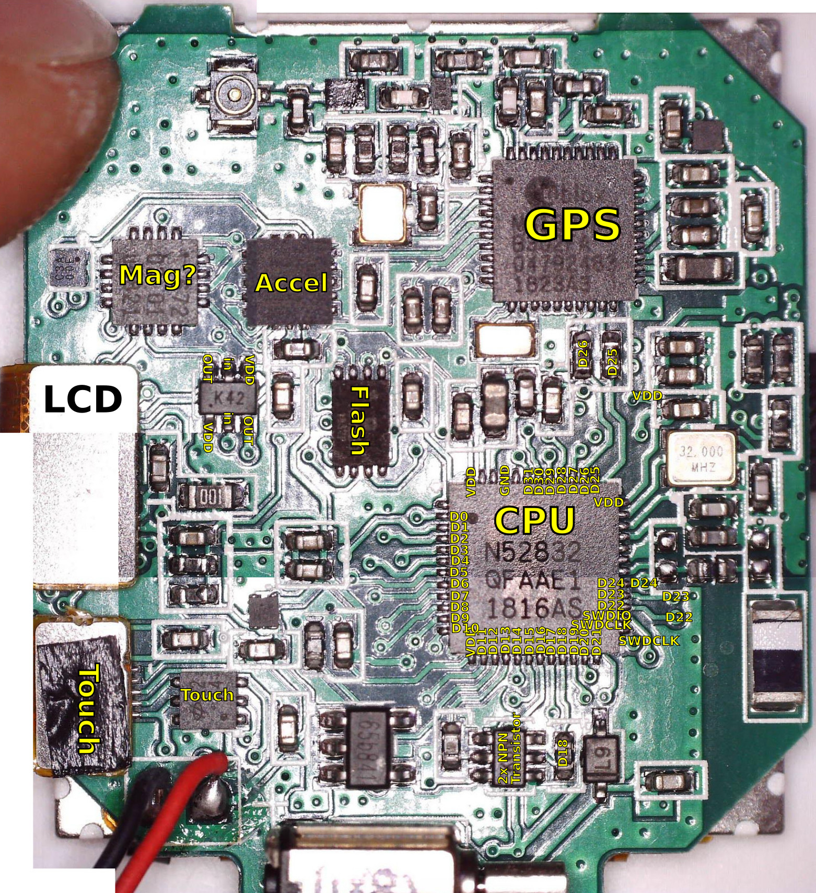
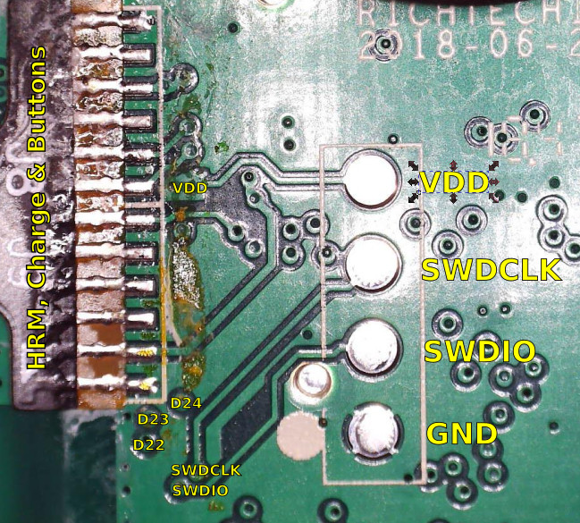
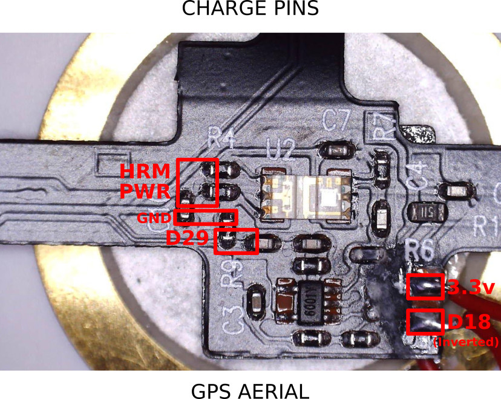
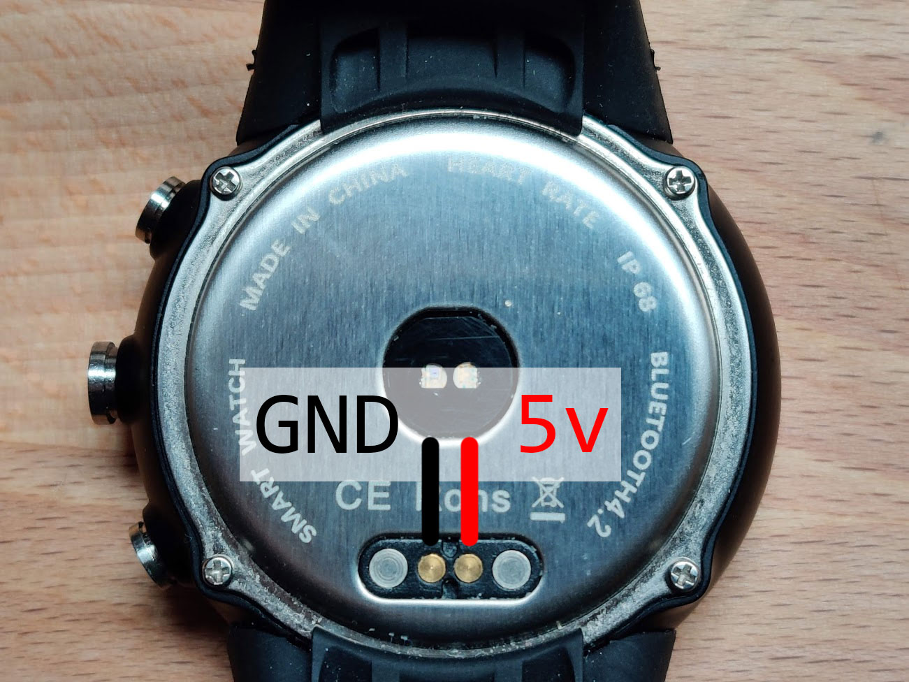

<!--- Copyright (c) 2019 Gordon Williams, Pur3 Ltd. See the file LICENSE for copying permission. -->
Bangle.js Technical Information
===============================

:warning: **Please view the correctly rendered version of this page at https://www.espruino.com/Bangle.js+Technical. Links, lists, videos, search, and other features will not work correctly when viewed on GitHub** :warning:

* KEYWORDS: Bangle.js,Bangle,Banglejs,Smartwatch,Watch,pinout,pins,io,specs,spec
* USES: Bangle.js

**For general Bangle.js information, try [the Bangle.js 1](/Bangle.js) or [the Bangle.js 2](/Bangle.js2) pages**

**This page contains detailed information on Bangle.js's 1's internals. [Click here for Bangle.js 2](/Bangle.js2+Technical)**. If you're
just writing JS then you should have no need for this information, but if you
plan on modifying the Bangle.js firmware it might be of interest.

Contents
--------

* APPEND_TOC

Features
--------

* IP68 Waterproof (everyday use, **not swimming or baths**)
* Nordic 64MHz nRF52832 ARM Cortex-M4 processor with Bluetooth LE
* 64kB RAM 512kB on-chip flash, 4MB external flash
* 1.3 inch 240x240 16 bit LCD display with 2 zone touch
* GPS/Glonass receiver (UBlox)
* Heart rate monitor
* 3 Axis Accelerometer (with Pedometer and Tap detect)
* 3 Axis Magnetometer
* Vibration motor
* 350mAh battery, 1 week standby time
* 5 x 5 x 1.7 cm case, plastic with stainless steel ring
* Can be disassembled with just 4 screws

Software
---------

Where mentioned in the source code or filenames, `Q3` references Bangle.js 2, and `F18` references Bangle.js 1.

The Espruino version for Bangle.js has a few specific modifications:

* [`jswrap_bangle.c`](https://github.com/espruino/Espruino/blob/master/libs/banglejs/jswrap_bangle.c) contains
all `Bangle.*` functions and pretty much all Bangle.js functionality.
* Some functionality (like menus) is in JavaScript which is built into the firmware. Those [JavaScript files are here](https://github.com/espruino/Espruino/tree/master/libs/js/banglejs)
* [`BANGLEJS.py`](https://github.com/espruino/Espruino/blob/master/boards/BANGLEJS.py) describes the build
  * The `SPIFLASH` device causes `SPIFLASH_BASE` to be defined, which enables external SPI flash memory support in [`jshardware.c`](https://github.com/espruino/Espruino/blob/master/targets/nrf5x/jshardware.c)
* The bootloader starts at `0x7A000` (4k less than the standard SDK12 bootloader) because it was originally an SDK11 device

Hardware
--------

Want to get inside? Check out the [Bangle.js Disassembly page](/Bangle.js+Disassembly)

* [KX023 accelerometer](/datasheets/KX023-1025.pdf)
* [GMC303 3 axis compass](/datasheets/GMC303.pdf)
* BD 1668 heart rate sensor (HRM) (no datasheet). All analog - op-amp comparing two wavelengths of light
* 32 mbit flash - similar command set to [Macronix MX25](https://media.digikey.com/pdf/Data%20Sheets/Macronix/MX25U12835F.pdf)
* 240x240 LCD with [ST7789 driver](https://www.rhydolabz.com/documents/33/ST7789.pdf) used in 8 bit parallel mode
* Holtek touch controller - probably the [BS83A02A](https://www.holtek.com.tw/documents/10179/11842/BS83A02A-4_A04A-3-4v171.pdf) with 2 zone on/off
* GPS is [UBlox UBX-M8130](https://www.u-blox.com/sites/default/files/products/documents/u-blox8-M8_ReceiverDescrProtSpec_%28UBX-13003221%29_Public.pdf)
* 502527 Lithium ion battery

GPS
---

As above the GPS is a [UBlox UBX-M8130](https://www.u-blox.com/sites/default/files/products/documents/u-blox8-M8_ReceiverDescrProtSpec_%28UBX-13003221%29_Public.pdf)

On boot, it reports: `ROM CORE 3.01, PROTVER=18.00*11`

Espruino handles reception and parsing of NMEA data from the GPS UART when `Bangle.setGPSPower(1)` is called.

However it is possible to also send UBLOX UBX commands to configure the GPS - see https://github.com/espruino/BangleApps/blob/master/testing/GPS-comms.js

GPIO
----

There's IO connected to the nRF52, plus an IO expander to provide power to some other things.

### nRF52

| Pin | Name | Notes |
|-----|------|-------|
| D0 | LCD_D0 | Bits 0-7 all set together via `(char*)P0_OUT` |
| D1 | LCD_D1 | Bits 0-7 all set together via `(char*)P0_OUT` |
| D2 | LCD_D2 | Bits 0-7 all set together via `(char*)P0_OUT` |
| D3 | LCD_D3 | Bits 0-7 all set together via `(char*)P0_OUT` |
| D4 | LCD_D4 | Bits 0-7 all set together via `(char*)P0_OUT` |
| D5 | LCD_D5 | Bits 0-7 all set together via `(char*)P0_OUT` |
| D6 | LCD_D6 | Bits 0-7 all set together via `(char*)P0_OUT` |
| D7 | LCD_D7 | Bits 0-7 all set together via `(char*)P0_OUT` |
| D8 | LCD_DC |  |
| D9 | LCD_CLK |  |
| D10 | LCD_CS |  |
| D11 | TOUCH RIGHT | inverted |
| D12 | Battery charging when low | Input pullup |
| D13 | VIBRATE - active high | |
| D14 | I2C SCK | |
| D15 | I2C_SDA | |
| D16 | TOUCH LEFT | inverted |
| D17 | Flash D3 (RST - connect to VCC) |
| D18 | Speaker (if included), otherwise inverted output on HRM PCB | |
| D19 | Flash SCLK | |
| D20 | Flash D1 (MISO) | |
| D21 | Flash CS | |
| D22 | Middle button  | inverted |
| D23 | Top button  | inverted |
| D24 | Bottom button  | inverted  |
| D25 | GPS RX | |
| D26 | GPS TX | |
| D27 | Flash D0 (MOSI) | |
| D28 | IO expander reset | |
| D29 | HRM Analog | |
| D30 | Battery Level | 0.51=low, 0.62=good |
| D31 | Flash D2 (WP - connect to GND) | |

### IO Expander

| Mask | Description | Default value |
|------|-------------|---------------|
| 0x01 | GPS | 0 |
| 0x02 |  | |
| 0x04 |  | |
| 0x08 |  | |
| 0x10 |  | |
| 0x20 | LCD backlight  |  1 |
| 0x40 | LCD reset |  1 |
| 0x80 | HRM  | 1 |

SWD / Programming
------------------

You can completely reprogram (and even debug) the nRF52 chip inside
Bangle.js with the SWD pins. These are on the circuit board under the
LCD.

You can carefully pull up the LCD and cut/tear through the foam tape holding
it on. Underneath that you'll find 4 pins, labelled as follows:

You only need `GND`, `SWDID` and `SWDCLK` (VDD is not required).

Heart Rate monitor PCB
----------------------

On the bottom right of the PCB (by the label `R6`) are the two
pads for the speaker. The one labelled `+` goes directly to `3.3v`,
and the one next to it goes to pin `D18` via a transistor.

As such, `D18` is inverted, and can only be used as an output - however
it is powered (pulldown via MMDT3904) so is able to drive reasonably high loads (up to ~100mA).

The heart rate monitor itself is powered from the IO expander, and
has just a single analog output, which is `D29`.

Charging pins
-------------

The two circular gold pads interface with the charging circuit. The right-hand
one (with them at the top of the watch) is connected to `GND`, and the left-hand
one goes to the charging circuitry.

I2C
---

SCK=D14, SDA=D15

* 0x0C - GMC303 magnetometer
* 0x1E - KX023 accelerometer
* 0x20 - io expander
* 0x7C - Unknown. Only checked once by OEM firmware.
