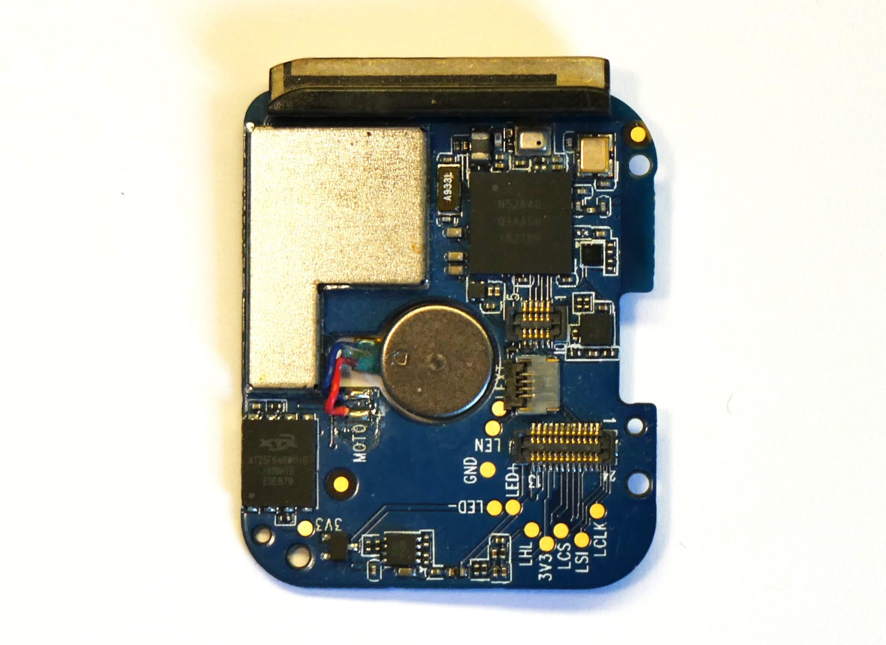
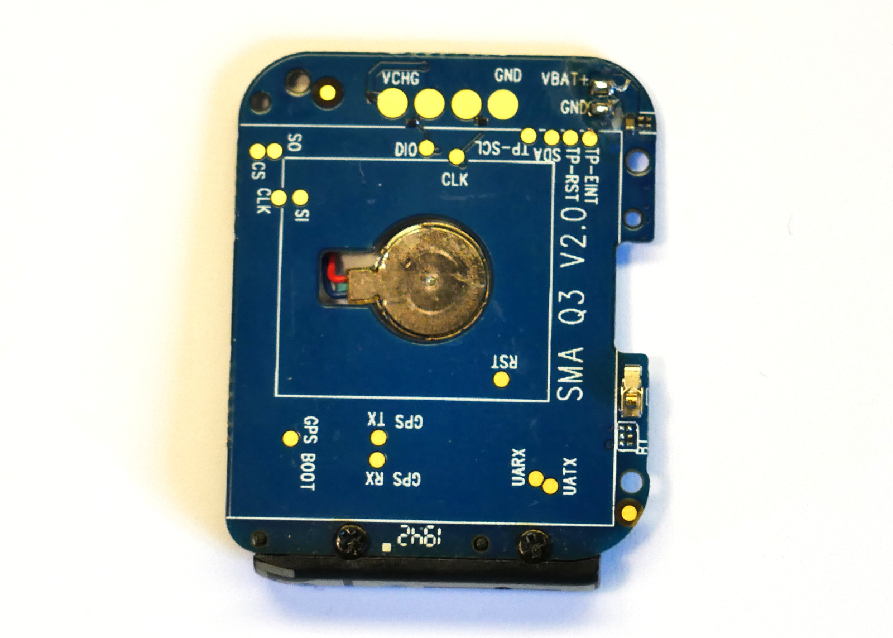
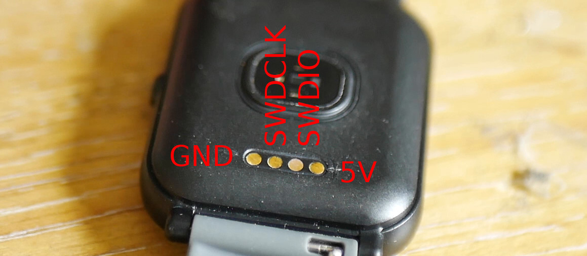
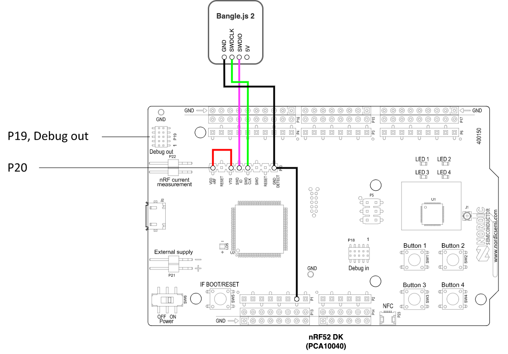

<!--- Copyright (c) 2023 Gordon Williams, Pur3 Ltd. See the file LICENSE for copying permission. -->
Bangle.js 2 Technical Information
===============================

<span style="color:red">:warning: **Please view the correctly rendered version of this page at https://www.espruino.com/Bangle.js2+Technical. Links, lists, videos, search, and other features will not work correctly when viewed on GitHub** :warning:</span>

* KEYWORDS: Bangle.js,Bangle,Banglejs,Smartwatch,Watch,pinout,pins,io,specs,spec
* USES: Bangle.js

**For general Bangle.js information, try [the Bangle.js 1](/Bangle.js) or [the Bangle.js 2](/Bangle.js2) pages**

This page contains detailed information on Bangle.js's 2's internals. If you're
just writing JS then you should have no need for this information, but if you
plan on modifying the Bangle.js firmware it might be of interest.

This file is based on reverse engineering of publically available firmware
and information, buy Gordon Williams, [fanoush](https://github.com/fanoush), and [atc1441](https://github.com/atc1441).
It was originally published as a [hackaday.io project page](https://hackaday.io/project/175577-hackable-nrf52840-smart-watch)

Contents
--------

* APPEND_TOC

Features
--------

* IP67 Water Resistant (everyday use, **not swimming or baths**)
* Nordic 64MHz [nRF52840](/datasheets/nRF52840_PS_v1.1.pdf) ARM Cortex-M4 processor with Bluetooth LE
* 256kB RAM 1024kB on-chip flash, 8MB external flash ([GD25Q64C](/datasheets/GD25Q64C.pdf)/[GD25Q64E](/datasheets/GD25Q64E.pdf))
* 1.3 inch 176x176 always-on 3 bit colour LCD display ([LPM013M126](/datasheets/LPM013M126C.pdf))
* Full touchscreen ([Hynitron CST816S](/datasheets/CST816S.pdf))
* Single button on side of watch
* GPS/Glonass receiver ([AT6558 / AT6558R](#gps))
* Heart rate monitor ([Vcare VC31 / VC31B](/datasheets/VC31B.pdf))
* 3 Axis Accelerometer ([Kionix KX023](/datasheets/KX023-1025.pdf))
* 3 Axis Magnetometer
* Air Pressure/Temperature sensor (Bosch BMP280 / [Goertek SPL06](/datasheets/SPL06.pdf))
* Vibration motor
* SWD program/debug pins on rear of watch
* 200mAh battery, 4 weeks standby time
* 36mm x 43mm x 12mm watch body, with standard 20mm watch straps

Software
---------

Where mentioned in the source code or filenames, `Q3` references Bangle.js 2, and `F18` references Bangle.js 1.

The Espruino version for Bangle.js has a few specific modifications:

* [`jswrap_bangle.c`](https://github.com/espruino/Espruino/blob/master/libs/banglejs/jswrap_bangle.c) contains
all `Bangle.*` functions and pretty much all Bangle.js functionality.
* Some functionality (like menus) is in JavaScript which is built into the firmware. Those [JavaScript files are here](https://github.com/espruino/Espruino/tree/master/libs/js/banglejs)
* [`BANGLEJS2.py`](https://github.com/espruino/Espruino/blob/master/boards/BANGLEJS2.py) describes the build
  * The `SPIFLASH` device causes `SPIFLASH_BASE` to be defined, which enables external SPI flash memory support in [`jshardware.c`](https://github.com/espruino/Espruino/blob/master/targets/nrf5x/jshardware.c)


Hardware
--------

Want to get inside? Check out the [Bangle.js 2 Disassembly page](/Bangle.js2+Disassembly)

PCB
---

Below are shots of the Bangle.js 2 PCB:





SWD
---

SWD - the 4 pads on the rear of the watch are GND, SWDIO/SWDCLK, VCC. The charge cable has wires for all 4 leads brought out to the USB connector, so the easiest method is just to attach wires from a USB socket to an nRF52DK



This can be connected to an SWD programmer. We'd recommend using an [nRF52 DK](https://www.nordicsemi.com/Products/Development-hardware/nrf52-dk) (or nRF52840DK).
When using the nRF52DK you'll need to short the `GND DETECT` pin to `GND` and short the `VTG` pin to `VDD` to tell it you're programming the Bangle.js and not the on-board nRF52. See the example schematic below.



The easiest way to connect to these is to use the provided USB charge cable and to wire up a USB type A socket:

| Pin # | Connect |
|-------|---------|
| 1     | 5v (not required) |
| 2     | SWDIO   |
| 3     | SWDCLK  |
| 4     | GND     |

Be sure to fully remove the tape and adheisive covering the SWDIO and SWDCLK pins.

GPS
---

The GPS is a [AT6558](/datasheets/AT6558.pdf) (or AT6558R on newest Bangle.js devices)

For more information on common usage, check out [the Bangle.js 2 GPS page](/Bangle.js2#gps)

Espruino handles reception and parsing of NMEA data from the GPS UART when `Bangle.setGPSPower(1)` is called.

On startup the GPS reports information about itself - this can be viewed with the following (assuming GPS was off before):

```JS
Bangle.setGPSPower(1);
Bangle.on('GPS-raw',print);
setTimeout(function() {
  Bangle.removeAllListeners('GPS-raw');
}, 1000);
```

The first few batches of Bangle.js devices report the following data upon startup, using `AT6558` with `V5.1.0.0` firmware:

```
$GPTXT,01,01,02,MA=CASIC*27 false                   # MA = Manufacturer
$GPTXT,01,01,02,IC=AT6558-5N-32-1C510800*48 false   # IC = Chip
$GPTXT,01,01,02,SW=URANUS5,V5.1.0.0*1F false        # SW = Firmware version
$GPTXT,01,01,02,TB=2018-04-18,10:28:16*40 false     # TB = Firmware compile date
$GPTXT,01,01,02,MO=GB*77 false                      # MO = working mode
```

Newer ones use a `AT6558R` with `V5.3.0.0` firmware.

```
$GPTXT,01,01,02,MA=CASIC*27 false
$GPTXT,01,01,02,IC=AT6558R-5N-32-1C580901*13 false
$GPTXT,01,01,02,SW=URANUS5,V5.3.0.0*1D false
$GPTXT,01,01,02,TB=2020-03-26,13:25:12*4B false
$GPTXT,01,01,02,MO=GR*67 false
```

The receiver can be configured with `$PCAS` commands. It's hard to find decent documentation
on these - the best we have found is [a Chinese Language datasheet here](/datasheets/Bangle.js2-GPS-CASIC-cn.pdf).

You need to calculate a checksum when sending, which can be done with the following:

```JS
function CASIC_CMD(cmd) {
  var cs = 0;
  for (var i=1;i<cmd.length;i++)
    cs = cs ^ cmd.charCodeAt(i);
  Serial1.println(cmd+"*"+cs.toString(16).toUpperCase().padStart(2, '0'));
}
```

Here are some example commands that work;


```JS
CASIC_CMD("$PCAS03,1,0,0,1,0,0,0,0"); // send only 'GGA+GSV' NMEA data (minimum for Bangle.js GPS event)
// $PCAS03,GGA,GLL,GSA,GSV,RMC,VTG,ZDA,ANT,DHV,LPS...
CASIC_CMD("$PCAS03,1,0,0,1,1,0,0,0"); // send the NMEA packets Bangle.js expects
CASIC_CMD("$PCAS04,1"); // Set to GPS-only mode
/*
1=GPS
2=BDS
3=GPS+BDS
4=GLONASS
5=GPS+GLONASS
6=BDS+GLONASS
7=GPS+BDS+GLONASS
*/
CASIC_CMD("$PCAS02,500"); // Change output speed from default 1000ms to 500ms
// The valid range is 100->1000ms, but to get below 500ms you must disable un-needed packets with PCAS03

CASIC_CMD("$PCAS00"); // Save all changes to flash memory (be careful!)
```

The receiver also accepts a binary protocol that begins with the characters `"\xBA\xCA"`, but you'll need to consult the datasheet for more information on that.

GPIO
----

Unlike Bangle.js 1, all IO is connected direct to the nRF52840 - there's no need for an IO expander

| Pin  |  Connected  |  State   |
|------|-------------|----------|
|  0  |  32876 oscillator  |  |
|  1  |  32876 oscillator  |  |
|  2  |  PRESSURE_SCL  |  |
|  3  |  Battery voltage analog GND-[1M]-D3-[3M]-VBATT  |  |
|  5  |  Memlcd_CS (active high)  |  out  |
|  6  |  Memlcd_EXTCOMIN | Needs to be toggled at 5ms or 250ms in sleep all the time  |
|  7  |  memlcd_DISP 1=disp on, 0=disp off  |  out, pulsed high |
|  8  |  Backlight  |  out |
|  13 (0x0d)  |  Flash_MISO  |  input  |
|  14 (0x0e)  |  Flash_CS  |  out  |
|  15 (0x0f)  |  Flash_MOSI  |  out  |
|  16 (0x10)  |  Flash_SCK  |  in_pullup  |
|  17 (0x11)  |  Button  |  In_pullup, edge detect  |
|  19 (0x13)  |  Vibrate, active=1  |  out  |
|  21 (0x15)  |  HRM_POWER, active=1  |  out  |
|  22 (0x16)  |  HRM_INT  |    |
|  23 (0x17)  |  Charge port  |  in_pullup  |
|  24 (0x18)  |  HRM_SDA  |     |
|  25 (0x19)  |  Charging complete  |    |
|  26 (0x1a)  |  memlcd_SCK  |    |
|  27 (0x1b)  |  memlcd_MOSI  |    |
|  29 (0x1d)  |  GPS power, active=1  |  out  |
|  30 (0x1e)  |  GPS TXD  |    |
|  31 (0x1f)  |  GPS RXD  |    |
|  32 (0x20)  |  HRM_SCL  |    |
|  33 (0x21)  |  TOUCH_SDA  |    |
|  34 (0x22)  |  TOUCH_SCL  |    |
|  35 (0x23)  |  TOUCH_RESET (active low)  |  out  |
|  36 (0x24)  |  TOUCH_INT (active low)  |    |
|  37 (0x25)  |  ACCEL_SDA  |    |
|  38 (0x26)  |  ACCEL_SCL  |    |
|  39 (0x27)  |  ACCEL_INT  |  input  |
|  44 (0x2c)  |  COMPASS_SDA  |    |
|  45 (0x2d)  |  COMPASS_SCL  |    |
|  47 (0x2f)  |  PRESSURE_SDA  |    |

## I2C

Bangle.js 2 has the following I2C devices. These are connected via their own pins and don't share an I2C bus - see above for the connections.

* PRESSURE - BMP280, I2C 0x3C(0x1E)
* TOUCH - Hynitron CST816S, I2C 0x2A(0x15)
* HRM - VCare VC31, I2C 0x66(0x33)
* ACCEL - Kionix KX022, I2C 0x3C(0x1E)
* COMPASS - I2C 0x18(0x0C)
