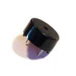
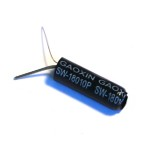
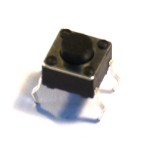
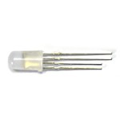
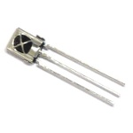

<!--- Copyright (c) 2013 Gordon Williams, Pur3 Ltd. See the file LICENSE for copying permission. -->
Espruino Kits
==============

:warning: **Please view the correctly rendered version of this page at https://www.espruino.com/Espruino+Kits. Links, lists, videos, search, and other features will not work correctly when viewed on GitHub** :warning:

* KEYWORDS: Espruino,Kit,Kits,KickStarter,Reward,Ultimate,Geek,Starter

If you supported the Espruino KickStarter campaign, you may have pledged for one of the kits of parts.

If so, these tables show you what you got and provide links to information on how to use each part.

Espruino Pico KickStarter
----------------------

|                                   | Starter Kit | Geek's Toy Kit | Ultimate Toy Kit |
|-----------------------------------|-------------|----------------|------------------|
| [Espruino Pico](/Pico)            | 1           |  3             |  10              |
| [[Breadboard]]                    | 1           |                |  1               |
| Jumper Wires                      | 10          |                |  140             |
| Terminal Block                    | 2           |                |  2               |
| [[PCD8544]] LCD Screen            | 1           |  1             |  2               |
| [[WS2811]] MultiColour LEDs       | 10          |  10            |  20              |
| 47uF Capacitor                    | 1           |  1             |  1               |
| Double [Relay](Relays) module     | 1           |  1             |  1               |
| Jumpers (for use with [Relay](Relays) module) | 4 |              |  4               |
| [Infrared Receiver](/IRReceiver)  | 1           |  1             |  2               |
| Infrared LED                      | 1           |  1             |  4               |
| Red LED                           | 1           |  1             |  1               |
| Resistors                         | 1           |  1             |  1               |
| Light Sensor ([[LDR]])            | 1           |  1             |  2               |
| Piezo [[Speaker]]                 | 1           |  1             |  1               |
| [Pushbutton](/Button)             | 2           |  2             |  2               |
| [[Vibration]] Sensor              | 1           |  2             |  2               |
| [[433Mhz]] Radio TX + RX          |             |  1             |  2               |
| [[DS18B20]] Temperature Sensor    |             |  1             |  1               |
| Micro [[Servo Motors]]            |             |  2             |  2               |
| [[Pyroelectric]] Sensor           |             |  1             |  1               |
| [[HC-SR04]] Ultrasonic Distance Sensor |        |  1             |  1               |
| [FET](/mosfets)                   |             |  1             |  1               |
| [[MFRC522]] NFC                   |             |  1             |  1               |
| [Stepper Motor](/Stepper+Motors)  |             |  1             |  1               |
| [[ESP8266]] WiFi                  |             |                |  1               |
| [[WIZnet]] W550io Ethernet        |             |                |  1               |
| [[KeyPad]]                        |             |                |  1               |

### Starter Kit tutorials

**Note:** In the reference card that comes with your starter kit, the [IR Receiver](/IRReceiver) is incorrectly referred to as a transmitter.

These are suitable for the Starter Kit, Ultimate Toy Kit, as well as the Geek Kit (if you own breadboard and Jumper Wires).

* APPEND_USES: PicoStarterKit

There are plenty of other [[Tutorials]] that can be used with the Pico, but those above deal with exactly the contents of the Starter Kit.

Original Espruino KickStarter
-------------------------

|                                   | Low Power Wireless | Multicolour Lights | Starter | Wireless Experimenter | WiFi Wireless | Ultimate WiFi |
|-----------------------------------|--------------------|--------------------|---------|-----------------------|---------------|---------------|
| [Espruino Board](/Original)  | 2                  | 1                  | 1       | 5                     | 4             | 4             |
| HC-05 [[Bluetooth]]               |                    |                    |         | 5 (or 2)              | 2             | 2             |
| [[NRF24L01P]] Wireless            | 2                  |                    |         | 0 (or 4)              | 2             | 2             |
| [[CC3000]] WiFi                   |                    |                    |         |                       | 1             | 1             |
| [[WS2811]] MultiColour LEDs       |                    | 25                 | 25      |                       |               | 25            |
| [Sockets, Pins and Wires](/Pin Strip) |                |                    | Yes     |                       |               | Yes           |
| Micro [[Servo Motors]]            |                    |                    | 2       |                       |               | 2             |
| [[DS18B20]] Temperature Sensor    |                    |                    | 1       |                       |               | 1             |
| Light Sensor ([[LDR]])            |                    |                    | 1       |                       |               | 1             |
| 4.7k Ohm Resistors                |                    |                    | 4       |                       |               | 4             |
| 100 Ohm Resistors                 |                    |                    |         |                       |               | 2             |
| [[Breadboard]]                    |                    |                    |         |                       |               | 1             |
| [[HC-SR04]] Ultrasonic Distance Sensor |               |                    |         |                       |               | 1             |
| [IR Proximity](/InfraredProximity) Sensor  |           |                    |         |                       |               | 1             |
| [[PCD8544]] LCD Screen            |                    |                    |         |                       |               | 1             |
| Rotary [[Encoder]]                |                    |                    |         |                       |               | 1             |
| [[KeyPad]]                        |                    |                    |         |                       |               | 1             |
| LiPo [[Battery]] and Charger      |                    |                    |         |                       |               | 1             |
| [Relay](Relays) Module            |                    |                    | 1       |                       |               | 1             |
| [[Pyroelectric]] Sensor           |                    |                    |         |                       |               | 1             |

Please note, both the Relay Module and Pyroelectric sensor are 'free' extras that were not advertised as being part of the KickStarter kits.

Buying
-----

Kits are not currently for sale, however when they are they will be available [here](/Order). In the mean time, the pages for most parts have links to where you can buy them.
