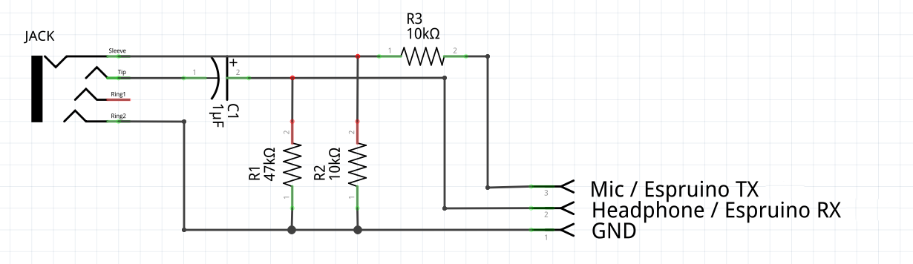
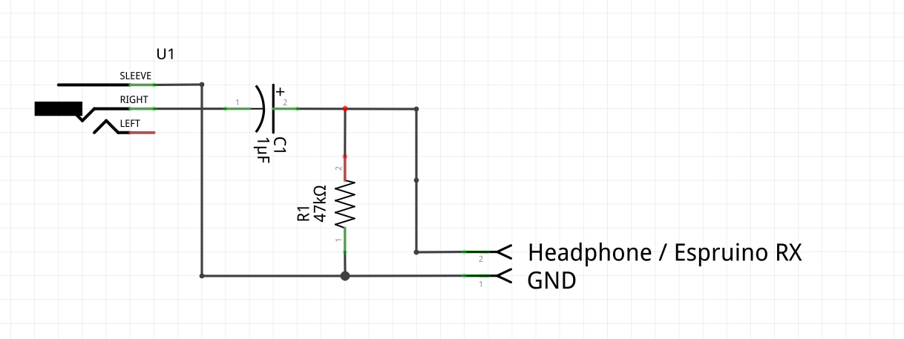

<!--- Copyright (c) 2015 Gordon Williams, Pur3 Ltd. See the file LICENSE for copying permission. -->
Headphone Jack Communications
=========================

<span style="color:red">:warning: **Please view the correctly rendered version of this page at https://www.espruino.com/Headphone. Links, lists, videos, search, and other features will not work correctly when viewed on GitHub** :warning:</span>

* KEYWORDS: Serial,Headphone,Jack,Communications,Line-In,Microphone

It's possible to use normal Headphone and Line In/Microphone connections as a 3.3v 9600 baud serial port. This means you can connect to a totally normal Espruino without needing USB or drivers.

All you need is a very simple circuit using a few cents worth of components. You can do this in two ways:

* **Bidirectional** uses a few more components (and needs the headphone and microphone jacks), but allows you to both send and receive data - getting the full Espruino experience.
* **Unidirectional** uses very few components, and needs only the headphone jack. You'll only be able to program your Espruino though.

**Note:** DO NOT RUN THE TOOLS SHOWN HERE WITHOUT THE HEADPHONE JACK CABLE PLUGGED IN - it makes nasty noises, and if you have the volume turned up high it might damage your speakers.

Wiring
-------

| Serial pin | [Original Espruino](/Original) | [Pico](/Pico) |
|----|-------|---------|
| RX | A10 | B7 |
| TX | A9  | B6 |

### Bidirectional



The circuit above shows a 4 pin jack plug (like you'd have in a smartphone). If you're
using a PC with a separate Microphone jack then you'll need to wire up two jacks, one for each.

* Connect Espruino GND to the sheath on both headphone and microphone jacks
* Connect TX on Espruino (see table above) to a 10k resistor, and connect that to the microphone Left+Right
* Connect a 10k resistor to the microphone sheath and connect that to microphone Left+Right too
* Connect RX on Espruino (see table above) to the Right channel of the headphone jack
* Connect a 40k resistor between the headphone jack Right channel and the headphone jack sheath

## Unidirectional



* Connect Espruino GND to the sheath on both headphone jack
* Connect RX on Espruino (see table above) to the Right channel of the headphone jack
* Connect a 40k resistor between the headphone jack Right channel and the headphone jack sheath

## Power

As you can't get power down the headphone jack, Espruino will need an external power source.

You can use a battery or USB, but if using USB then *don't use your PC*. When connected to a PC
via USB Espruino will automatically move the 'console' over to USB, and you won't be able to
interact with it.


How does it work? (electrically)
----------------------------

### Transmit to Espruino

Logic inputs on Microcontrollers have to convert a voltage to a 1 or a 0, however that voltage can be
anywhere between 0 and 3.3v. In order to avoid noise and to be error tolerant, they set some simple rules:

* If the voltage is above 2v it's a Logic 1
* If the voltage is below 0.8v it's a Logic 0
* If the voltage is between 0.8v and 2v, the logic level *stays the same*.

At the same time, the headphone output of your computer generally produces -1V to +1V. so a voltage
swing of 2 volts. If we could shift that (by adding about 1.5V) then it'd produce 0.5V to 2.5V - just
enough for the microcontroller.

So that's what we do:

* Use the internal 40k pull-up resistor on Espruino's RX pin (turned on by default),
and add a 47k pull-down resistor (R1), so it sits at a voltage of about 1.5v.
* Add a capacitor between the headphone output and the RX pin - this charges up slowly,
and shifts the voltage level.

And then it's just up to the PC to output the correct sounds (signals) on the headphone jack.

**Note:** Most computers already have a ~10uF capacitor in their headphone output, meaning the
capacitor might not be needed. **However some computers may not have it** so we'd always
suggest including one.


### Receive from Espruino

Receiving is even easier, as we can use some software in the PC to decode the signals that come from Espruino.
All we care about is making sure the signals aren't so big that they might damage your computer.

So all we do is use a potential divider (R2 and R3) to convert the 3.3v Espruino TX signal into a 1.6v
signal for the microphone. In fact if you didn't care much about your computer, you could just connect
directly and the computer's input protection circuitry would probably protect it - **buy we really don't
recommend that at all!**


Using
-----

* Plug the headphone/microphone jack(s) in
* You have set your volume to `100%` - try not to set it higher as it will clip the signal.
* If bidirectional, set the microphone volume to `Unamplified` or `Line In` if that's an option, or `100%`.
* Turn off any auto enhancement/echo cancellation you might have.

**Note:** Plug your headphones in first,


Normal Web IDE
------------

* Start the [Web IDE](/webide)
* Go to `Settings`, then `Communications`. Under `Connect over Audio`, choose `Normal Signal Polarity`
* Exit settings, and click the `Connect` button, choose `Audio`
* In the left-hand pane, press `enter`, then type `LED1.set()` then type enter again. It should light the LED.
* If that doesn't work, disconnect, go into settings again, choose `Fully Inverted`, and try connecting and typing again
* If that doesn't work, check your PC's sound settings (see above) and/or cable

Once that's done, you can click the `Send to Espruino` button and write any code you want!

### Bidirectional

If you have a bidirectional cable then pressing the `Reset` button on your Espruino (or power-cycling the Pico) should show you the Espruino Logo.

If you can't get the logo, but can send `LED1.set()` then fiddle with the `Connect over Audio` settings again. You may need to invert the output but
not the input, or vice-versa.

When that's done you can use Espruino totally normally - including the left-hand side 'terminal'.


Online Web IDE
-------------

Since you're just using the headphone jack, there's actually no need for the Chrome Web App at all.

Simply run the Web IDE online [by clicking here](http://espruino.github.io/EspruinoWebIDE/) - and use the instructions from above.

**Note:** this is a work in progress - any changes that could be made to the code at https://github.com/espruino/EspruinoWebIDE would be greatly appreciated!


Your own website
--------------

Since it's just audio, you can send information to Espruino using your own websites. Just include the file on your webpage with:

```
<script src="https://espruino.github.io/EspruinoOrion/serial_to_audio.js"></script>
```

And then to send and execute code, do something like the following:

```
// audio_serial_invert = true; // if your computer needed the inverted polarity
audio_serial_write("digitalWrite(LED1,1);\n");
```

[[https://youtu.be/BQDZNFXygrM]]

Bidirectional communications are harder, as the relevant code is embedded in the
[EspruinoTools](https://github.com/espruino/EspruinoTools) project. If you're interested
please [get in touch on the forum](http://www.espruino.com/Forum) and we can
work on getting an easy to use library developed.

[[https://youtu.be/IP7e5KJGVnM]]

More examples and information are available on:

* [This page on GitHub](https://github.com/espruino/EspruinoOrion)
* [This forum post](http://forum.espruino.com/conversations/257732/)
