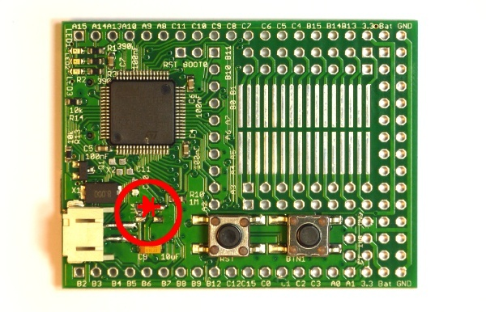

<!--- Copyright (c) 2013 Gordon Williams, Pur3 Ltd. See the file LICENSE for copying permission. -->
Power Consumption
===============

<span style="color:red">:warning: **Please view the correctly rendered version of this page at https://www.espruino.com/Power+Consumption. Links, lists, videos, search, and other features will not work correctly when viewed on GitHub** :warning:</span>

* KEYWORDS: Power,Watts,Efficiency,Milliamps,Microamps,Sleep,Stop,Standby,Deep Sleep

**Note:** This information is mainly relevant to the [Original Espruino](/Original), [[Pico]], and [[WiFi]] boards. Espruino Bluetooth LE boards enter deep sleep automatically (see the reference for your specific board for detailed power consumption figures).

Espruino on STM32 can run in one of 3 different modes.

| Mode  | [Original Espruino](/Original) 1v4 | [[Pico]]  | Notes |
|-------|---------------------------------|-------------------|------|
| Run   | ~35mA (57 hours)                | 32mA              | Espruino is executing code and running at 72Mhz |
| Sleep | ~12mA (7 days)                  | ~11mA             | Espruino has stopped the clock to the CPU, but all peripherals are still running and can wake it up |
| Stop  | ~0.03mA<sup>1</sup> (> 2 years) | 0.02mA            | Espruino has stopped the clock to everything except the real-time clock (RTC). It can wake up on setInterval/setTimeout or setWatch |

<sup>1</sup> Espruino 1v3 has a slightly higher 'Stop' power consumption of 0.11mA.

**Note:** Standby mode is available on the STM32 chip (very low power, but **all data** is lost from RAM). It is not currently used in Espruino.

Sleep
-----

This is the normal low-power mode for Espruino. You don't have to do anything to enter this at all, Espruino will enter this mode whenever it isn't doing anything.

Deep Sleep (Stop)
---------------

This is the best low-power mode in Espruino, which involves turning off the main clock (which stops all peripherals) and waking only when an external pin changes state or after a set amount of time. It is only enabled when you run ```setDeepSleep(1)``` (you can turn it off by passing 0). It's not enabled by default because:

* Espruino can't be woken by Serial/USART traffic (and will not receive data while in Deep Sleep). For instance you would be unable to use Deep Sleep if you were using the Bluetooth module and wanted to react to messages from it. To work around this, you'd need to implement RTS/CTS flow control in software (waking Espruino on RTS, and only setting CTS after `setDeepSleep(0)` has been called).
* All external peripherals (including timers for PWM) will stop. Espruino does not currently detect if any of these timers are in use before entering Deep Sleep.

### Conditions for Deep Sleep

For deep sleep to work, you must:

* Have called ```setDeepSleep(1)```
* Not be connected to USB
* Not have any data waiting to be sent down Serial or USB
* Have no pending callbacks from setIntervals/setTimeout that are **less than 1.5 seconds** away (this is less on the [[Pico]]). Espruino uses the real time clock for wakeups, and the RTC can only wake up on a second by second basis.
* Not have any [[Waveform]]s running, and not have a `digitalPulse(...)` command that is yet to finish

**Note:** Espruino won't enter deep sleep as soon as you execute ```setDeepSleep(1)```. It'll wait until all the bullet points above are satisfied, and then it'll enter it. For example you can type ```setDeepSleep(1)``` while you're connected to your PC via USB, and Espruino will only enter deep sleep mode once you unplug from USB.

`setDeepSleep(...)` sets a flag internally - so you only need to call it once (not each time you want to go to sleep).

Examples
-------

You can wake after a set amount of time - for example to flash an LED every 60 seconds:

```
setInterval(function() {
  digitalWrite(LED1, 1);
  setTimeout(function () {
    digitalWrite(LED1, 0);
  }, 20);
}, 60000);
setDeepSleep(1);
```

or you can wake when an external pin changes state - for instance to flash an LED when pressing the button:

```
setWatch(function() {
  digitalWrite(LED1, 1);
  setTimeout(function () {
    digitalWrite(LED1, 0);
  }, 20);
}, BTN, true);
setDeepSleep(1);
```

Debugging Sleep
-------------

You can call ```setSleepIndicator(LED1)```. LED1 will then be lit whenever the device is **not** sleeping, allowing you to make sure it is sleeping as much as possible. There is currently no way to see when Espruino has entered Deep Sleep.

Note that Espruino won't go to sleep when it is connected via USB, as it knows it has ample power available.

Probably the best way to measure power draw is to connect a multimeter in series with a battery and power Espruino from that. You'll then get a good idea of exactly how much power is being used.

If Espruino is not sleeping, check that you haven't called ```setInterval``` with a small timeout. For instance you may have been controlling model aircraft servos or something similar, but if they are already in the correct position you can call ```clearInterval(...)``` to ensure that Espruino is not having to wake up as often.

Saving Power
-----------

Bear in mind that lighting just one LED light uses about the same amount of power as Espruino itself. Don't turn on LEDs when sleeping, and be sure that Espruino isn't powering anything externally. If you've used outputs, you may be able to set them to 'float' either by reading the value with ```digitalRead``` or by using ```pinMode``` to change the state of the pin to input.

Other sources of Power Draw
------------------------

On the Espruino Board rev 1v3 the voltage regulator draws 80uA, which makes up the majority of the 110uA power draw. The rev 1v4 has a much more efficient regulator, which allows a power draw of just 30uA.

**What follows is not relevant for Espruino Boards rev 1v4 and later**

The STM32 itself can run from between 2 and 3.6v, so you may not need a voltage regulator. If you need the lowest possible power and you are running from a Lithium Ion/Polymer battery that doesn't exceed 4.3v, you can replace the voltage regulator with a single diode - which will drop the voltage by 0.7v. (bringing the voltage to `5v - 0.7v*2 = 3.6v` when on USB, and `4.2v - 0.7v = 3.5v` maximum when on Li-Ion batteries.



To do this, see the image above. Unsolder the small 5-pin IC that is near the battery connector, and then solder a standard diode (the SOD-123 package works well) between the two pins nearest the STM32 chip. The diode should be placed with the white line on the diode towards the pushbuttons.
