<!--- Copyright (c) 2015 Gordon Williams, Pur3 Ltd. See the file LICENSE for copying permission. -->
Espruino Pico 'Shims'
===================

<span style="color:red">:warning: **Please view the correctly rendered version of this page at https://www.espruino.com/Shims. Links, lists, videos, search, and other features will not work correctly when viewed on GitHub** :warning:</span>

* KEYWORDS: Pico,Shim,Adaptor,Shield,ESP8266,ESP01,ESP12,W550io,Bluetooth,HC-05,HC-06,HM-10,RFM12B,RFM69,Arduino,MicroSD,SD,Breakout,Prototype

'Shims' for the Espruino Pico are small adaptor boards that you can solder to the Espruino Pico to make it easier to attach devices. For example:

ESP8266 WiFi
-----------

[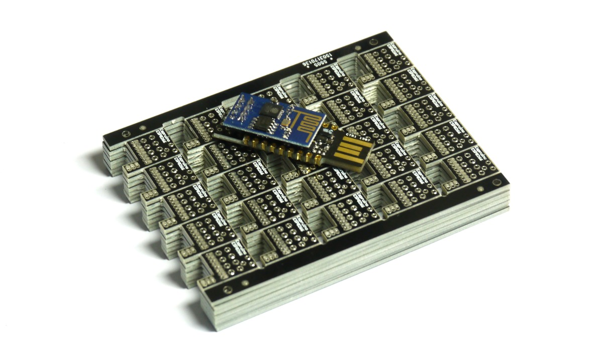](/ESP8266)

WIZnet W550io Ethernet
--------------------

[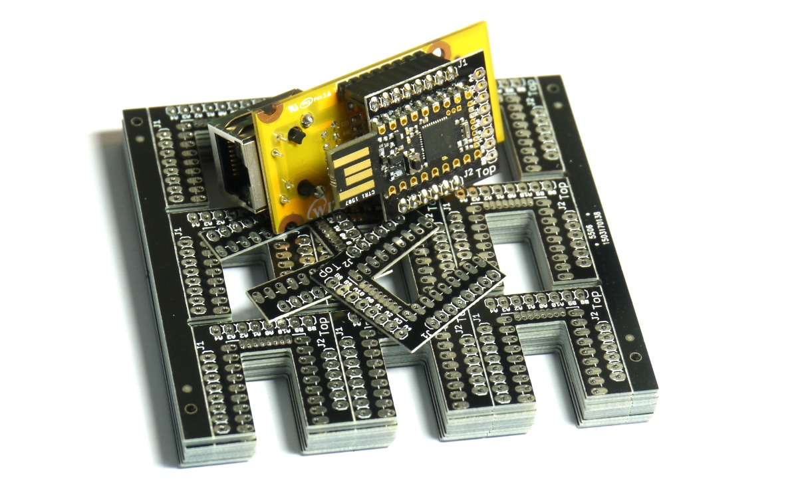](/WIZnet)

Shim Collection
-------------

[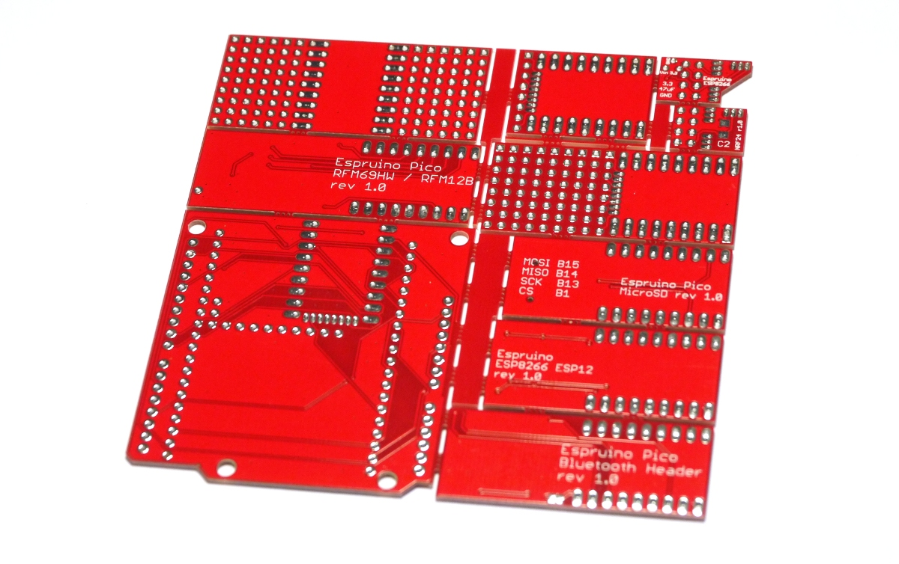](https://www.tindie.com/products/gfwilliams/espruino-pico-adaptor-pack/)

The [shim collection](https://www.tindie.com/products/gfwilliams/espruino-pico-adaptor-pack/) is a single 10cm x 10cm board, containing several different shims for your Pico that can be snapped out.

It consists of:


### ESP8266 ESP01 0.05" Shim

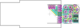

Eagle CAD [board](https://raw.githubusercontent.com/espruino/EspruinoBoard/master/Pico/Adaptors/eagle/esp8266_esp01_shim_rev2.brd)
 and [schematic](https://raw.githubusercontent.com/espruino/EspruinoBoard/master/Pico/Adaptors/eagle/esp8266_esp01_shim_rev2.sch)


See [the ESP8266 page](/ESP8266) for more information (and videos) on soldering this shim.


### NRF24L01P 0.05" Shim

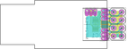

Eagle CAD [board](https://raw.githubusercontent.com/espruino/EspruinoBoard/master/Pico/Adaptors/eagle/nrf24_shim.brd)
 and [schematic](https://raw.githubusercontent.com/espruino/EspruinoBoard/master/Pico/Adaptors/eagle/nrf24_shim.sch)


Solder this on to the end of your Pico like the [ESP8266](/ESP8266) shim. The NRF24 should be positioned such that it overlaps the Pico.

See the [NRF24L01P](/NRF24L01P) page for more information on software.

| Pico | NRF24L01P |
|------|-----------|
| A10  | CE        |
| A0   | CSN       |
| A1   | SCK       |
| A2   | MOSI      |
| A3   | MISO      |
| A4   | IRQ       |


### ESP8266 ESP12 0.1" Adaptor

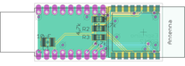

Eagle CAD [board](https://raw.githubusercontent.com/espruino/EspruinoBoard/master/Pico/Adaptors/eagle/esp8266_esp12_header.brd)
 and [schematic](https://raw.githubusercontent.com/espruino/EspruinoBoard/master/Pico/Adaptors/eagle/esp8266_esp12_header.sch)

This board may need an Espruino Pico rev 1v4 board (or an Espruino rev 1v3 with external power) to work reliably.

**Note:** on rev 1.0 adaptors, you need to short pins 9 and 10 of the ESP8266 together (the two pins on the edge, nearest the Pico's pin A8).

```
// make sure the Espruino console doesn't interfere with ESP8266 if we're not connected to USB
USB.setConsole();
// Start ESP8266
Serial1.setup(115200, { rx: B7, tx : B6 });
var wifi = require("ESP8266WiFi_0v25").connect(Serial1, function(err) {
  if (err) throw err;
  console.log("Connecting to WiFi");
  wifi.connect("WiFi_Name","WPA2_Key", function(err) {
    if (err) throw err;
    console.log("Connected");
    // Now you can do something, like an HTTP request
    require("http").get("http://www.pur3.co.uk/hello.txt", function(res) {
      console.log("Response: ",res);
      res.on('data', function(d) {
        console.log("--->"+d);
      });
    });
  });
});
```

See [the ESP8266 page](/ESP8266) for more information on software.

| Pico | ESP8266   |
|------|-----------|
| B6   | ESP8266 RX|
| B7   | ESP8266_TX|


| Component | Function |
|-----------|----------|
| R1        | 1206 4.7k Optional pullup for GPIO16 and RESET |
| R2        | 1206 4.7k Optional pullup for GPIO0 |
| R3        | 1206 4.7k Optional pullup for GPIO2 |


### Bluetooth 0.1" Adaptor

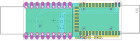

Eagle CAD [board](https://raw.githubusercontent.com/espruino/EspruinoBoard/master/Pico/Adaptors/eagle/bluetooth_header.brd)
 and [schematic](https://raw.githubusercontent.com/espruino/EspruinoBoard/master/Pico/Adaptors/eagle/bluetooth_header.sch)


This connects to HC-05, HC-06 or HM-10 bluetooth modules. See [the Bluetooth](/Bluetooth) and [BLE pages](/Bluetooth+BLE) for more information on software.

| Pico | Bluetooth |
|------|-----------|
| B6   | Bluetooth RX |
| B7   | Bluetooth TX |
| A8   | Bluetooth Key PIO0 (if solder jumper on reverse is shorted) |

**Note:** PIO1 on Bluetooth (the connection status LED) is connected to pads down the side of the Bluetooth module for an optional 0603 100 Ohm resistor and LED.


### RFM69/RFM12B 0.1" Adaptor

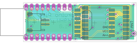

Eagle CAD [board](https://raw.githubusercontent.com/espruino/EspruinoBoard/master/Pico/Adaptors/eagle/rfm69_rfm12b_header.brd)
 and [schematic](https://raw.githubusercontent.com/espruino/EspruinoBoard/master/Pico/Adaptors/eagle/rfm69_rfm12b_header.sch)

This adaptor lets you solder on a RFM69 or a RFM12B module

See the [RFM69](/RFM69) page for information on software. There is currently no software for the RFM12B.

| Pico | RFM12B | RFM69  |
|------|--------|--------|
| A7   | IRQ    | DIO0 (IRQ) |
| B1   | -      | RST    |
| B10  | CS     | CS     |
| B13  | SCK    | SCK    |
| B14  | MISO   | MISO   |
| B15  | MOSI   | MOSI   |

**Note:**

* When positioning the device, check the silkscreen on the rear for an `ANT` marking, and position that away from the Pico, near `ANT` on the PCB.
* The outlines for the RFM12/RFM69 overlap, so to make sure there is no chance of a short when adding a module, please cover the row of unused pins that sits under the module you're soldering with a small bit of tape.
* There is an outline for a surface mount JST battery connector that sits under the Pico. If soldering your Pico flat onto the board (without pin sockets) please cover this with tape first to avoid shorts.


### Arduino Adaptor

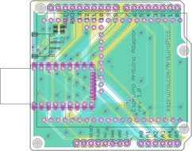

Eagle CAD [board](https://raw.githubusercontent.com/espruino/EspruinoBoard/master/Pico/Adaptors/eagle/arduino.brd)
 and [schematic](https://raw.githubusercontent.com/espruino/EspruinoBoard/master/Pico/Adaptors/eagle/arduino.sch)

This adaptor [has its own page](/ArduinoPico)

### MicroSD 0.1" Adaptor

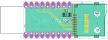

Eagle CAD [board](https://raw.githubusercontent.com/espruino/EspruinoBoard/master/Pico/Adaptors/eagle/microsd_header.brd)
 and [schematic](https://raw.githubusercontent.com/espruino/EspruinoBoard/master/Pico/Adaptors/eagle/microsd_header.sch)

| Pico | MicroSD |
|------|---------|
| B1   | CS      |
| B13  | SCK     |
| B14  | MISO    |
| B15  | MOSI    |

**Note 2:** On rev 1.0 of this board, GND is not connected. You will have manually to add a wire from GND of the Espruino Pico to pin 6 of the micro SD card connector. Adding a 0.1uF decoupling capacitor across the voltage rail is also a good idea.

**Note:** The resistor `R1` is for a 1206-size 100k pullup resistor for the `CS` line. This should
be added as it avoids unintentional SD card accesses that could occur before the Espruino Pico has set
up the CS line properly.


```
SPI2.setup({mosi:B15,miso:B14,sck:B13});
E.connectSDCard(SPI2,B1);
console.log(require("fs").readdirSync());
```

### 0.05" Breakout Adaptor

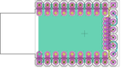

Eagle CAD [board](https://raw.githubusercontent.com/espruino/EspruinoBoard/master/Pico/Adaptors/eagle/pins.brd)
 and [schematic](https://raw.githubusercontent.com/espruino/EspruinoBoard/master/Pico/Adaptors/eagle/pins.sch)

This adaptor simply converts the Pico's 0.05" pins to 0.1" pins that can be easily accessed. To use this properly you'll need to solder an unpinned Pico flat onto the board.

**Note:** The board is not handed and can be used any way up.


### 0.05" Breakout and Prototype Adaptor

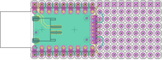

Eagle CAD [board](https://raw.githubusercontent.com/espruino/EspruinoBoard/master/Pico/Adaptors/eagle/prototype.brd)
 and [schematic](https://raw.githubusercontent.com/espruino/EspruinoBoard/master/Pico/Adaptors/eagle/prototype.sch)

This adaptor converts the Pico's 0.05" pins to 0.1" pins that can be easily accessed, and also provides a prototype area on the end of the board. To use this properly you'll need to solder an unpinned Pico flat onto the board.

**Note:** There is the outline for a surface mount JST battery connector on the board.

* On early revisions this is on the Top of the board and would get in the way of the Pico (so needs covering up with tape first to avoid shorts).
* On later revisions this is on the Bottom of the board, and the Top has `Pico This Side` on the silkscreen.


### 0.1" Prototype Adaptor

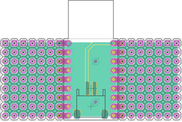

Eagle CAD [board](https://raw.githubusercontent.com/espruino/EspruinoBoard/master/Pico/Adaptors/eagle/prototype2.brd)
 and [schematic](https://raw.githubusercontent.com/espruino/EspruinoBoard/master/Pico/Adaptors/eagle/prototype2.sch)


This adaptor provides a small prototype area either side of the Espruino Pico. It does not allow connections to any of the 0.05" pins, but can be used in conjunction with 0.05" shims like the ESP8266 or WiFi shims above.

**Note:** There is an outline for a surface mount JST battery connector that sits under the Pico. If soldering your Pico flat onto the board (without pin sockets) please cover this with tape first to avoid shorts.


Where can I get one?
------------------

We're now selling a selection of shims [on Tindie](https://www.tindie.com/stores/gfwilliams/), with the Shim Collection [here](https://www.tindie.com/products/gfwilliams/espruino-pico-adaptor-pack/). However all the shims we've designed are Open Source.

You can [view and download them here](https://github.com/espruino/EspruinoBoard/tree/master/Pico/Adaptors) and can then send the designs (`.brd` files) to someone like [OSHPark](https://www.oshpark.com/) who will manufacture them to order for a very reasonable price.
